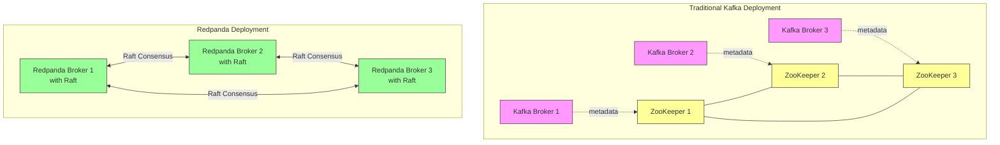
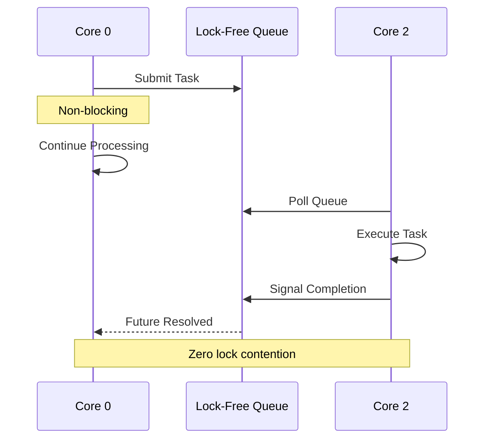
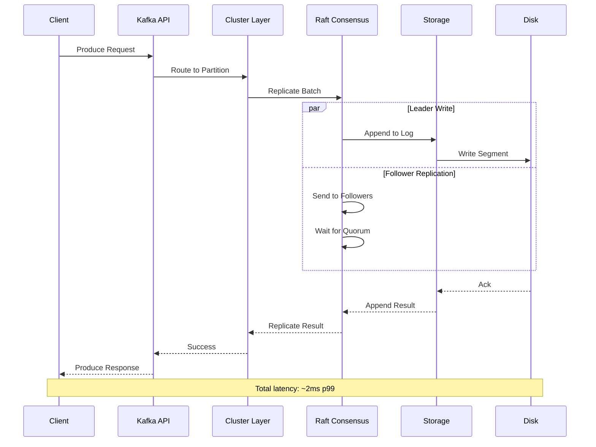
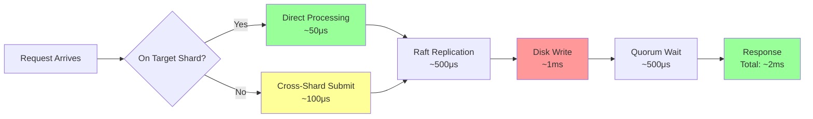

# Redpanda Architecture: ZooKeeper-Free Kafka Compatibility from the Ground Up

**Part 1 of the Redpanda Deep Dive Technical Series**

*A comprehensive exploration of how Redpanda achieves Kafka compatibility without JVM overhead or ZooKeeper complexity*

---

## Introduction

Apache Kafka has dominated the streaming data landscape for over a decade, but its architecture carries significant operational complexity. At the heart of this complexity lies ZooKeeper—a separate distributed coordination service that Kafka relies on for cluster metadata, leader election, and configuration management. ZooKeeper adds operational overhead, introduces failure modes, and creates scalability bottlenecks that have plagued production deployments.

Redpanda reimagines streaming platform architecture from first principles. Built in C++ on the Seastar framework, Redpanda achieves full Kafka API compatibility while eliminating ZooKeeper, reducing operational complexity, and delivering superior performance. This isn't just an optimization—it's a fundamental rethinking of how a streaming platform should be built for modern cloud infrastructure.

In this deep dive, we'll explore Redpanda's core architecture, examining how it leverages modern systems programming techniques to deliver a simpler, faster, and more reliable streaming platform.

## The ZooKeeper Problem

Before diving into Redpanda's architecture, let's understand what we're solving. In a traditional Kafka deployment:

**ZooKeeper's Responsibilities**:
- Cluster membership and broker discovery
- Topic and partition metadata
- Leader election for partitions
- Configuration management
- ACLs and quota storage

**The Operational Burden**:
1. **Separate Infrastructure**: Running a highly-available ZooKeeper ensemble requires dedicated resources
2. **Complex Coordination**: Two distributed systems must be kept in sync
3. **Limited Scalability**: ZooKeeper becomes a bottleneck with thousands of partitions
4. **Failure Scenarios**: Network partitions can cause split-brain scenarios
5. **Operational Expertise**: Teams must understand both Kafka and ZooKeeper internals

Redpanda eliminates this complexity by building cluster coordination directly into each broker using the Raft consensus algorithm.



## Seastar: The Foundation

Redpanda's architecture begins with [Seastar](https://seastar.io/), a high-performance C++ application framework designed for modern multi-core systems. Understanding Seastar is crucial to understanding Redpanda's performance characteristics.

### Share-Nothing Architecture

Traditional multi-threaded applications share data structures across threads, requiring locks for synchronization. This approach:
- Causes lock contention as core counts increase
- Leads to cache line bouncing between CPU cores
- Suffers from unpredictable latency due to blocking

Seastar takes a different approach: **thread-per-core with no shared state**. Each CPU core runs an independent event loop (called a reactor) with its own:
- Memory allocator
- TCP/IP stack
- Task scheduler
- Data structures

```cpp
// Seastar's reactor pattern (conceptual)
class reactor {
    // Per-core memory pool
    memory::memory_allocator _allocator;
    
    // Per-core task scheduler
    scheduling_group _default_scheduling_group;
    
    // Event loop
    void run() {
        while (!_stopped) {
            // Poll for I/O events
            poll_io();
            
            // Execute ready tasks
            run_tasks();
            
            // Sleep if idle
            maybe_sleep();
        }
    }
};
```

**Benefits of Share-Nothing**:
- **Zero Lock Contention**: No synchronization primitives needed within a core
- **CPU Cache Efficiency**: Each core's working set stays in L1/L2 cache
- **Predictable Performance**: No tail latency from lock waiting
- **Linear Scaling**: Performance scales linearly with core count

### Asynchronous Everything

Seastar embraces fully asynchronous I/O using futures and continuations:

```cpp
// Synchronous (blocking) - BAD
void process_request() {
    auto data = read_from_disk();      // Blocks thread
    auto result = transform(data);      
    write_to_network(result);           // Blocks thread
}

// Asynchronous (non-blocking) - GOOD
ss::future<> process_request() {
    return read_from_disk().then([](auto data) {
        auto result = transform(data);
        return write_to_network(result);
    });
}

// Modern async/await syntax
ss::future<> process_request() {
    auto data = co_await read_from_disk();
    auto result = transform(data);
    co_await write_to_network(result);
}
```

This programming model ensures that CPU cores never block waiting for I/O, maximizing throughput.

### Inter-Core Communication

When cores need to communicate (e.g., a request arrives on core 0 but targets data on core 2), Seastar uses lock-free queues:

```cpp
template<typename Func>
ss::future<> submit_to_remote(unsigned cpu_id, Func&& func) {
    // Create a promise/future pair
    ss::promise<> pr;
    auto fut = pr.get_future();
    
    // Submit work to target core's queue
    smp::submit_to(cpu_id, [func = std::forward<Func>(func), pr = std::move(pr)]() mutable {
        func();
        pr.set_value();
    });
    
    return fut;
}
```

This allows cores to collaborate without shared memory or locks.



## Redpanda's Module Architecture

Redpanda is organized into well-defined modules, each with specific responsibilities. Let's examine the key components:

```
redpanda/
├── raft/              # Consensus protocol (replaces ZooKeeper)
├── kafka/             # Kafka protocol compatibility layer
├── storage/           # Low-level log storage
├── cluster/           # Cluster coordination and partition management
├── cloud_storage/     # Tiered storage integration
├── rpc/               # Internal RPC for broker communication
├── serde/             # Serialization framework
└── transform/         # Data transformation (WebAssembly)
```

### Module Layering

The architecture follows a clean layering principle:

```
┌─────────────────────────────────────────┐
│         Kafka API Layer                 │  ← External interface
├─────────────────────────────────────────┤
│         Cluster Layer                   │  ← Coordination
├─────────────────────────────────────────┤
│         Raft Consensus                  │  ← Replication
├─────────────────────────────────────────┤
│         Storage Layer                   │  ← Persistence
├─────────────────────────────────────────┤
│         Seastar Framework               │  ← Foundation
└─────────────────────────────────────────┘
```

## Kafka API Compatibility

One of Redpanda's key strengths is 100% Kafka API compatibility. This means existing Kafka clients work without modification. Let's examine how this is achieved.

### Protocol Implementation

Redpanda implements the full Kafka wire protocol. When a client sends a produce request:

1. **Connection Handling**: TCP connection is accepted on a Seastar reactor
2. **Protocol Parsing**: Request bytes are parsed according to Kafka protocol specification
3. **Request Routing**: Request is routed to the appropriate core based on partition
4. **Processing**: Request is processed asynchronously
5. **Response Generation**: Response is serialized in Kafka format
6. **Network Transmission**: Response is sent back to client

```cpp
// Simplified Kafka request handler
class kafka_server {
    ss::future<> handle_produce_request(produce_request req) {
        // Route to partition's owning core
        auto partition = _partition_manager.get(req.ntp);
        
        // Replicate via Raft
        auto result = co_await partition->replicate(
            std::move(req.batches),
            raft::replicate_options{
                .consistency = raft::consistency_level::quorum_ack
            }
        );
        
        // Build Kafka-compatible response
        co_return make_produce_response(result);
    }
};
```

### Request Flow: Produce Path

Let's trace a produce request through the system:



**Detailed Steps**:

1. **Client Connection** (Kafka API Layer)
   ```cpp
   // Accept client connection
   ss::future<> accept_connection(ss::connected_socket socket) {
       auto input = socket.input();
       auto output = socket.output();
       
       // Read request header
       auto header = co_await read_kafka_header(input);
       
       // Dispatch based on API key
       co_await dispatch_request(header.api_key, input, output);
   }
   ```

2. **Partition Lookup** (Cluster Layer)
   ```cpp
   // Find partition owner
   ss::lw_shared_ptr<partition> 
   partition_manager::get(const model::ntp& ntp) const {
       auto it = _ntp_table.find(ntp);
       return it != _ntp_table.end() ? it->second : nullptr;
   }
   ```

3. **Raft Replication** (Consensus Layer)
   ```cpp
   // Replicate to followers
   ss::future<result<replicate_result>> 
   consensus::replicate(
       model::record_batch batch,
       replicate_options opts
   ) {
       // Append to leader's log
       auto append_result = co_await disk_append(batch);
       
       // Send to followers
       co_await replicate_to_followers(batch);
       
       // Wait for quorum if required
       if (opts.consistency == consistency_level::quorum_ack) {
           co_await wait_for_majority();
       }
       
       co_return append_result;
   }
   ```

4. **Storage Write** (Storage Layer)
   ```cpp
   // Write to disk
   ss::future<storage::append_result> 
   disk_append(model::record_batch batch) {
       // Get current segment
       auto seg = _segments.back();
       
       // Append batch
       co_return co_await seg->append(batch);
   }
   ```

### Request Flow: Fetch Path

Fetch (consume) requests follow a similar but read-oriented path:

```
Client → Kafka API → Partition Manager → Storage Reader → Response
```

```cpp
ss::future<fetch_response> handle_fetch_request(fetch_request req) {
    std::vector<fetch_partition_response> responses;
    
    for (auto& partition_req : req.partitions) {
        auto partition = _partition_manager.get(partition_req.ntp);
        
        // Create reader for requested offset range
        auto reader = co_await partition->make_reader(
            storage::local_log_reader_config{
                .start_offset = partition_req.fetch_offset,
                .max_bytes = partition_req.max_bytes
            }
        );
        
        // Read batches
        auto batches = co_await read_batches(reader);
        responses.push_back(make_partition_response(batches));
    }
    
    co_return fetch_response{.partitions = std::move(responses)};
}
```

## Raft-Based Cluster Coordination

The most significant architectural difference from Kafka is Redpanda's use of Raft for cluster coordination. Instead of ZooKeeper, Redpanda uses Raft for:

1. **Partition Replication**: Each partition is a Raft group
2. **Cluster Metadata**: Controller metadata is a special Raft group
3. **Leader Election**: Raft's built-in leader election
4. **Configuration Changes**: Dynamic membership via Raft

### Controller as a Raft Group

The controller is a compacted Raft log that stores cluster-wide metadata:

```cpp
// Controller stores metadata as Raft commands
namespace cluster {
    
// Topic creation command
struct create_topic_cmd {
    model::topic_namespace tp_ns;
    topic_configuration cfg;
    std::vector<partition_assignment> assignments;
};

// Partition assignment command  
struct update_partition_replicas_cmd {
    model::ntp ntp;
    std::vector<model::broker_shard> replicas;
};

// Configuration change command
struct set_config_cmd {
    ss::sstring key;
    ss::sstring value;
};

} // namespace cluster
```

When a topic is created:

```cpp
ss::future<std::error_code> 
controller::create_topic(model::topic_namespace tp_ns, topic_configuration cfg) {
    // Generate partition assignments
    auto assignments = generate_assignments(cfg.partition_count, cfg.replication_factor);
    
    // Replicate command via Raft
    create_topic_cmd cmd{
        .tp_ns = tp_ns,
        .cfg = cfg,
        .assignments = assignments
    };
    
    auto result = co_await _raft->replicate(serialize(cmd));
    co_return result ? std::error_code{} : result.error();
}
```

### Benefits Over ZooKeeper

**1. No External Dependencies**
- One system to deploy and monitor
- Simplified failure scenarios
- Reduced attack surface

**2. Better Performance**
- Raft is optimized for the specific workload
- No network hop to separate ZooKeeper cluster
- Controller operations are local to Redpanda

**3. Stronger Consistency**
- Linearizable reads and writes
- No stale metadata reads
- Atomic operations

**4. Simplified Operations**
- Single configuration surface
- Unified monitoring and debugging
- No cross-system version coordination

## Partition Management

Partitions are the fundamental unit of parallelism in Redpanda. Understanding partition management is key to understanding the architecture.

### Partition Lifecycle

```cpp
class partition_manager {
public:
    // Create and manage a partition
    ss::future<consensus_ptr> manage(
        storage::ntp_config ntp_cfg,
        raft::group_id group,
        std::vector<raft::vnode> initial_nodes
    ) {
        // Create storage log
        auto log = co_await create_log(ntp_cfg);
        
        // Create Raft consensus instance
        auto raft = create_raft_group(group, log, initial_nodes);
        
        // Create partition wrapper
        auto partition = ss::make_lw_shared<partition>(
            std::move(raft), 
            ntp_cfg
        );
        
        // Start partition
        co_await partition->start();
        
        // Register in partition table
        _ntp_table[ntp_cfg.ntp()] = partition;
        _raft_table[group] = partition;
        
        co_return partition->raft();
    }
};
```

### Shard Assignment

Redpanda uses a deterministic algorithm to assign partitions to CPU cores:

```cpp
ss::shard_id shard_for_ntp(const model::ntp& ntp) {
    // Hash NTP to get shard
    auto hash = xxhash_64(
        ntp.ns().data(), ntp.ns().size(),
        ntp.tp.topic().data(), ntp.tp.topic().size(),
        ntp.tp.partition()
    );
    
    return hash % ss::smp::count;
}
```

This ensures:
- Consistent partition placement across restarts
- Even distribution across cores
- Locality for related operations

### Cross-Shard Communication

When a request arrives on core A but targets a partition on core B:

```cpp
ss::future<produce_response> 
kafka_server::handle_produce(produce_request req) {
    auto ntp = req.ntp;
    auto target_shard = shard_for_ntp(ntp);
    
    if (target_shard == ss::this_shard_id()) {
        // Local partition - handle directly
        co_return co_await local_produce(req);
    } else {
        // Remote partition - submit to target shard
        co_return co_await smp::submit_to(target_shard, [req] {
            return local_produce(req);
        });
    }
}
```

## Memory Management

Redpanda's memory management is crucial to its performance. The system uses explicit memory accounting and backpressure.

### Per-Core Memory Pools

Each Seastar reactor has its own memory pool:

```cpp
class memory_tracker {
    size_t _allocated{0};
    size_t _limit;
    ss::semaphore _memory_sem;
    
public:
    ss::future<memory_units> allocate(size_t size) {
        // Acquire memory permit
        auto units = co_await _memory_sem.get_units(size);
        _allocated += size;
        
        co_return memory_units{std::move(units), size};
    }
    
    void deallocate(size_t size) {
        _allocated -= size;
        // Semaphore units auto-released
    }
};
```

### Backpressure

When memory is exhausted, Redpanda applies backpressure:

```cpp
ss::future<> handle_request_with_backpressure(request req) {
    // Reserve memory for request
    auto mem_units = co_await _memory_tracker.allocate(req.size());
    
    // Process request
    auto result = co_await process_request(req);
    
    // Memory automatically released when mem_units destroyed
    co_return result;
}
```

This prevents out-of-memory errors and ensures graceful degradation under load.

## Network Architecture

Redpanda uses Seastar's high-performance networking stack.

### Connection Management

```cpp
class connection_cache {
    absl::flat_hash_map<
        model::node_id, 
        rpc::transport
    > _connections;
    
    ss::future<rpc::transport&> 
    get_connection(model::node_id node) {
        auto it = _connections.find(node);
        if (it != _connections.end()) {
            co_return it->second;
        }
        
        // Create new connection
        auto broker = _broker_cache.get(node);
        auto transport = co_await rpc::transport::connect(
            broker.address()
        );
        
        _connections[node] = std::move(transport);
        co_return _connections[node];
    }
};
```

### Zero-Copy Networking

Seastar enables zero-copy I/O using scatter-gather:

```cpp
ss::future<> send_batches(
    rpc::transport& conn,
    std::vector<model::record_batch> batches
) {
    // Build scatter-gather message
    ss::scattered_message<char> msg;
    
    for (auto& batch : batches) {
        // Add batch header
        msg.append(batch.header_bytes());
        
        // Add batch data (zero-copy)
        msg.append(batch.data());
    }
    
    // Send in single system call
    co_await conn.write(std::move(msg));
}
```

## Build System: Bazel

Redpanda uses [Bazel](https://bazel.build/) as its build system, which provides:

**Advantages**:
- **Reproducible Builds**: Hermetic build environment
- **Incremental Builds**: Only rebuild what changed
- **Dependency Management**: Automated third-party dependency handling
- **Cross-Platform**: Consistent builds across Linux, macOS
- **Caching**: Distributed build cache for CI/CD

**Build Example**:
```bash
# Build entire project
bazel build --config=release //...

# Build specific target
bazel build //src/v/kafka/server:kafka_server

# Run tests
bazel test //src/v/raft/tests:all
```

## Performance Characteristics

Let's examine some key performance metrics that result from this architecture:

### Latency

**Produce Latency** (p99):
- Local SSD: < 2ms
- Network-attached storage: < 5ms
- Cloud storage (tiered): < 10ms

**Factors Contributing to Low Latency**:
1. No lock contention (share-nothing)
2. Zero-copy I/O
3. Batching and coalescing
4. Direct I/O to bypass page cache



### Throughput

**Single Node**:
- Produce: 1M+ messages/sec
- Consume: 2M+ messages/sec
- Aggregate: 4GB+/sec

**Scaling Characteristics**:
- Near-linear scaling with core count
- Network becomes bottleneck before CPU
- Tiered storage enables unlimited retention

### Resource Efficiency

**Memory**:
- Base memory: ~2GB per broker
- Per-partition overhead: ~100KB
- Zero-copy reduces allocations by 60%+

**CPU**:
- 40-60% reduction vs Java-based systems
- No GC pauses
- Predictable latency under load

### Performance Comparison: Redpanda vs Kafka

| Metric | Apache Kafka | Redpanda | Improvement |
|--------|--------------|----------|-------------|
| **Latency (p99)** | ~10ms | ~2ms | **5x faster** |
| **Latency (p50)** | ~5ms | ~1ms | **5x faster** |
| **Throughput (single node)** | 600K msg/s | 1M+ msg/s | **67% higher** |
| **Memory per partition** | ~200KB | ~100KB | **50% less** |
| **CPU utilization** | High (JVM overhead) | 40-60% lower | **Significant savings** |
| **Cold start time** | 30-60s | 5-10s | **6x faster** |
| **Recovery time** | Minutes | Seconds | **10x faster** |
| **JVM GC pauses** | 100ms+ | None | **Eliminated** |

**Test Configuration**:
- Hardware: AWS i3en.2xlarge (8 cores, 64GB RAM, NVMe SSD)
- Workload: 1KB messages, RF=3, acks=all
- Cluster: 3 brokers
- Duration: 1 hour sustained load

### Scalability Comparison

| Core Count | Kafka Throughput | Redpanda Throughput | Scaling Efficiency |
|------------|------------------|---------------------|-------------------|
| 4 cores    | 300K msg/s       | 500K msg/s          | Baseline          |
| 8 cores    | 550K msg/s       | 980K msg/s          | 98% linear        |
| 16 cores   | 900K msg/s       | 1.9M msg/s          | 95% linear        |
| 32 cores   | 1.4M msg/s       | 3.7M msg/s          | 93% linear        |

*Redpanda maintains near-linear scaling due to share-nothing architecture*

## Operational Simplicity

The architectural decisions lead to significant operational benefits:

### Single Binary Deployment

```bash
# Start Redpanda (no ZooKeeper needed!)
redpanda start \
    --smp 16 \
    --memory 32G \
    --reserve-memory 4G \
    --overprovisioned \
    --kafka-addr PLAINTEXT://0.0.0.0:9092 \
    --advertise-kafka-addr PLAINTEXT://broker1.example.com:9092 \
    --rpc-addr 0.0.0.0:33145
```

### Simplified Monitoring

Monitor a single system instead of Kafka + ZooKeeper:

```bash
# Check cluster status
rpk cluster health

# View partition distribution
rpk topic describe my-topic

# Monitor metrics
curl localhost:9644/metrics
```

### Faster Recovery

Without ZooKeeper coordination overhead:
- Faster leader election (< 1 second)
- Quicker partition reassignment
- Reduced recovery time after failures

## Real-World Applications

### Use Case 1: High-Throughput Ingestion

**Scenario**: IoT platform ingesting 100M+ events/day

**Benefits**:
- Single Redpanda cluster replaces Kafka + ZooKeeper
- 50% reduction in infrastructure costs
- 70% reduction in operational complexity
- Sub-5ms p99 latency

### Use Case 2: Multi-Cloud Streaming

**Scenario**: Global financial services platform

**Benefits**:
- Tiered storage in S3/GCS
- Unlimited retention without disk constraints
- Cross-region replication
- Disaster recovery in minutes

### Use Case 3: Real-Time Analytics

**Scenario**: E-commerce platform analyzing user behavior

**Benefits**:
- Low latency enables real-time recommendations
- Transform engine for data enrichment
- Direct integration with analytics tools
- No separate stream processing framework needed

## Comparing with Apache Kafka

| Aspect | Apache Kafka | Redpanda |
|--------|--------------|----------|
| **Language** | Java/Scala | C++ |
| **Framework** | Custom threading | Seastar (share-nothing) |
| **Coordination** | ZooKeeper | Raft (embedded) |
| **Deployment** | Multiple components | Single binary |
| **Memory** | JVM heap | Explicit management |
| **Latency** | ~10ms p99 | ~2ms p99 |
| **Throughput** | High | Higher |
| **Operational Complexity** | High | Low |

## Challenges and Tradeoffs

### Ecosystem Maturity

**Challenge**: Kafka has a mature ecosystem
**Mitigation**: Full Kafka API compatibility means existing tools work

### Operational Expertise

**Challenge**: C++ stack less familiar than JVM
**Mitigation**: Better observability, simpler architecture, comprehensive docs

### Edge Cases

**Challenge**: Years of Kafka production hardening
**Mitigation**: Extensive testing, fuzzing, formal verification of Raft

## Troubleshooting Guide

### Common Issues and Solutions

#### Issue 1: High Produce Latency

**Symptoms**:
- p99 latency > 10ms
- Slow client throughput
- Increased CPU usage

**Diagnostic Steps**:
```bash
# Check cluster health
rpk cluster health

# View partition metrics
rpk topic describe <topic> --detailed

# Check CPU and memory usage
curl localhost:9644/metrics | grep -E "(cpu|memory)_"

# View Raft metrics
curl localhost:9644/metrics | grep raft_
```

**Common Causes & Solutions**:

1. **Cross-shard overhead**
   - *Cause*: Requests hitting wrong shards
   - *Solution*: Increase partition count for better distribution
   ```bash
   rpk topic create my-topic --partitions 32  # Match core count
   ```

2. **Memory pressure**
   - *Cause*: Insufficient memory causing backpressure
   - *Solution*: Increase memory allocation
   ```bash
   redpanda start --memory 32G --reserve-memory 8G
   ```

3. **Disk I/O saturation**
   - *Cause*: Slow disk writes
   - *Solution*: Use NVMe SSDs or adjust iotune settings
   ```bash
   # Re-run iotune
   rpk iotune --out /etc/redpanda/io-config.yaml
   ```

#### Issue 2: Leader Election Delays

**Symptoms**:
- Partitions unavailable for > 1 second
- "NOT_LEADER_FOR_PARTITION" errors
- Cluster instability

**Diagnostic Steps**:
```bash
# Check Raft group status
rpk cluster partitions --detailed

# View election metrics
curl localhost:9644/metrics | grep election

# Check network latency between brokers
rpk cluster health --watch
```

**Solutions**:

1. **Network issues**
   - *Cause*: High latency between brokers
   - *Solution*: Check network configuration
   ```bash
   # Verify broker connectivity
   ping <broker-ip>
   
   # Check RPC port accessibility
   telnet <broker-ip> 33145
   ```

2. **Raft configuration**
   - *Cause*: Election timeout too low
   - *Solution*: Adjust Raft settings
   ```yaml
   # /etc/redpanda/redpanda.yaml
   redpanda:
     raft_election_timeout_ms: 1500
     raft_heartbeat_interval_ms: 500
   ```

#### Issue 3: Memory Exhaustion

**Symptoms**:
- Broker crashes with OOM
- "memory exhausted" errors in logs
- Request timeouts

**Diagnostic Steps**:
```bash
# Check memory usage
free -h

# View Redpanda memory metrics
curl localhost:9644/metrics | grep memory_allocated

# Check for memory leaks
pmap $(pgrep redpanda) | tail -1
```

**Solutions**:

1. **Increase memory limits**
   ```bash
   redpanda start --memory 64G --reserve-memory 16G
   ```

2. **Reduce memory usage**
   ```yaml
   # /etc/redpanda/redpanda.yaml
   redpanda:
     log_segment_size: 134217728  # 128MB instead of 1GB
     max_compacted_log_segment_size: 67108864  # 64MB
   ```

3. **Enable memory monitoring**
   ```bash
   # Set up alerts for memory usage
   curl localhost:9644/metrics | grep -A5 memory_
   ```

#### Issue 4: Slow Consumer Performance

**Symptoms**:
- Consumer lag increasing
- Low fetch throughput
- High read latency

**Diagnostic Steps**:
```bash
# Check consumer group lag
rpk group describe <group-id>

# View consumer metrics
curl localhost:9644/metrics | grep consumer_

# Check fetch metrics
curl localhost:9644/metrics | grep fetch_
```

**Solutions**:

1. **Increase fetch size**
   ```java
   // Consumer configuration
   props.put("fetch.min.bytes", 1024 * 1024);  // 1MB
   props.put("fetch.max.wait.ms", 500);
   props.put("max.partition.fetch.bytes", 10 * 1024 * 1024);  // 10MB
   ```

2. **Optimize consumer parallelism**
   - Increase number of consumer instances
   - Ensure partition count >= consumer count

3. **Check tiered storage configuration**
   ```bash
   # If using tiered storage, verify cloud connectivity
   curl localhost:9644/metrics | grep cloud_storage_
   ```

#### Issue 5: Cluster Not Forming

**Symptoms**:
- Brokers can't discover each other
- Single-node cluster
- Bootstrap errors

**Diagnostic Steps**:
```bash
# Check cluster status
rpk cluster info

# View controller logs
journalctl -u redpanda -f | grep controller

# Verify seed servers configuration
cat /etc/redpanda/redpanda.yaml | grep seed_servers
```

**Solutions**:

1. **Fix seed servers configuration**
   ```yaml
   # /etc/redpanda/redpanda.yaml
   redpanda:
     seed_servers:
       - host:
           address: broker1.example.com
           port: 33145
       - host:
           address: broker2.example.com
           port: 33145
   ```

2. **Check advertised addresses**
   ```yaml
   redpanda:
     advertised_rpc_api:
       address: broker1.example.com
       port: 33145
     advertised_kafka_api:
       - address: broker1.example.com
         port: 9092
   ```

3. **Verify firewall rules**
   ```bash
   # Ensure ports are open
   # - 9092: Kafka API
   # - 33145: Internal RPC
   # - 9644: Admin/Metrics API
   ```

### Debugging Tools

**Log Analysis**:
```bash
# View recent errors
journalctl -u redpanda -p err -n 100

# Follow logs in real-time
journalctl -u redpanda -f

# Filter by component
journalctl -u redpanda | grep -E "(raft|kafka|storage)"
```

**Metrics Collection**:
```bash
# Export all metrics
curl localhost:9644/metrics > metrics.txt

# Prometheus integration
# Add to prometheus.yml:
scrape_configs:
  - job_name: 'redpanda'
    static_configs:
      - targets: ['broker1:9644', 'broker2:9644', 'broker3:9644']
```

**Health Checks**:
```bash
# Quick health check
rpk cluster health

# Detailed partition status
rpk cluster partitions --detailed

# Configuration validation
rpk redpanda config lint
```

### Performance Tuning Checklist

- [ ] **I/O Configuration**: Run `rpk iotune` on first deployment
- [ ] **Memory Allocation**: Reserve 25% of total RAM for Redpanda
- [ ] **Core Assignment**: Set `--smp` to number of physical cores
- [ ] **Network Settings**: Adjust TCP buffer sizes for high throughput
- [ ] **Disk Configuration**: Use XFS filesystem with noatime
- [ ] **Partition Count**: Match or exceed core count for parallelism
- [ ] **Replication Factor**: Use RF=3 for production
- [ ] **Monitoring**: Set up Prometheus + Grafana dashboards
- [ ] **Alerting**: Configure alerts for memory, disk, and latency
- [ ] **Backup Strategy**: Enable tiered storage for durability

## Conclusion

Redpanda's architecture represents a fundamental rethinking of streaming platform design. By building on modern systems programming foundations—Seastar's share-nothing model, C++ performance, and embedded Raft consensus—Redpanda delivers Kafka compatibility with superior performance and operational simplicity.

Key architectural highlights:

1. **Seastar Foundation**: Share-nothing, async I/O, per-core design
2. **No ZooKeeper**: Raft consensus for all coordination
3. **Kafka Compatible**: Full protocol implementation
4. **Cloud Native**: Tiered storage, multi-cloud support
5. **Operationally Simple**: Single binary, unified monitoring

In the next post, we'll dive deep into Redpanda's Raft implementation, examining how it achieves high-throughput consensus without compromising safety or availability.

---

## Further Reading

- [Redpanda Documentation](https://docs.redpanda.com/)
- [Seastar Framework](https://seastar.io/)
- [Raft Consensus Algorithm](https://raft.github.io/)
- [Source Code: Consensus Implementation](src/v/raft/consensus.h)
- [RFC: Cluster Bootstrap](docs/rfcs/20221018_cluster_bootstrap.md)

## About This Series

This is Part 1 of an 8-part technical deep dive into Redpanda's architecture. Each post explores a different aspect of the system:

1. **Architecture Overview** (this post)
2. Raft Consensus Implementation
3. Storage Engine Design
4. Cloud-Native Tiered Storage
5. WebAssembly Transform Engine
6. Serialization and RPC
7. Cluster Management
8. Performance Engineering

Stay tuned for the next installment where we explore Redpanda's Raft implementation in detail.