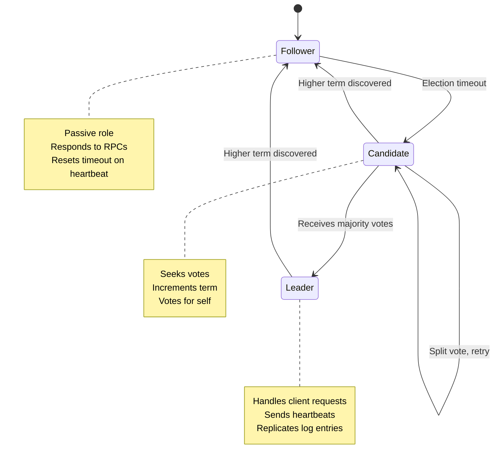
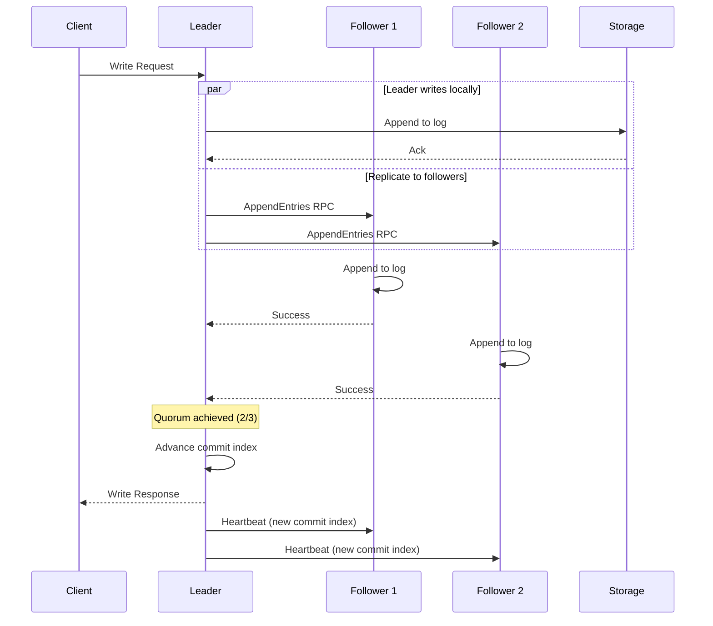

# Inside Redpanda's Raft Implementation: Consensus Without Compromise

**Part 2 of the Redpanda Deep Dive Technical Series**

*An in-depth exploration of how Redpanda implements high-throughput Raft consensus for both partition replication and cluster coordination*

---

## Introduction

In the previous post, we explored how Redpanda eliminates ZooKeeper by embedding consensus directly into each broker. At the heart of this design is Raft—a consensus algorithm designed for understandability and practical implementation. However, implementing Raft correctly is challenging, and optimizing it for high-throughput workloads requires careful engineering.

Redpanda's Raft implementation powers two critical functions:
1. **Partition Replication**: Every partition is a Raft group, ensuring data durability
2. **Cluster Coordination**: The controller uses Raft to manage cluster metadata

In this deep dive, we'll examine Redpanda's Raft implementation, exploring both the core algorithm and the performance optimizations that enable high-throughput streaming workloads.

## Raft Fundamentals

Before diving into implementation details, let's review Raft's core concepts. If you're already familiar with Raft, feel free to skip to the implementation section.

### The Consensus Problem

Distributed systems need to agree on a sequence of operations despite:
- Network delays and partitions
- Server failures and restarts
- Concurrent operations from multiple clients

Raft solves this through **replicated state machines**: servers maintain identical logs of commands, and applying commands in the same order produces identical state.

### Raft's Three Components

**1. Leader Election**
- At any time, one server is the leader
- Leader handles all client requests
- If leader fails, followers elect a new leader

**2. Log Replication**
- Leader accepts client commands
- Leader replicates commands to followers
- Leader commits commands once majority has them

**3. Safety**
- Committed entries never lost
- State machines execute same commands in same order
- Only servers with complete logs can become leader

### Key Raft Concepts

**Terms**: Logical clock incremented on each election
```cpp
using term_id = named_type<int64_t, struct term_id_tag>;
```

**Offsets**: Log position (equivalent to Raft's index)
```cpp
using offset = named_type<int64_t, struct offset_tag>;
```

**Voted For**: Which candidate this server voted for in current term
```cpp
struct voted_for_configuration {
    vnode voted_for;
    model::term_id term{0};
};
```

## Redpanda's Consensus Class

The [`consensus`](src/v/raft/consensus.h:67) class is the heart of Redpanda's Raft implementation:

```cpp
class consensus {
public:
    // Current state
    model::term_id term() const { return _term; }
    bool is_leader() const { return is_elected_leader() && _term == _confirmed_term; }
    model::offset committed_offset() const { return _commit_index; }
    
    // Replication
    ss::future<result<replicate_result>> 
    replicate(model::record_batch batch, replicate_options opts);
    
    // Voting
    ss::future<vote_reply> vote(vote_request&& r);
    
    // Append entries
    ss::future<append_entries_reply> 
    append_entries(append_entries_request&& r);
    
private:
    // Raft state
    vnode _self;
    model::term_id _term;
    model::offset _commit_index;
    vnode _voted_for;
    std::optional<vnode> _leader_id;
    vote_state _vstate;  // follower, candidate, or leader
    
    // Storage
    ss::shared_ptr<storage::log> _log;
    
    // Followers (leader only)
    follower_states _fstates;
};
```

### Lifecycle States

A Raft node transitions through three states:

```cpp
enum class vote_state { 
    follower,   // Receives append entries from leader
    candidate,  // Seeking votes to become leader
    leader      // Accepts client requests, replicates to followers
};
```

State transitions:



## Leader Election

Leader election begins when a follower's heartbeat timeout expires.

### Election Process

```cpp
void consensus::dispatch_vote(bool leadership_transfer) {
    // Prevent concurrent elections
    _election_lock.get_units().then([this, leadership_transfer](auto units) {
        return do_dispatch_vote(leadership_transfer, std::move(units));
    });
}

ss::future<> consensus::do_dispatch_vote(
    bool leadership_transfer,
    semaphore_units units
) {
    // Increment term
    _term = _term + model::term_id(1);
    
    // Vote for self
    _voted_for = _self;
    _vstate = vote_state::candidate;
    
    // Persist vote
    co_await write_voted_for({.voted_for = _self, .term = _term});
    
    // Request votes from all peers
    vote_request req{
        .node_id = _self,
        .target_node_id = {},  // Set per-follower
        .group = _group,
        .term = _term,
        .prev_log_index = _log->offsets().dirty_offset,
        .prev_log_term = get_last_entry_term(_log->offsets()),
        .leadership_transfer = leadership_transfer
    };
    
    // Send vote requests in parallel
    std::vector<ss::future<vote_reply>> vote_futures;
    for (auto& node : _configuration_manager.get_latest().voters()) {
        if (node == _self) continue;
        
        vote_futures.push_back(
            _client_protocol.vote(node.id(), req.copy())
        );
    }
    
    // Wait for votes
    auto replies = co_await ss::when_all_succeed(
        vote_futures.begin(), vote_futures.end()
    );
    
    // Count votes
    size_t votes_granted = 1;  // Self vote
    for (auto& reply : replies) {
        if (reply.granted) {
            votes_granted++;
        } else if (reply.term > _term) {
            // Higher term seen, step down
            co_await step_down(reply.term);
            co_return;
        }
    }
    
    // Check if won election
    size_t majority = (_configuration_manager.get_latest().voters().size() / 2) + 1;
    if (votes_granted >= majority) {
        // Become leader
        _vstate = vote_state::leader;
        _leader_id = _self;
        
        // Initialize follower state
        for (auto& node : _configuration_manager.get_latest().voters()) {
            if (node == _self) continue;
            _fstates.emplace(node, follower_index_metadata{
                .last_sent_offset = _log->offsets().dirty_offset
            });
        }
        
        // Send initial heartbeat
        co_await send_heartbeats();
    }
}
```

### Vote Request Handling

When a follower receives a vote request:

```cpp
ss::future<vote_reply> consensus::vote(vote_request&& r) {
    return _op_lock.with([this, r = std::move(r)]() mutable {
        return do_vote(std::move(r));
    });
}

ss::future<vote_reply> consensus::do_vote(vote_request r) {
    vote_reply reply{
        .term = _term,
        .granted = false,
        .log_ok = false
    };
    
    // Reject if term is old
    if (r.term < _term) {
        co_return reply;
    }
    
    // Step down if term is newer
    if (r.term > _term) {
        _term = r.term;
        _voted_for = {};
        do_step_down("received vote request with higher term");
    }
    
    // Check if already voted
    bool already_voted = _voted_for.has_value() && _voted_for != r.node_id;
    
    // Check if candidate's log is at least as up-to-date
    auto last_entry_term = get_last_entry_term(_log->offsets());
    auto last_offset = _log->offsets().dirty_offset;
    
    bool log_is_ok = (r.prev_log_term > last_entry_term)
                  || (r.prev_log_term == last_entry_term 
                      && r.prev_log_index >= last_offset);
    
    reply.log_ok = log_is_ok;
    
    // Grant vote if conditions met
    if (!already_voted && log_is_ok) {
        _voted_for = r.node_id;
        co_await write_voted_for({.voted_for = r.node_id, .term = _term});
        reply.granted = true;
        
        // Reset election timeout
        arm_vote_timeout();
    }
    
    co_return reply;
}
```

### Pre-Vote Optimization

Redpanda implements pre-voting to prevent disruption from partitioned nodes:

```cpp
ss::future<election_success> consensus::dispatch_prevote(bool leadership_transfer) {
    // Send pre-vote requests without incrementing term
    prevote_request req{
        .node_id = _self,
        .group = _group,
        .term = _term + model::term_id(1),  // Prospective term
        .prev_log_index = _log->offsets().dirty_offset,
        .prev_log_term = get_last_entry_term(_log->offsets())
    };
    
    // Collect pre-votes
    auto replies = co_await send_prevote_requests(req);
    
    size_t votes_granted = 1;
    for (auto& reply : replies) {
        if (reply.granted) votes_granted++;
    }
    
    size_t majority = (_configuration_manager.get_latest().voters().size() / 2) + 1;
    
    // Only start real election if pre-vote succeeds
    if (votes_granted >= majority) {
        co_await dispatch_vote(leadership_transfer);
        co_return election_success::yes;
    }
    
    co_return election_success::no;
}
```

## Log Replication

Once elected, the leader replicates log entries to followers.



### Replicate API

The main entry point for replication:

```cpp
ss::future<result<replicate_result>> 
consensus::replicate(
    model::record_batch batch,
    replicate_options opts
) {
    return replicate(
        chunked_vector<model::record_batch>{std::move(batch)},
        opts
    );
}

ss::future<result<replicate_result>>
consensus::replicate(
    chunked_vector<model::record_batch> batches,
    replicate_options opts
) {
    // Must be leader
    if (!is_elected_leader()) {
        co_return errc::not_leader;
    }
    
    // Check term matches expected (for conditional replication)
    if (opts.expected_term && opts.expected_term != _term) {
        co_return errc::not_leader;
    }
    
    // Acquire operation lock
    auto units = co_await _op_lock.get_units();
    
    // Append to local log
    auto append_result = co_await disk_append(
        std::move(batches),
        update_last_quorum_index::yes
    );
    
    // Build append entries request
    append_entries_request req = make_append_entries_request(
        append_result
    );
    
    // Get sequence numbers for followers
    auto sequences = next_followers_request_seq();
    
    // Dispatch to followers
    co_return co_await dispatch_replicate(
        std::move(req),
        std::move(units),
        std::move(sequences)
    );
}
```

### Follower State Tracking

The leader maintains state for each follower:

```cpp
struct follower_index_metadata {
    // Next offset to send to this follower
    model::offset next_index;
    
    // Highest offset known to be replicated on this follower
    model::offset match_index;
    
    // Last offset we sent to this follower
    model::offset last_sent_offset;
    
    // Timestamp of last successful append
    clock_type::time_point last_successful_append;
    
    // Is this follower recovering (catching up)?
    bool is_recovering{false};
    
    // Request sequence number for ordering
    follower_req_seq last_sent_seq;
};

class follower_states {
    absl::flat_hash_map<vnode, follower_index_metadata> _followers;
    
public:
    void emplace(vnode node, follower_index_metadata meta) {
        _followers.emplace(node, std::move(meta));
    }
    
    follower_index_metadata& get(vnode node) {
        return _followers.at(node);
    }
    
    // Iterate over all followers
    template<typename Func>
    void for_each(Func&& f) {
        for (auto& [node, meta] : _followers) {
            f(node, meta);
        }
    }
};
```

### Append Entries RPC

The leader sends append entries to replicate log entries:

```cpp
ss::future<result<replicate_result>> 
consensus::dispatch_replicate(
    append_entries_request req,
    std::vector<ssx::semaphore_units> units,
    absl::flat_hash_map<vnode, follower_req_seq> sequences
) {
    // Send to all followers in parallel
    std::vector<ss::future<result<append_entries_reply>>> futures;
    
    _fstates.for_each([&](vnode node, follower_index_metadata& meta) {
        // Create per-follower request
        auto follower_req = make_follower_request(node, req, meta);
        
        // Track inflight request
        auto guard = track_append_inflight(node);
        
        // Send RPC
        futures.push_back(
            _client_protocol.append_entries(node.id(), std::move(follower_req))
                .then([this, node, seq = sequences[node], last_offset = meta.last_sent_offset]
                      (result<append_entries_reply> reply) {
                    // Process reply
                    process_append_entries_reply(
                        node.id(), std::move(reply), seq, last_offset
                    );
                    return reply;
                })
        );
        
        // Update follower state
        meta.last_sent_offset = req.last_offset();
        meta.last_sent_seq = sequences[node];
    });
    
    // Wait for majority
    auto replies = co_await ss::when_all(futures.begin(), futures.end());
    
    // Check consistency level
    if (req.consistency == consistency_level::leader_ack) {
        // Don't wait for followers
        co_return replicate_result{
            .last_offset = req.last_offset()
        };
    }
    
    // Wait for quorum
    co_await _replication_monitor.wait_for_majority(
        req.last_offset(),
        model::timeout_clock::now() + 30s
    );
    
    co_return replicate_result{
        .last_offset = req.last_offset()
    };
}
```

### Handling Append Entries Replies

When a follower responds:

```cpp
void consensus::process_append_entries_reply(
    model::node_id node,
    result<append_entries_reply> reply_result,
    follower_req_seq seq,
    model::offset last_sent_offset
) {
    if (!reply_result) {
        // RPC failed
        return;
    }
    
    auto& reply = reply_result.value();
    
    // Check if term is stale
    if (reply.term > _term) {
        do_step_down("received append entries reply with higher term");
        return;
    }
    
    // Ignore old replies
    auto& meta = _fstates.get(vnode{node, reply.node_id.revision()});
    if (seq < meta.last_sent_seq) {
        return;  // Out of order reply
    }
    
    if (reply.result == append_entries_reply::status::success) {
        // Update match index
        meta.match_index = last_sent_offset;
        meta.last_successful_append = clock_type::now();
        
        // Update commit index if majority replicated
        maybe_update_leader_commit_idx();
        
    } else if (reply.result == append_entries_reply::status::failure) {
        // Log mismatch, backtrack
        if (reply.last_flushed_log_index < meta.next_index) {
            meta.next_index = reply.last_flushed_log_index + model::offset(1);
        } else {
            meta.next_index = meta.next_index - model::offset(1);
        }
        
        // Retry immediately
        dispatch_recovery(meta);
    }
}
```

### Commit Index Updates

The leader advances its commit index when entries are replicated on a majority:

```cpp
void consensus::maybe_update_leader_commit_idx() {
    if (!is_leader()) return;
    
    // Collect match indices from all followers
    std::vector<model::offset> match_indices;
    match_indices.reserve(_fstates.size() + 1);
    
    // Add own offset
    match_indices.push_back(_log->offsets().dirty_offset);
    
    // Add follower match indices
    _fstates.for_each([&](vnode node, const follower_index_metadata& meta) {
        match_indices.push_back(meta.match_index);
    });
    
    // Sort to find median (majority)
    std::sort(match_indices.begin(), match_indices.end());
    
    // Majority is at position (n-1)/2
    size_t majority_idx = (match_indices.size() - 1) / 2;
    model::offset new_commit_index = match_indices[majority_idx];
    
    // Only advance commit index
    if (new_commit_index > _commit_index) {
        // Verify entry is from current term (Raft safety requirement)
        auto term = get_term(new_commit_index);
        if (term == _term) {
            _commit_index = new_commit_index;
            _commit_index_updated.broadcast();
        }
    }
}
```

## Follower Recovery

When a follower falls behind, the leader uses a recovery process to catch it up efficiently.

### Detecting Recovery Need

```cpp
bool consensus::needs_recovery(
    const follower_index_metadata& meta,
    model::offset leader_offset
) {
    // Follower is behind by more than threshold
    auto lag = leader_offset - meta.match_index;
    return lag > config::recovery_threshold();
}

void consensus::dispatch_recovery(follower_index_metadata& meta) {
    if (meta.is_recovering) {
        return;  // Already recovering
    }
    
    meta.is_recovering = true;
    
    // Schedule recovery in background
    ssx::spawn_with_gate(_bg, [this, &meta] {
        return do_recovery(meta);
    });
}
```

### Recovery Process

```cpp
ss::future<> consensus::do_recovery(follower_index_metadata& meta) {
    while (meta.next_index < _log->offsets().dirty_offset) {
        // Read batch of entries to send
        auto reader = co_await _log->make_reader(
            storage::local_log_reader_config{
                .start_offset = meta.next_index,
                .max_bytes = config::recovery_batch_size()
            }
        );
        
        auto batches = co_await read_all_batches(std::move(reader));
        
        // Send to follower
        append_entries_request req{
            .node_id = _self,
            .target_node_id = meta.node,
            .group = _group,
            .term = _term,
            .prev_log_index = meta.next_index - model::offset(1),
            .prev_log_term = get_term(meta.next_index - model::offset(1)),
            .batches = std::move(batches),
            .commit_index = _commit_index
        };
        
        auto reply = co_await _client_protocol.append_entries(
            meta.node.id(), std::move(req)
        );
        
        if (!reply || reply.value().result != append_entries_reply::status::success) {
            // Retry after delay
            co_await ss::sleep(1s);
            continue;
        }
        
        // Update state
        meta.next_index = req.last_offset() + model::offset(1);
        meta.match_index = req.last_offset();
    }
    
    meta.is_recovering = false;
}
```

## Configuration Changes

Raft supports dynamic membership changes. Redpanda implements joint consensus for safe configuration transitions.

### Adding a Member

```cpp
ss::future<std::error_code> 
consensus::add_group_member(
    vnode node_to_add,
    model::revision_id new_revision,
    std::optional<model::offset> learner_start_offset
) {
    if (!is_leader()) {
        co_return errc::not_leader;
    }
    
    auto units = co_await _op_lock.get_units();
    
    // Get current configuration
    auto current_cfg = _configuration_manager.get_latest();
    
    // Create new configuration with added node
    group_configuration new_cfg = current_cfg.copy();
    
    if (learner_start_offset) {
        // Add as learner first
        new_cfg.add_learner(broker_revision{
            .broker = lookup_broker(node_to_add),
            .rev = new_revision
        }, *learner_start_offset);
    } else {
        // Add as voter directly
        new_cfg.add_voter(broker_revision{
            .broker = lookup_broker(node_to_add),
            .rev = new_revision
        });
    }
    
    // Replicate configuration change
    co_return co_await replicate_configuration(
        std::move(units), std::move(new_cfg)
    );
}
```

### Joint Consensus

During configuration changes, Redpanda uses joint consensus:

```cpp
enum class configuration_state : uint8_t { 
    simple,        // Single configuration
    transitional,  // Old + new (legacy)
    joint          // Joint consensus (old ∪ new)
};

class group_configuration {
    std::vector<vnode> _current_voters;   // C_old
    std::vector<vnode> _new_voters;       // C_new
    configuration_state _state;
    
public:
    bool is_voter(vnode node) const {
        switch (_state) {
        case configuration_state::simple:
            return contains(_current_voters, node);
        case configuration_state::joint:
            // Node is voter if in either configuration
            return contains(_current_voters, node) 
                || contains(_new_voters, node);
        default:
            return false;
        }
    }
    
    bool has_quorum(const std::vector<vnode>& nodes) const {
        switch (_state) {
        case configuration_state::simple:
            return has_majority(_current_voters, nodes);
        case configuration_state::joint:
            // Need majority in BOTH old and new
            return has_majority(_current_voters, nodes)
                && has_majority(_new_voters, nodes);
        default:
            return false;
        }
    }
};
```

## Write Caching and Batching

Redpanda optimizes Raft throughput through write caching and batching.

### Replicate Batcher

The [`replicate_batcher`](src/v/raft/replicate_batcher.h) combines multiple small writes:

```cpp
class replicate_batcher {
    struct pending_batch {
        model::record_batch batch;
        ss::promise<replicate_result> promise;
    };
    
    std::vector<pending_batch> _pending;
    ss::timer<> _flush_timer;
    size_t _pending_bytes{0};
    
public:
    ss::future<replicate_result> replicate(model::record_batch batch) {
        ss::promise<replicate_result> pr;
        auto fut = pr.get_future();
        
        // Add to pending
        _pending_bytes += batch.size_bytes();
        _pending.push_back({
            .batch = std::move(batch),
            .promise = std::move(pr)
        });
        
        // Flush if threshold reached
        if (_pending_bytes >= config::max_pending_flush_bytes()
            || _pending.size() >= config::max_pending_batches()) {
            flush();
        } else if (!_flush_timer.armed()) {
            // Arm timer for max latency
            _flush_timer.arm(config::flush_ms());
        }
        
        return fut;
    }
    
    void flush() {
        if (_pending.empty()) return;
        
        // Combine all pending batches
        chunked_vector<model::record_batch> batches;
        std::vector<ss::promise<replicate_result>> promises;
        
        for (auto& item : _pending) {
            batches.push_back(std::move(item.batch));
            promises.push_back(std::move(item.promise));
        }
        
        _pending.clear();
        _pending_bytes = 0;
        _flush_timer.cancel();
        
        // Replicate combined batch
        _consensus->replicate(std::move(batches), replicate_options{})
            .then([promises = std::move(promises)](auto result) mutable {
                // Satisfy all promises
                for (auto& pr : promises) {
                    pr.set_value(result);
                }
            });
    }
};
```

### Write-Through vs Write-Back

Redpanda supports configurable consistency levels:

```cpp
enum class consistency_level { 
    quorum_ack,    // Wait for majority fsync (write-through)
    leader_ack,    // Wait for leader fsync only (write-back)
    no_ack         // Don't wait for fsync (cache)
};
```

**Tradeoffs**:
- `quorum_ack`: Highest durability, ~5ms latency
- `leader_ack`: Good durability, ~2ms latency
- `no_ack`: Best throughput, risk of data loss

### Flush Policies

```cpp
ss::future<consensus::flushed> consensus::flush_log() {
    if (_pending_flush_bytes == 0) {
        co_return flushed::no;
    }
    
    // Flush to disk
    co_await _log->flush();
    
    _pending_flush_bytes = 0;
    _last_flush_time = clock_type::now();
    _flushed_offset = _log->offsets().dirty_offset;
    
    co_return flushed::yes;
}

void consensus::maybe_schedule_flush() {
    // Flush if bytes threshold reached
    if (_pending_flush_bytes >= _max_pending_flush_bytes) {
        background_flush_log();
        return;
    }
    
    // Or if time threshold reached
    auto time_since_flush = clock_type::now() - _last_flush_time;
    if (time_since_flush >= flush_ms()) {
        background_flush_log();
    }
}
```

## Heartbeats and Liveness

Leaders send periodic heartbeats to maintain leadership and detect follower failures.

### Heartbeat Manager

The [`heartbeat_manager`](src/v/raft/heartbeat_manager.h:87) batches heartbeats across partitions:

```cpp
class heartbeat_manager {
    struct node_heartbeat {
        model::node_id target;
        std::vector<group_heartbeat> groups;
    };
    
public:
    ss::future<> send_heartbeats() {
        // Group by target node
        absl::flat_hash_map<model::node_id, node_heartbeat> heartbeats;
        
        for (auto& [group_id, consensus] : _groups) {
            if (!consensus->is_leader()) continue;
            
            auto cfg = consensus->config();
            for (auto& node : cfg.voters()) {
                if (node == consensus->self()) continue;
                
                heartbeats[node.id()].groups.push_back({
                    .group = group_id,
                    .commit_index = consensus->committed_offset(),
                    .term = consensus->term()
                });
            }
        }
        
        // Send batched heartbeats
        co_await ss::parallel_for_each(heartbeats, [this](auto& entry) {
            return send_node_heartbeat(entry.first, entry.second);
        });
    }
};
```

### Heartbeat Compression

For large clusters, heartbeats use delta encoding:

```cpp
struct heartbeat_request_v2 {
    // Full metadata for some groups
    std::vector<group_heartbeat> full_heartbeats;
    
    // Delta updates for others (just commit index changes)
    std::vector<group_heartbeat_delta> delta_heartbeats;
    
    // Metadata hash for validation
    uint64_t metadata_hash;
};

struct group_heartbeat_delta {
    raft::group_id group;
    model::offset commit_index;  // Only send if changed
};
```

## Snapshots

Raft snapshots enable log compaction and fast recovery.

### Snapshot Creation

```cpp
ss::future<> consensus::write_snapshot(write_snapshot_cfg cfg) {
    auto units = co_await _snapshot_lock.get_units();
    
    // Create snapshot writer
    auto writer = co_await _snapshot_mgr.start_snapshot(
        snapshot_metadata{
            .last_included_offset = cfg.last_included_offset,
            .last_included_term = get_term(cfg.last_included_offset),
            .cluster_config = _configuration_manager.get_latest()
        }
    );
    
    // Write snapshot data
    co_await writer.write(std::move(cfg.data));
    co_await writer.close();
    
    // Update snapshot offsets
    _last_snapshot_index = cfg.last_included_offset;
    _last_snapshot_term = get_term(cfg.last_included_offset);
    
    // Truncate log up to snapshot
    if (_keep_snapshotted_log == keep_snapshotted_log::no) {
        co_await _log->truncate_prefix(
            storage::truncate_prefix_config{
                .start_offset = cfg.last_included_offset + model::offset(1)
            }
        );
    }
}
```

### Snapshot Installation

When a follower is too far behind, the leader sends a snapshot:

```cpp
ss::future<install_snapshot_reply> 
consensus::install_snapshot(install_snapshot_request r) {
    auto units = co_await _op_lock.get_units();
    
    install_snapshot_reply reply{
        .term = _term,
        .success = false
    };
    
    // Reject if term is old
    if (r.term < _term) {
        co_return reply;
    }
    
    // Step down if newer term
    if (r.term > _term) {
        _term = r.term;
        do_step_down("install_snapshot with higher term");
    }
    
    // Write snapshot
    auto writer = co_await _snapshot_mgr.start_snapshot(
        snapshot_metadata{
            .last_included_offset = r.last_included_offset,
            .last_included_term = r.last_included_term,
            .cluster_config = r.cluster_config
        }
    );
    
    co_await writer.write(std::move(r.data));
    co_await writer.close();
    
    // Truncate log
    co_await _log->truncate_prefix(
        storage::truncate_prefix_config{
            .start_offset = r.last_included_offset + model::offset(1)
        }
    );
    
    // Update state
    _last_snapshot_index = r.last_included_offset;
    _last_snapshot_term = r.last_included_term;
    _commit_index = r.last_included_offset;
    
    reply.success = true;
    co_return reply;
}
```

## Performance Optimizations

### Parallel Append Entries

Redpanda sends append entries to followers in parallel:

```cpp
ss::future<> consensus::send_append_entries_to_followers() {
    std::vector<ss::future<>> futures;
    
    _fstates.for_each([&](vnode node, follower_index_metadata& meta) {
        futures.push_back(send_append_entries(node, meta));
    });
    
    co_await ss::when_all_succeed(futures.begin(), futures.end());
}
```

### Pipelining

Multiple append entries requests can be in flight simultaneously:

```cpp
class inflight_appends_guard {
    consensus* _parent;
    model::term_id _term;
    vnode _target;
    
public:
    ~inflight_appends_guard() {
        if (_parent) {
            _parent->update_heartbeat_status(_target, false);
        }
    }
};

consensus::inflight_appends_guard 
consensus::track_append_inflight(vnode target) {
    update_heartbeat_status(target, true);
    return inflight_appends_guard{this, _term, target};
}
```

### Speculative Execution

For `leader_ack` consistency, return before waiting for followers:

```cpp
ss::future<result<replicate_result>> consensus::replicate(
    model::record_batch batch,
    replicate_options opts
) {
    // Append to leader's log
    auto append_result = co_await disk_append(batch);
    
    // Start replication to followers (don't wait)
    ssx::spawn_with_gate(_bg, [this, req = make_append_entries_request()] {
        return replicate_to_followers(std::move(req));
    });
    
    // Return immediately for leader_ack
    if (opts.consistency == consistency_level::leader_ack) {
        co_return append_result;
    }
    
    // Wait for quorum for quorum_ack
    co_await wait_for_majority(append_result.last_offset);
    co_return append_result;
}
```

## Performance Characteristics

### Raft Performance Metrics

| Metric | Typical Value | Contributing Factors |
|--------|--------------|---------------------|
| **Election Time** | < 1 second | Pre-vote optimization, fast RPC |
| **Replication Latency (quorum_ack)** | ~2-5ms | Parallel RPC, batching |
| **Replication Latency (leader_ack)** | ~1-2ms | No follower wait |
| **Throughput (single partition)** | 100K+ ops/sec | Batching, pipelining |
| **Heartbeat Overhead** | < 1% CPU | Delta compression, batching |
| **Recovery Speed** | 1GB+ /sec | Parallel catch-up |

### Consistency Level Comparison

| Consistency Level | Durability | Latency | Throughput | Use Case |
|-------------------|------------|---------|------------|----------|
| **quorum_ack** | Strong (RF-1 failures) | ~5ms | Medium | Critical data |
| **leader_ack** | Good (1 failure) | ~2ms | High | Standard workloads |
| **no_ack** | Weak (0 failures) | ~1ms | Very High | Analytics, logs |

### Scalability Metrics

| Partitions per Broker | Election Time | Memory per Partition | CPU Overhead |
|-----------------------|---------------|---------------------|--------------|
| 100 | ~500ms | ~200KB | < 1% |
| 1,000 | ~800ms | ~150KB | ~3% |
| 10,000 | ~1.2s | ~120KB | ~8% |
| 100,000 | ~2.5s | ~100KB | ~15% |

*Redpanda's heartbeat batching enables efficient scaling to 100K+ partitions per broker*

## Troubleshooting Raft Issues

### Issue 1: Frequent Leader Elections

**Symptoms**:
- Logs show repeated elections
- High "NOT_LEADER_FOR_PARTITION" error rate
- Unstable cluster state

**Diagnostic Steps**:
```bash
# Check election frequency
curl localhost:9644/metrics | grep raft_leadership_changes

# View current leaders
rpk cluster partitions --detailed | grep -i leader

# Check network latency between brokers
rpk cluster health --watch

# View Raft logs
journalctl -u redpanda | grep "election\|vote"
```

**Common Causes & Solutions**:

1. **Network issues**
   - *Cause*: High latency or packet loss between brokers
   - *Solution*: Check network configuration
   ```bash
   # Test latency
   ping -c 100 <broker-ip>
   
   # Check packet loss
   mtr <broker-ip>
   ```

2. **Election timeout too aggressive**
   - *Cause*: Timeout shorter than network round-trip
   - *Solution*: Increase election timeout
   ```yaml
   # /etc/redpanda/redpanda.yaml
   redpanda:
     raft_election_timeout_ms: 1500  # Increase from default 1000
     raft_heartbeat_interval_ms: 500
   ```

3. **CPU starvation**
   - *Cause*: Overloaded broker can't send heartbeats
   - *Solution*: Check CPU usage and reduce load
   ```bash
   # Check CPU usage
   top -p $(pgrep redpanda)
   
   # View partition count
   rpk cluster partitions | wc -l
   ```

### Issue 2: Slow Replication

**Symptoms**:
- High produce latency
- Growing follower lag
- Timeout errors

**Diagnostic Steps**:
```bash
# Check replication lag
curl localhost:9644/metrics | grep raft_recovery_partition_movement_available_bytes

# View follower health
curl localhost:9644/public_metrics | grep follower_

# Check disk I/O
iostat -x 1
```

**Solutions**:

1. **Disk bottleneck**
   - *Solution*: Use faster disks (NVMe) or reduce fsync frequency
   ```yaml
   redpanda:
     raft_replica_max_pending_flush_bytes: 262144  # Increase batching
     raft_replica_max_flush_delay_ms: 100
   ```

2. **Network bandwidth saturation**
   - *Solution*: Enable compression or increase network capacity
   ```yaml
   redpanda:
     raft_enable_lw_heartbeat: true  # Reduce heartbeat size
   ```

3. **Too many partitions**
   - *Solution*: Rebalance or consolidate topics
   ```bash
   # Check partition distribution
   rpk topic list --detailed
   
   # Rebalance
   rpk cluster partitions rebalance
   ```

### Issue 3: Split Brain Scenario

**Symptoms**:
- Multiple leaders for same partition
- Data inconsistency
- Partition unavailable errors

**Diagnostic Steps**:
```bash
# Check for multiple leaders
rpk cluster partitions --detailed | sort -k3 | uniq -c -f2

# View term history
curl localhost:9644/v1/partitions/<namespace>/<topic>/<partition>

# Check broker connectivity
rpk cluster health
```

**Solutions**:

1. **Network partition**
   - *Immediate*: Manually decommission minority partition
   ```bash
   # Identify minority partition brokers
   rpk cluster health
   
   # Decommission if necessary
   rpk cluster decommission <broker-id>
   ```

2. **Prevention**: Enable pre-vote
   ```yaml
   redpanda:
     enable_leader_balancer: true
     raft_enable_prevote: true  # Prevents disruption from partitioned nodes
   ```

### Issue 4: High Memory Usage by Raft

**Symptoms**:
- Memory usage grows with partition count
- OOM errors
- Slow performance

**Diagnostic Steps**:
```bash
# Check Raft memory usage
curl localhost:9644/metrics | grep raft_ | grep memory

# View per-partition memory
pmap $(pgrep redpanda) | grep -i raft
```

**Solutions**:

1. **Reduce in-memory state**
   ```yaml
   redpanda:
     raft_learner_recovery_rate: 104857600  # 100MB/s limit
     raft_recovery_throttle_disable_dynamic_mode: true
   ```

2. **Increase snapshot frequency**
   ```yaml
   redpanda:
     raft_compaction_interval_ms: 300000  # Snapshot every 5 minutes
     log_segment_size: 134217728  # Smaller segments
   ```

### Issue 5: Failed Configuration Changes

**Symptoms**:
- Replica addition/removal fails
- Partition stuck in "reconfiguring" state
- Cluster instability

**Diagnostic Steps**:
```bash
# Check ongoing reconfigurations
curl localhost:9644/v1/partitions | jq '.[] | select(.status=="reconfiguring")'

# View replica status
rpk cluster partitions move-status

# Check controller status
curl localhost:9644/v1/cluster/controller
```

**Solutions**:

1. **Stuck reconfiguration**
   ```bash
   # Cancel stuck operations
   rpk cluster partitions move-cancel <namespace>/<topic>/<partition>
   
   # Retry with different replicas
   rpk topic alter-config <topic> --set replication.factor=3
   ```

2. **Insufficient resources**
   - Ensure target broker has capacity
   ```bash
   # Check disk space
   df -h
   
   # Check broker load
   rpk cluster status
   ```

### Debugging Tools

**Raft State Inspection**:
```bash
# Dump Raft state for partition
curl localhost:9644/v1/partitions/<namespace>/<topic>/<partition>/raft

# View committed offset
curl localhost:9644/v1/partitions/<namespace>/<topic>/<partition>/committed_offset

# Check leader
curl localhost:9644/v1/partitions/<namespace>/<topic>/<partition>/leader
```

**Log Analysis**:
```bash
# Find election events
journalctl -u redpanda | grep "became_leader\|became_follower"

# Track replication errors
journalctl -u redpanda | grep -i "append_entries.*error"

# Monitor term changes
journalctl -u redpanda | grep "term_update"
```

**Metrics to Monitor**:
```bash
# Key Raft metrics
curl localhost:9644/metrics | grep -E "(raft_leadership_changes|raft_log_flushes|raft_replicate_latency)"

# Set up alerts for:
# - Election frequency > 10/hour
# - Replication latency > 100ms
# - Follower lag > 1GB
```

### Performance Tuning Checklist

- [ ] **Election Timeout**: Set to 3x heartbeat interval (e.g., 1500ms)
- [ ] **Heartbeat Interval**: 500ms for most deployments
- [ ] **Enable Pre-Vote**: Prevents disruption from partitioned nodes
- [ ] **Batch Size**: 256KB for balanced latency/throughput
- [ ] **Flush Interval**: 100ms for most workloads
- [ ] **Snapshot Frequency**: Every 5-10 minutes
- [ ] **Recovery Rate**: Limit to avoid overwhelming followers
- [ ] **Monitor Elections**: Alert if > 1 per hour per partition

## Conclusion

Redpanda's Raft implementation demonstrates that consensus algorithms can be both correct and performant. Key design choices:

1. **Embedded Consensus**: No external coordination service
2. **Batching**: Combine writes for throughput
3. **Pipelining**: Multiple inflight requests
4. **Write Caching**: Configurable durability/latency tradeoffs
5. **Optimized Heartbeats**: Delta encoding and batching
6. **Efficient Recovery**: Parallel catch-up for lagging followers

In the next post, we'll explore Redpanda's storage engine—the foundation that Raft replicates across nodes.

---

## Further Reading

- [Raft Paper](https://raft.github.io/raft.pdf)
- [Source: Consensus Implementation](src/v/raft/consensus.h)
- [Source: Follower States](src/v/raft/follower_states.h)
- [RFC: Cluster Bootstrap](docs/rfcs/20221018_cluster_bootstrap.md)
- [RFC: Raft Recovery](docs/rfcs/20200421_raft_recovery.md)

*Next: Part 3 - Storage Engine Design*