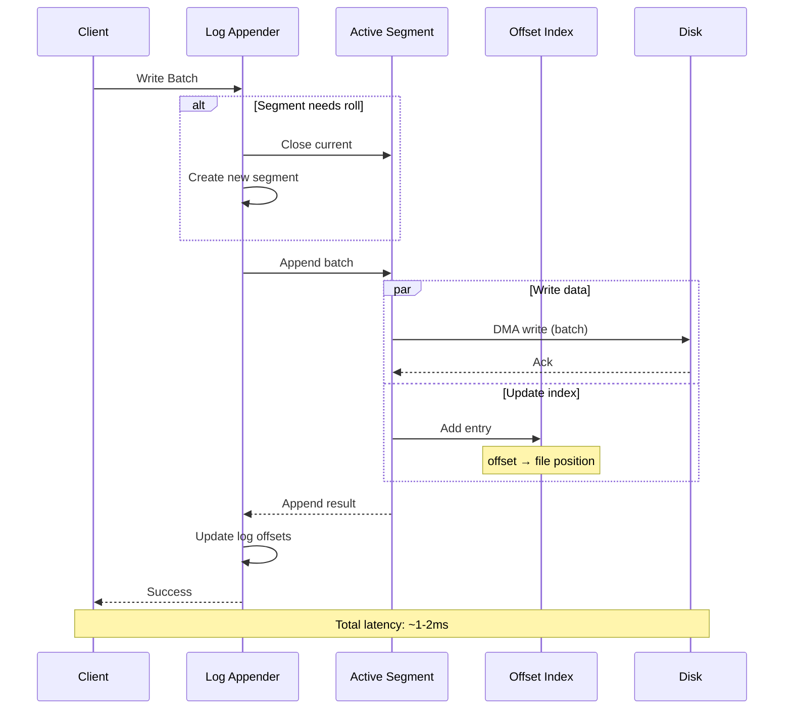
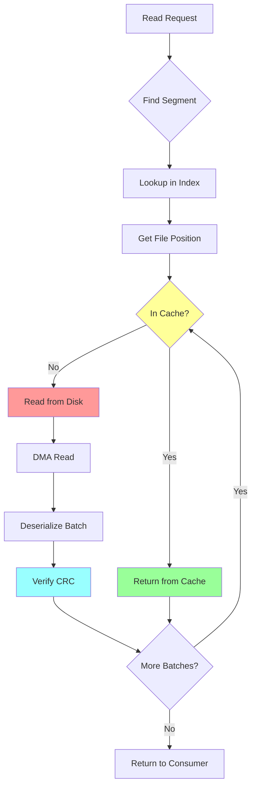

# Redpanda's Storage Engine: Building for Performance and Durability

**Part 3 of the Redpanda Deep Dive Technical Series**

*A comprehensive exploration of Redpanda's storage layer, from disk layout to read/write optimizations*

---

## Introduction

A streaming platform's storage engine is its foundation. It must handle high-throughput writes, low-latency reads, efficient compaction, and crash recovery—all while maintaining strict ordering and durability guarantees. Redpanda's storage layer achieves these goals through careful architectural choices and performance optimizations.

In this post, we'll examine Redpanda's storage engine, exploring its log-structured design, segment management, indexing strategies, and the critical path optimizations that enable industry-leading performance.

## Log-Structured Storage

Redpanda uses a log-structured storage model where data is always appended sequentially. This design offers several advantages for streaming workloads.

### The Log Abstraction

The core storage abstraction is the [`log`](src/v/storage/log.h:37) interface:

```cpp
class log {
public:
    // Write operations
    virtual log_appender make_appender(log_append_config) = 0;
    virtual ss::future<> flush() = 0;
    
    // Read operations
    virtual ss::future<model::record_batch_reader>
        make_reader(local_log_reader_config) = 0;
    
    // Maintenance
    virtual ss::future<> truncate(truncate_config) = 0;
    virtual ss::future<> truncate_prefix(truncate_prefix_config) = 0;
    virtual ss::future<> gc(gc_config) = 0;
    
    // Queries
    virtual storage::offset_stats offsets() const = 0;
    virtual std::optional<model::term_id> get_term(model::offset) const = 0;
    virtual ss::future<std::optional<timequery_result>>
        timequery(timequery_config) = 0;
    
    // Offset translation
    virtual model::offset_delta offset_delta(model::offset) const = 0;
    virtual model::offset from_log_offset(model::offset) const = 0;
    virtual model::offset to_log_offset(model::offset) const = 0;
};
```

### NTP Configuration

Each log is identified by an NTP (Namespace-Topic-Partition):

```cpp
class ntp_config {
    model::ntp _ntp;
    std::filesystem::path _base_directory;
    
    // Override settings
    struct default_overrides {
        std::optional<model::cleanup_policy_bitflags> cleanup_policy;
        std::optional<model::compression> compression;
        std::optional<size_t> segment_size;
        std::optional<std::chrono::milliseconds> retention_time;
        std::optional<size_t> retention_bytes;
    };
    
    default_overrides _overrides;
    
public:
    const model::ntp& ntp() const { return _ntp; }
    
    std::filesystem::path work_directory() const {
        return _base_directory / _ntp.path();
    }
};
```

### Segment Structure

Logs are divided into segments for management and retention:

```
partition-0/
├── 0-1-v1.log           # Segment: base_offset-term-version.log
├── 0-1-v1.log.index     # Offset index
├── 100000-1-v1.log
├── 100000-1-v1.log.index
├── 200000-2-v1.log      # Term changed to 2
├── 200000-2-v1.log.index
└── partition_manifest.json
```

Each segment contains:
- **Log file**: Record batches in Kafka wire format
- **Index file**: Offset → file position mapping
- **Optional**: Time index, transaction index

### Segment Class

```cpp
class segment {
    // File handles
    ss::file _data_file;
    ss::file _index_file;
    
    // Metadata
    model::offset _base_offset;
    model::term_id _term;
    size_t _size_bytes{0};
    
    // Index
    std::unique_ptr<offset_index> _index;
    
public:
    // Append batch to segment
    ss::future<append_result> append(model::record_batch batch) {
        // Serialize batch
        auto serialized = serialize_batch(batch);
        
        // Write to file
        auto pos = co_await _data_file.dma_write(
            _size_bytes,
            serialized.data(),
            serialized.size()
        );
        
        // Update index
        _index->append(
            batch.base_offset(),
            _size_bytes,
            batch.header().timestamp
        );
        
        _size_bytes += serialized.size();
        
        co_return append_result{
            .base_offset = batch.base_offset(),
            .last_offset = batch.last_offset(),
            .byte_size = serialized.size()
        };
    }
    
    // Read from segment
    ss::future<ss::input_stream<char>> 
    make_stream(model::offset start) {
        // Look up position in index
        auto pos = _index->find_nearest(start);
        
        // Create file stream from position
        co_return co_await make_file_input_stream(
            _data_file,
            pos.file_position
        );
    }
};
```

## Write Path

Let's trace a write through the storage layer.



### Log Appender

The write path starts with a log appender:

```cpp
class log_appender {
    ss::shared_ptr<storage::log> _log;
    segment* _active_segment;
    
public:
    ss::future<storage::append_result> 
    append(model::record_batch batch) {
        // Check if need to roll segment
        if (should_roll_segment(batch)) {
            co_await roll_segment();
        }
        
        // Append to active segment
        auto result = co_await _active_segment->append(std::move(batch));
        
        // Update log metadata
        _log->update_offsets(result);
        
        co_return result;
    }
    
private:
    bool should_roll_segment(const model::record_batch& batch) {
        // Roll if size exceeded
        if (_active_segment->size_bytes() + batch.size_bytes() 
            > _log->config().segment_size()) {
            return true;
        }
        
        // Roll if time exceeded
        auto age = clock::now() - _active_segment->create_time();
        if (age > _log->config().segment_ms()) {
            return true;
        }
        
        return false;
    }
    
    ss::future<> roll_segment() {
        // Close current segment
        co_await _active_segment->close();
        
        // Create new segment
        auto next_offset = _log->offsets().dirty_offset + model::offset(1);
        auto next_term = _raft->term();
        
        _active_segment = co_await _log->create_segment(
            next_offset,
            next_term
        );
    }
};
```

### Batch Format

Record batches use Kafka wire format:

```
Batch:
┌────────────────────────────────────┐
│  Base Offset          (8 bytes)    │
├────────────────────────────────────┤
│  Batch Length         (4 bytes)    │
├────────────────────────────────────┤
│  Partition Leader Epoch (4 bytes)  │
├────────────────────────────────────┤
│  Magic                (1 byte)     │
├────────────────────────────────────┤
│  CRC                  (4 bytes)    │
├────────────────────────────────────┤
│  Attributes           (2 bytes)    │
├────────────────────────────────────┤
│  Last Offset Delta    (4 bytes)    │
├────────────────────────────────────┤
│  First Timestamp      (8 bytes)    │
├────────────────────────────────────┤
│  Max Timestamp        (8 bytes)    │
├────────────────────────────────────┤
│  Producer ID          (8 bytes)    │
├────────────────────────────────────┤
│  Producer Epoch       (2 bytes)    │
├────────────────────────────────────┤
│  Base Sequence        (4 bytes)    │
├────────────────────────────────────┤
│  Record Count         (4 bytes)    │
├────────────────────────────────────┤
│  Records...                        │
└────────────────────────────────────┘
```

### Flush Strategies

Redpanda supports configurable flush behavior:

```cpp
enum class flush_after_append : uint8_t {
    never,     // Flush based on time/size thresholds
    always     // Fsync after every append
};

ss::future<> log::flush() {
    // Flush all dirty segments
    co_await ss::parallel_for_each(_segments, [](auto& seg) {
        return seg->flush();
    });
    
    // Fsync directory for durability
    co_await _base_directory.sync_directory();
}
```

### Direct I/O

Redpanda uses Direct I/O to bypass the kernel page cache:

```cpp
ss::file open_segment_file(std::filesystem::path path) {
    return ss::open_file_dma(
        path.string(),
        ss::open_flags::rw | ss::open_flags::create,
        ss::file_open_options{
            .extent_allocation_size_hint = 1_MiB,
            .sloppy_size = true
        }
    );
}
```

**Benefits**:
- Predictable performance (no page cache eviction)
- Direct control over memory usage
- Better I/O scheduling

**Tradeoffs**:
- Alignment requirements (512-byte or 4KB boundaries)
- Application must manage caching

## Read Path

Read performance is critical for consumer throughput and latency.



### Creating a Reader

```cpp
ss::future<model::record_batch_reader>
log::make_reader(local_log_reader_config cfg) {
    // Find starting segment
    auto seg_it = find_segment(cfg.start_offset);
    
    if (seg_it == _segments.end()) {
        co_return empty_reader();
    }
    
    // Create segment reader
    co_return make_segment_reader(
        seg_it,
        _segments.end(),
        cfg
    );
}
```

### Segment Reader

```cpp
class segment_reader {
    segment* _current_segment;
    segment_set::iterator _next_segment;
    segment_set::iterator _end;
    
    ss::input_stream<char> _stream;
    model::offset _current_offset;
    size_t _bytes_read{0};
    
    local_log_reader_config _config;
    
public:
    ss::future<model::record_batch_header> read_header() {
        // Read batch header
        auto header_bytes = co_await _stream.read_exactly(
            sizeof(model::record_batch_header)
        );
        
        co_return deserialize_header(header_bytes);
    }
    
    ss::future<model::record_batch> read_batch() {
        auto header = co_await read_header();
        
        // Read batch body
        auto body_size = header.size_bytes - sizeof(header);
        auto body_bytes = co_await _stream.read_exactly(body_size);
        
        // Check CRC
        verify_crc(header, body_bytes);
        
        // Deserialize records
        auto records = deserialize_records(body_bytes, header.record_count);
        
        co_return model::record_batch{
            header,
            std::move(records)
        };
    }
    
    ss::future<model::record_batch_reader::data_t> 
    read_batches() {
        model::record_batch_reader::data_t batches;
        
        while (!is_done()) {
            // Check if need to switch segments
            if (_stream.eof()) {
                if (_next_segment == _end) {
                    break;  // No more segments
                }
                
                co_await switch_to_next_segment();
            }
            
            // Read batch
            auto batch = co_await read_batch();
            
            // Apply filters
            if (should_include(batch)) {
                batches.push_back(std::move(batch));
                _bytes_read += batch.size_bytes();
            }
            
            _current_offset = batch.last_offset() + model::offset(1);
            
            // Check limits
            if (_bytes_read >= _config.max_bytes) {
                break;
            }
        }
        
        co_return batches;
    }
    
private:
    bool should_include(const model::record_batch& batch) {
        // Check offset range
        if (batch.last_offset() < _config.start_offset) {
            return false;
        }
        
        if (_config.max_offset 
            && batch.base_offset() > *_config.max_offset) {
            return false;
        }
        
        // Check type filter
        if (_config.type_filter 
            && !_config.type_filter->contains(batch.header().type)) {
            return false;
        }
        
        return true;
    }
};
```

### Batch Consumer Pattern

Redpanda uses the batch consumer pattern for streaming reads:

```cpp
class batch_consumer {
public:
    virtual ss::future<consume_result> 
    operator()(model::record_batch batch) = 0;
    
    virtual void end_of_stream() = 0;
};

enum class consume_result {
    accept_batch,    // Continue reading
    stop_parser      // Stop reading
};

// Example: Count records
class counting_consumer : public batch_consumer {
    size_t _count{0};
    
public:
    ss::future<consume_result> 
    operator()(model::record_batch batch) override {
        _count += batch.record_count();
        co_return consume_result::accept_batch;
    }
    
    void end_of_stream() override {}
    
    size_t count() const { return _count; }
};
```

## Indexing

Efficient random access requires indexing.

### Offset Index

The offset index maps logical offsets to file positions:

```cpp
class offset_index {
    struct entry {
        model::offset offset;
        uint64_t file_position;
        model::timestamp timestamp;
    };
    
    std::vector<entry> _entries;
    
public:
    void append(
        model::offset offset,
        uint64_t file_position,
        model::timestamp timestamp
    ) {
        _entries.push_back({offset, file_position, timestamp});
    }
    
    std::optional<entry> find_nearest(model::offset target) {
        // Binary search for largest offset <= target
        auto it = std::upper_bound(
            _entries.begin(),
            _entries.end(),
            target,
            [](model::offset off, const entry& e) {
                return off < e.offset;
            }
        );
        
        if (it == _entries.begin()) {
            return std::nullopt;
        }
        
        return *std::prev(it);
    }
    
    ss::future<> flush_to_disk(ss::file f) {
        // Serialize index entries
        iobuf buffer;
        for (auto& entry : _entries) {
            buffer.append(&entry, sizeof(entry));
        }
        
        // Write to file
        co_await f.dma_write(0, buffer.data(), buffer.size());
        co_await f.flush();
    }
};
```

### Time-Based Queries

The time index enables timestamp-based seeking:

```cpp
ss::future<std::optional<timequery_result>>
log::timequery(timequery_config cfg) {
    // Find segment containing timestamp
    for (auto& seg : _segments) {
        if (seg->max_timestamp() < cfg.time) {
            continue;  // Skip older segments
        }
        
        // Search within segment
        auto result = co_await seg->timequery(cfg.time);
        if (result) {
            co_return result;
        }
    }
    
    co_return std::nullopt;
}

ss::future<std::optional<timequery_result>>
segment::timequery(model::timestamp target) {
    // Binary search in time index
    auto entry = _time_index.find_nearest(target);
    
    if (!entry) {
        co_return std::nullopt;
    }
    
    // Scan forward from entry position
    auto stream = co_await make_stream_at(entry->file_position);
    
    while (true) {
        auto batch = co_await read_batch(stream);
        
        if (batch.header().max_timestamp >= target) {
            co_return timequery_result{
                .offset = batch.base_offset(),
                .timestamp = batch.header().first_timestamp
            };
        }
    }
}
```

## Offset Translation

Redpanda maintains both Kafka offsets (data) and Raft offsets (log).

### Why Offset Translation?

Certain record batches don't count toward Kafka offsets:
- Raft configuration records
- Transaction markers
- Offset translator snapshots

### Offset Translator

The [`offset_translator`](src/v/cloud_storage/offset_translation_layer.h:36) handles the mapping:

```cpp
class offset_translator {
    struct delta {
        model::offset raft_offset;
        model::offset_delta delta;  // Kafka offset = raft_offset - delta
    };
    
    std::vector<delta> _deltas;
    
public:
    // Translate Raft offset to Kafka offset
    model::offset from_log_offset(model::offset raft_offset) const {
        auto delta = offset_delta(raft_offset);
        return raft_offset - delta;
    }
    
    // Translate Kafka offset to Raft offset
    model::offset to_log_offset(model::offset kafka_offset) const {
        // Find delta at this position
        auto it = std::upper_bound(
            _deltas.begin(),
            _deltas.end(),
            kafka_offset,
            [](model::offset off, const delta& d) {
                return off < (d.raft_offset - d.delta);
            }
        );
        
        if (it == _deltas.begin()) {
            return kafka_offset;
        }
        
        auto& delta_entry = *std::prev(it);
        return kafka_offset + delta_entry.delta;
    }
    
    model::offset_delta offset_delta(model::offset raft_offset) const {
        // Find applicable delta
        auto it = std::upper_bound(
            _deltas.begin(),
            _deltas.end(),
            raft_offset,
            [](model::offset off, const delta& d) {
                return off < d.raft_offset;
            }
        );
        
        if (it == _deltas.begin()) {
            return model::offset_delta(0);
        }
        
        return std::prev(it)->delta;
    }
    
    // Record a new delta
    void add_delta(model::offset raft_offset, model::offset_delta delta) {
        // Only add if delta changed
        if (!_deltas.empty() && _deltas.back().delta == delta) {
            return;
        }
        
        _deltas.push_back({raft_offset, delta});
    }
};
```

### Example Translation

```
Raft Log:
  Offset 0: Data batch (10 records)
  Offset 10: Config change (1 record)  ← Gap created
  Offset 11: Data batch (5 records)
  Offset 16: Data batch (3 records)

Kafka Offsets:
  0-9: First data batch
  10-14: Second data batch (gap hidden)
  15-17: Third data batch

Delta Tracking:
  Raft offset 0-10: delta = 0
  Raft offset 11+: delta = 1  (one config record)
```

## Compaction

Compaction reclaims space by removing old or deleted records.

### Compaction Strategies

```cpp
enum class cleanup_policy_bitflags : uint8_t {
    none = 0,
    deletion = 1,      // Time/size-based deletion
    compaction = 2     // Key-based compaction
};
```

### Key-Based Compaction

For topics with `cleanup_policy=compact`:

```cpp
ss::future<> compact_segment(segment* seg) {
    // Build key → latest offset map
    absl::flat_hash_map<iobuf, model::offset> latest_offsets;
    
    auto reader = co_await seg->make_reader(/* all offsets */);
    
    while (auto batch = co_await reader.read_batch()) {
        for (auto& record : batch.records()) {
            if (record.key()) {
                latest_offsets[record.key()] = record.offset();
            }
        }
    }
    
    // Create new segment with only latest values
    auto compacted = co_await create_temp_segment();
    reader = co_await seg->make_reader(/* all offsets */);
    
    while (auto batch = co_await reader.read_batch()) {
        model::record_batch new_batch;
        
        for (auto& record : batch.records()) {
            // Keep if it's the latest for this key
            if (!record.key() 
                || latest_offsets[record.key()] == record.offset()) {
                new_batch.add_record(record);
            }
        }
        
        if (!new_batch.empty()) {
            co_await compacted->append(new_batch);
        }
    }
    
    // Replace old segment with compacted one
    co_await replace_segment(seg, compacted);
}
```

### Sliding Window Compaction

Redpanda implements sliding window compaction for better recency bias:

```cpp
class sliding_window_compactor {
    std::chrono::milliseconds _window_size;
    
public:
    ss::future<> compact_with_window(segment* seg) {
        auto now = model::timestamp::now();
        auto window_start = now - _window_size;
        
        // Split into windows
        auto windows = split_into_windows(seg, _window_size);
        
        // Compact each window independently
        for (auto& window : windows) {
            co_await compact_window(window);
        }
    }
    
private:
    ss::future<> compact_window(segment_window window) {
        // Only keep latest record per key within this window
        absl::flat_hash_map<iobuf, record> latest_in_window;
        
        for (auto& batch : window.batches) {
            for (auto& record : batch.records()) {
                if (record.timestamp() >= window.start_time) {
                    latest_in_window[record.key()] = record;
                }
            }
        }
        
        // Write compacted window
        co_await write_compacted_batches(latest_in_window.values());
    }
};
```

## Crash Recovery

Redpanda must recover correctly after crashes.

### Recovery Process

```cpp
ss::future<> log::start(
    std::optional<truncate_prefix_config> truncate_cfg,
    ss::abort_source& as
) {
    // Discover segments on disk
    auto segment_paths = co_await list_segments(_config.work_directory());
    
    // Recover each segment
    for (auto& path : segment_paths) {
        auto seg = co_await recover_segment(path);
        _segments.insert(std::move(seg));
    }
    
    // Truncate if requested (snapshot installation)
    if (truncate_cfg) {
        co_await truncate_prefix(*truncate_cfg);
    }
    
    // Validate log consistency
    validate_log_consistency();
    
    // Recover indices
    co_await rebuild_indices();
}

ss::future<ss::shared_ptr<segment>> 
log::recover_segment(std::filesystem::path path) {
    auto file = co_await ss::open_file_dma(path.string());
    
    // Parse filename for metadata
    auto [base_offset, term] = parse_segment_filename(path);
    
    auto seg = ss::make_shared<segment>(
        base_offset,
        term,
        std::move(file)
    );
    
    // Recover index
    auto index_path = path.string() + \".index\";
    if (co_await file_exists(index_path)) {
        seg->load_index(index_path);
    } else {
        co_await seg->rebuild_index();
    }
    
    co_return seg;
}
```

### Corruption Detection

```cpp
void segment::verify_batch_integrity(const model::record_batch& batch) {
    // Verify CRC
    auto computed_crc = crc::crc32c(batch.data());
    if (computed_crc != batch.header().crc) {
        throw std::runtime_error(fmt::format(
            \"Batch CRC mismatch at offset {}: expected {}, got {}\",
            batch.base_offset(),
            batch.header().crc,
            computed_crc
        ));
    }
    
    // Verify offset monotonicity
    if (!_batches.empty()) {
        auto& last = _batches.back();
        if (batch.base_offset() != last.last_offset() + model::offset(1)) {
            throw std::runtime_error(fmt::format(
                \"Offset gap detected: last_offset={}, next_base={}\",
                last.last_offset(),
                batch.base_offset()
            ));
        }
    }
}
```

## Retention and Garbage Collection

Logs must be pruned to reclaim disk space.

### Retention Policies

```cpp
struct gc_config {
    // Time-based retention
    std::optional<std::chrono::milliseconds> retention_time;
    
    // Size-based retention
    std::optional<size_t> retention_bytes;
    
    // Cloud storage offset (don't delete what's not uploaded)
    model::offset cloud_gc_offset;
};

ss::future<> log::gc(gc_config cfg) {
    auto retention_offset = calculate_retention_offset(cfg);
    
    if (!retention_offset) {
        co_return;  // Nothing to delete
    }
    
    // Find segments to delete
    std::vector<ss::shared_ptr<segment>> to_delete;
    
    for (auto& seg : _segments) {
        if (seg->max_offset() < *retention_offset) {
            to_delete.push_back(seg);
        } else {
            break;  // Segments are sorted
        }
    }
    
    // Delete segments
    for (auto& seg : to_delete) {
        co_await seg->close();
        co_await seg->remove();
        _segments.erase(seg);
    }
}

std::optional<model::offset> 
log::calculate_retention_offset(gc_config cfg) {
    std::optional<model::offset> time_retention;
    std::optional<model::offset> size_retention;
    
    // Time-based retention
    if (cfg.retention_time) {
        auto cutoff = model::timestamp::now() - *cfg.retention_time;
        
        for (auto& seg : _segments) {
            if (seg->max_timestamp() >= cutoff) {
                time_retention = seg->base_offset();
                break;
            }
        }
    }
    
    // Size-based retention
    if (cfg.retention_bytes) {
        size_t total_size = 0;
        
        // Count from newest to oldest
        for (auto it = _segments.rbegin(); it != _segments.rend(); ++it) {
            total_size += (*it)->size_bytes();
            
            if (total_size > *cfg.retention_bytes) {
                size_retention = (*it)->max_offset() + model::offset(1);
                break;
            }
        }
    }
    
    // Take minimum (most conservative)
    if (time_retention && size_retention) {
        return std::min(*time_retention, *size_retention);
    }
    return time_retention.value_or(size_retention);
}
```

## Performance Optimizations

### Batch Caching

Frequently accessed batches are cached in memory:

```cpp
class batch_cache {
    struct cache_entry {
        model::record_batch batch;
        clock_type::time_point last_access;
    };
    
    lru_cache<model::offset, cache_entry> _cache;
    
public:
    std::optional<model::record_batch> 
    get(model::offset offset) {
        auto it = _cache.find(offset);
        if (it != _cache.end()) {
            it->second.last_access = clock_type::now();
            return it->second.batch.copy();
        }
        return std::nullopt;
    }
    
    void put(model::offset offset, model::record_batch batch) {
        _cache.insert_or_assign(offset, cache_entry{
            .batch = batch.share(),
            .last_access = clock_type::now()
        });
    }
};
```

### Prefetching

Sequential reads benefit from prefetching:

```cpp
class prefetching_reader {
    static constexpr size_t prefetch_distance = 4_MiB;
    
    ss::future<> start_prefetch() {
        auto prefetch_offset = _current_offset + prefetch_distance;
        
        // Read ahead asynchronously
        _prefetch_future = _segment->read_range(
            _current_offset + model::offset(1),
            prefetch_offset
        ).then([this](auto data) {
            _prefetch_buffer = std::move(data);
        });
    }
    
    ss::future<model::record_batch> read_next() {
        // Check prefetch buffer first
        if (_prefetch_buffer && !_prefetch_buffer->empty()) {
            auto batch = std::move(_prefetch_buffer->front());
            _prefetch_buffer->pop_front();
            co_return batch;
        }
        
        // Wait for prefetch
        if (_prefetch_future) {
            co_await std::move(*_prefetch_future);
            _prefetch_future.reset();
        }
        
        // Read from disk
        co_return co_await _segment->read_batch(_current_offset);
    }
};
```

### Zero-Copy Reads

Where possible, avoid copying data:

```cpp
ss::future<ss::scattered_message<char>>
segment::read_as_scattered(offset_range range) {
    ss::scattered_message<char> msg;
    
    // Find file positions
    auto start_pos = _index->find_nearest(range.begin)->file_position;
    auto end_pos = _index->find_nearest(range.end)->file_position;
    
    // Read directly into scattered message
    auto size = end_pos - start_pos;
    auto buffer = co_await _data_file.dma_read_exactly<char>(
        start_pos,
        size
    );
    
    // Add to message without copying
    msg.append_static(buffer.get(), size);
    
    co_return msg;
}
```

## Compression

Redpanda supports multiple compression algorithms.

### Compression Types

```cpp
enum class compression : int8_t {
    none = 0,
    gzip = 1,
    snappy = 2,
    lz4 = 3,
    zstd = 4
};
```

### Compression in Write Path

```cpp
model::record_batch compress_batch(
    model::record_batch batch,
    compression codec
) {
    if (codec == compression::none) {
        return batch;
    }
    
    // Serialize records
    iobuf records_data;
    for (auto& record : batch) {
        serialize_record(records_data, record);
    }
    
    // Compress
    iobuf compressed;
    switch (codec) {
    case compression::zstd:
        compressed = compress_zstd(records_data);
        break;
    case compression::lz4:
        compressed = compress_lz4(records_data);
        break;
    // ... other codecs
    }
    
    // Create compressed batch
    batch.set_compression(codec);
    batch.set_records(std::move(compressed));
    
    return batch;
}
```

### Decompression in Read Path

```cpp
ss::future<model::record_batch> 
decompress_batch(model::record_batch batch) {
    if (batch.header().attrs.compression() == compression::none) {
        co_return batch;
    }
    
    // Decompress data
    iobuf decompressed;
    switch (batch.header().attrs.compression()) {
    case compression::zstd:
        decompressed = co_await decompress_zstd(batch.data());
        break;
    case compression::lz4:
        decompressed = co_await decompress_lz4(batch.data());
        break;
    }
    
    // Parse records
    auto records = parse_records(decompressed, batch.record_count());
    
    batch.set_records(std::move(records));
    batch.set_compression(compression::none);
    
    co_return batch;
}
```

## Production Considerations

### Monitoring Storage Health

```cpp
class storage_probe {
public:
    void record_write_latency(std::chrono::microseconds latency) {
        _write_latency_hist.record(latency.count());
    }
    
    void record_read_latency(std::chrono::microseconds latency) {
        _read_latency_hist.record(latency.count());
    }
    
    void record_segment_roll() {
        _segments_rolled++;
    }
    
    void record_compaction(size_t bytes_before, size_t bytes_after) {
        _bytes_compacted += (bytes_before - bytes_after);
        _compactions_run++;
    }
    
    // Metrics
    uint64_t total_bytes_written() const { return _bytes_written; }
    uint64_t total_bytes_read() const { return _bytes_read; }
    double compression_ratio() const {
        return static_cast<double>(_bytes_compacted) / _bytes_written;
    }
    
private:
    log_hist_internal _write_latency_hist;
    log_hist_internal _read_latency_hist;
    uint64_t _bytes_written{0};
    uint64_t _bytes_read{0};
    uint64_t _bytes_compacted{0};
    uint64_t _segments_rolled{0};
    uint64_t _compactions_run{0};
};
```

### Disk Space Management

```cpp
struct usage_report {
    size_t total_size;
    size_t reclaimable_size;
    model::offset retention_offset;
};

ss::future<usage_report> log::disk_usage(gc_config cfg) {
    size_t total = 0;
    size_t reclaimable = 0;
    
    auto retention_offset = calculate_retention_offset(cfg);
    
    for (auto& seg : _segments) {
        total += seg->size_bytes();
        
        if (retention_offset && seg->max_offset() < *retention_offset) {
            reclaimable += seg->size_bytes();
        }
    }
    
    co_return usage_report{
        .total_size = total,
        .reclaimable_size = reclaimable,
        .retention_offset = retention_offset.value_or(model::offset{})
    };
}
```

## Performance Characteristics

### Storage Performance Metrics

| Operation | Latency (p50) | Latency (p99) | Throughput | Notes |
|-----------|---------------|---------------|------------|-------|
| **Sequential Write** | ~500μs | ~1.5ms | 4GB+/sec | NVMe SSD, no fsync |
| **Write + fsync** | ~1ms | ~2ms | 1GB/sec | Durability guaranteed |
| **Sequential Read** | ~300μs | ~1ms | 6GB+/sec | Cache miss |
| **Random Read** | ~800μs | ~2ms | 500K ops/sec | Index lookup |
| **Segment Roll** | ~2ms | ~5ms | N/A | Happens infrequently |
| **Index Lookup** | ~50μs | ~200μs | 2M+ ops/sec | In-memory search |

### Compression Performance

| Codec | Compression Ratio | Encode Speed | Decode Speed | CPU Overhead | Use Case |
|-------|-------------------|--------------|--------------|--------------|----------|
| **None** | 1.0x | N/A | N/A | 0% | Maximum speed |
| **LZ4** | 2.5x | 500 MB/s | 2 GB/s | Low (~5%) | Balanced |
| **Snappy** | 2.0x | 400 MB/s | 1.5 GB/s | Low (~6%) | Compatible |
| **Zstd (level 3)** | 3.5x | 200 MB/s | 600 MB/s | Medium (~10%) | Best ratio |
| **Gzip** | 3.0x | 100 MB/s | 300 MB/s | High (~15%) | Legacy |

*Recommended: LZ4 for most workloads, Zstd for archival*

### Disk I/O Patterns

| Workload | IOPS | Throughput | Access Pattern | Optimization |
|----------|------|------------|----------------|--------------|
| **Write-Heavy** | 50K | 3 GB/s | Sequential | Large batches, delayed fsync |
| **Read-Heavy** | 100K | 4 GB/s | Sequential | Prefetching, caching |
| **Mixed** | 75K | 2.5 GB/s | Mixed | Separate read/write queues |
| **Compaction** | 30K | 1 GB/s | Sequential | Background, throttled |

### Storage Overhead

| Component | Per Partition | Per Segment | Notes |
|-----------|---------------|-------------|-------|
| **Segment Metadata** | ~50KB | ~2KB | File handles, index |
| **Index** | ~10KB/GB data | ~500 bytes/batch | Sparse index (1/4KB) |
| **Offset Translator** | ~5KB | N/A | Delta tracking |
| **Batch Cache** | ~100MB (shared) | N/A | Configurable size |
| **Total** | ~100KB | ~3KB | Scales linearly |

## Troubleshooting Storage Issues

### Issue 1: High Write Latency

**Symptoms**:
- p99 write latency > 10ms
- Slow producer throughput
- Disk I/O saturation

**Diagnostic Steps**:
```bash
# Check disk I/O stats
iostat -x 1 10

# View storage metrics
curl localhost:9644/metrics | grep storage_

# Check segment roll frequency
curl localhost:9644/metrics | grep log_segments_created

# Monitor fsync latency
curl localhost:9644/metrics | grep log_flushed_bytes
```

**Common Causes & Solutions**:

1. **Slow disk**
   - *Cause*: HDD or poor SSD performance
   - *Solution*: Use NVMe SSD or run iotune
   ```bash
   # Run iotune to optimize for your disk
   rpk iotune --out /etc/redpanda/io-config.yaml --duration 10m
   
   # Apply configuration
   redpanda start --io-properties-file /etc/redpanda/io-config.yaml
   ```

2. **Excessive fsync**
   - *Cause*: Flushing too frequently
   - *Solution*: Increase flush interval
   ```yaml
   # /etc/redpanda/redpanda.yaml
   redpanda:
     log_flush_interval_ms: 100  # Increase from default
     raft_replica_max_pending_flush_bytes: 262144  # Batch more
   ```

3. **Small batches**
   - *Cause*: Too many small writes
   - *Solution*: Enable producer batching
   ```java
   // Producer configuration
   props.put("linger.ms", 10);  // Wait up to 10ms to batch
   props.put("batch.size", 32768);  // 32KB batches
   ```

### Issue 2: High Disk Usage

**Symptoms**:
- Disk space filling up
- Retention not working
- Old segments not deleted

**Diagnostic Steps**:
```bash
# Check disk usage per topic
du -sh /var/lib/redpanda/data/*

# View retention settings
rpk topic describe <topic> | grep retention

# Check GC metrics
curl localhost:9644/metrics | grep log_segments_removed

# List segments
ls -lh /var/lib/redpanda/data/<namespace>/<topic>/*/*.log
```

**Solutions**:

1. **Configure retention**
   ```bash
   # Time-based retention (7 days)
   rpk topic alter-config <topic> --set retention.ms=604800000
   
   # Size-based retention (100GB)
   rpk topic alter-config <topic> --set retention.bytes=107374182400
   
   # Enable compaction for event sourcing
   rpk topic alter-config <topic> --set cleanup.policy=compact
   ```

2. **Enable tiered storage**
   ```yaml
   # /etc/redpanda/redpanda.yaml
   redpanda:
     cloud_storage_enabled: true
     cloud_storage_enable_remote_read: true
     cloud_storage_enable_remote_write: true
   ```

3. **Trigger manual GC**
   ```bash
   # Force garbage collection
   curl -X POST localhost:9644/v1/partitions/<namespace>/<topic>/<partition>/trigger_gc
   ```

### Issue 3: Slow Consumer Reads

**Symptoms**:
- High fetch latency
- Low consumer throughput
- Consumer lag growing

**Diagnostic Steps**:
```bash
# Check read latency
curl localhost:9644/metrics | grep storage_read_latency

# View cache hit rate
curl localhost:9644/metrics | grep batch_cache_hit_rate

# Monitor disk read IOPS
iostat -x 1

# Check consumer lag
rpk group describe <group-id>
```

**Solutions**:

1. **Increase batch cache**
   ```yaml
   # /etc/redpanda/redpanda.yaml
   redpanda:
     batch_cache_max_size: 1073741824  # 1GB cache
   ```

2. **Optimize read-ahead**
   ```yaml
   redpanda:
     storage_read_buffer_size: 131072  # 128KB read buffer
     storage_read_readahead_count: 4  # Prefetch 4 batches
   ```

3. **Use tiered storage for historical data**
   ```bash
   # Configure retention with tiered storage
   rpk topic alter-config <topic> \
     --set retention.local.target.bytes=10737418240  # Keep 10GB local
   ```

### Issue 4: Index Corruption

**Symptoms**:
- "Index corruption detected" errors
- Read failures at specific offsets
- Segment recovery failures

**Diagnostic Steps**:
```bash
# Check for corruption
journalctl -u redpanda | grep -i "corruption\\|index"

# Verify segment integrity
curl localhost:9644/v1/partitions/<namespace>/<topic>/<partition>/segments

# List index files
ls -lh /var/lib/redpanda/data/*/*/*/*.index
```

**Solutions**:

1. **Rebuild indices**
   ```bash
   # Stop Redpanda
   systemctl stop redpanda
   
   # Remove corrupted index files
   rm /var/lib/redpanda/data/<namespace>/<topic>/*/*.index
   
   # Start Redpanda (will rebuild indices)
   systemctl start redpanda
   ```

2. **Verify and repair**
   ```bash
   # Use rpk to verify partition
   rpk cluster partitions verify <namespace> <topic> <partition>
   ```

### Issue 5: Compaction Not Running

**Symptoms**:
- Disk usage growing on compacted topics
- Old records not being removed
- Low compaction_ratio metric

**Diagnostic Steps**:
```bash
# Check compaction metrics
curl localhost:9644/metrics | grep compaction

# View topic cleanup policy
rpk topic describe <topic> | grep cleanup.policy

# Check compaction lag
curl localhost:9644/metrics | grep log_compaction_lag_bytes
```

**Solutions**:

1. **Verify compaction enabled**
   ```bash
   rpk topic alter-config <topic> --set cleanup.policy=compact
   ```

2. **Adjust compaction thresholds**
   ```yaml
   # /etc/redpanda/redpanda.yaml
   redpanda:
     compaction_ctrl_min_shares: 50  # CPU allocation
     compaction_ctrl_max_shares: 1000
     log_compaction_interval_ms: 60000  # Run every minute
   ```

3. **Trigger manual compaction**
   ```bash
   curl -X POST localhost:9644/v1/partitions/<namespace>/<topic>/<partition>/trigger_compaction
   ```

### Debugging Tools

**Segment Inspection**:
```bash
# List all segments for partition
ls -lh /var/lib/redpanda/data/<namespace>/<topic>/<partition>/

# View segment metadata
curl localhost:9644/v1/partitions/<namespace>/<topic>/<partition>/segments

# Check offset ranges
rpk topic describe <topic> --detailed
```

**Performance Profiling**:
```bash
# Monitor real-time I/O
iotop -p $(pgrep redpanda)

# Track system calls
strace -p $(pgrep redpanda) -e trace=file,desc

# Profile with perf
perf record -g -p $(pgrep redpanda)
perf report
```

**Metrics to Monitor**:
```bash
# Key storage metrics
curl localhost:9644/metrics | grep -E \
  "(storage_write_latency|storage_read_latency|log_segments_created|batch_cache_hit_rate)"

# Set up alerts for:
# - Write latency p99 > 10ms
# - Disk usage > 80%
# - Cache hit rate < 50%
# - Compaction lag > 10GB
```

### Performance Tuning Checklist

- [ ] **Run iotune**: Optimize for your specific disk hardware
- [ ] **Configure Retention**: Set appropriate time/size limits
- [ ] **Enable Compression**: Use LZ4 for most workloads
- [ ] **Tune Segment Size**: 128MB-1GB based on partition count
- [ ] **Batch Cache Size**: Allocate 10-20% of RAM
- [ ] **Read-Ahead**: Enable prefetching for sequential reads
- [ ] **Compaction**: Configure for compacted topics
- [ ] **Tiered Storage**: Enable for long-term retention
- [ ] **Filesystem**: Use XFS with noatime mount option
- [ ] **Monitor Metrics**: Track latency, throughput, disk usage

## Conclusion

Redpanda's storage engine demonstrates how careful architectural choices and optimization can deliver both high performance and strong durability guarantees:

**Key Design Principles**:
1. **Log-Structured**: Sequential writes for maximum throughput
2. **Indexed**: Fast random access without sacrificing write performance
3. **Offset Translation**: Clean separation of Raft and Kafka offsets
4. **Configurable Durability**: Match guarantees to requirements
5. **Efficient Compaction**: Reclaim space without impacting performance

**Performance Highlights**:
- Sub-millisecond write latency
- Multi-GB/sec throughput per node
- Efficient compression and compaction
- Fast crash recovery

In the next post, we'll explore how Redpanda extends this storage foundation to the cloud with its tiered storage architecture.

---

## Further Reading

- [Source: Storage Log Interface](src/v/storage/log.h)
- [Source: Offset Translation](src/v/cloud_storage/offset_translation_layer.h)
- [Kafka Log Format Specification](https://kafka.apache.org/documentation/#recordbatch)

*Next: Part 4 - Cloud-Native Tiered Storage*