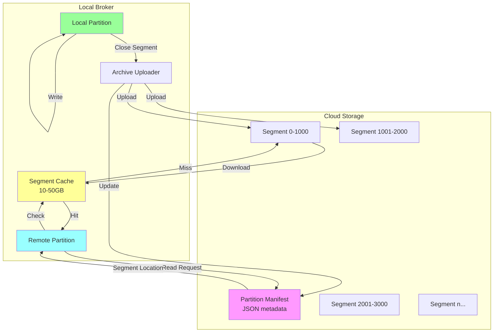
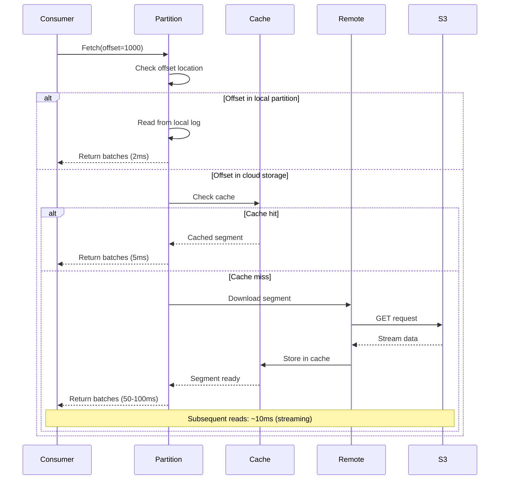

# Cloud-Native from Day One: Redpanda's Tiered Storage Architecture

**Part 4 of the Redpanda Deep Dive Technical Series**

*An in-depth exploration of how Redpanda seamlessly integrates cloud object storage for infinite retention at minimal cost*

---

## Introduction

Traditional streaming platforms face a fundamental constraint: disk capacity limits retention. Organizations must choose between expensive local storage or complex data archival pipelines. Redpanda's tiered storage eliminates this tradeoff by seamlessly integrating cloud object storage (S3, GCS, Azure Blob Storage) as a first-class storage tier.

This isn't bolted-on archival—it's a carefully architected system that makes cloud storage feel like local disk, with transparent reads, intelligent caching, and automatic lifecycle management. In this post, we'll explore the architecture that makes this possible.

## The Tiered Storage Vision

### The Problem

**Traditional Approach**:
```
┌─────────────────────────────────────┐
│         Kafka Broker                │
│                                     │
│  Retention: 7 days (disk limit)    │
│                                     │
│  ┌──────────────────────────────┐  │
│  │   Local Disk (expensive)     │  │
│  │   - Fast but limited         │  │
│  │   - $200-400/TB/month        │  │
│  └──────────────────────────────┘  │
└─────────────────────────────────────┘

External Archival (if needed):
- Kafka Connect
- Separate archival service
- Complex data pipeline
- No direct querying
```

**Redpanda's Approach**:
```
┌─────────────────────────────────────┐
│       Redpanda Broker               │
│                                     │
│  Retention: Infinite                │
│                                     │
│  ┌──────────────────────────────┐  │
│  │   Local Cache                │  │
│  │   - Hot data                 │  │
│  │   - Configurable size        │  │
│  └──────────┬───────────────────┘  │
└────────────┼────────────────────────┘
             │
             ▼
┌─────────────────────────────────────┐
│    Object Storage (S3/GCS/Azure)    │
│    - Unlimited retention            │
│    - $20-40/TB/month                │
│    - Transparent to clients         │
└─────────────────────────────────────┘
```

### Benefits

1. **Cost**: 10x reduction in storage costs
2. **Retention**: Infinite retention without disk constraints
3. **Simplicity**: No external archival pipelines
4. **Performance**: Intelligent caching maintains low latency
5. **Disaster Recovery**: Cloud storage serves as backup

## Architecture Overview

Redpanda's tiered storage consists of several key components:



```cpp
// Core abstractions
namespace cloud_storage {

class remote;                    // Cloud storage operations
class remote_partition;          // Read from cloud
class partition_manifest;        // Segment metadata
class materialized_resources;    // Cache management
class async_manifest_view;       // Manifest materialization

} // namespace cloud_storage
```

## Cloud Storage Client

The [`remote`](src/v/cloud_storage/remote.h:127) class abstracts cloud storage operations:

```cpp
class remote : public cloud_storage_api {
public:
    // Upload segment
    ss::future<upload_result> upload_segment(
        cloud_storage_clients::bucket_name bucket,
        const remote_segment_path& path,
        const cloud_storage_clients::object_key& key,
        ss::input_stream<char> stream
    ) {
        // Add metadata
        auto metadata = build_segment_metadata();
        
        // Upload to cloud
        auto result = co_await _client->put_object(
            bucket,
            key,
            stream.size(),
            std::move(stream),
            metadata
        );
        
        _probe->uploaded_bytes(result.size_bytes);
        
        co_return result;
    }
    
    // Download segment
    ss::future<download_result> download_segment(
        cloud_storage_clients::bucket_name bucket,
        const remote_segment_path& path,
        const cloud_storage_clients::object_key& key,
        ss::output_stream<char> stream
    ) {
        auto result = co_await _client->get_object(
            bucket,
            key,
            [stream = std::move(stream)](auto chunk) mutable {
                return stream.write(std::move(chunk));
            }
        );
        
        co_await stream.flush();
        co_await stream.close();
        
        _probe->downloaded_bytes(result.size_bytes);
        
        co_return result;
    }
    
    // List objects
    ss::future<list_result> list_objects(
        cloud_storage_clients::bucket_name bucket,
        std::optional<cloud_storage_clients::object_key> prefix
    );
    
    // Delete object
    ss::future<> delete_object(
        cloud_storage_clients::bucket_name bucket,
        const cloud_storage_clients::object_key& key
    );

private:
    std::unique_ptr<cloud_storage_clients::client> _client;
    std::unique_ptr<remote_probe> _probe;
};
```

### Multi-Cloud Support

Redpanda supports multiple cloud providers:

```cpp
// S3 client
class s3_client : public client {
    ss::future<upload_result> put_object(
        bucket_name bucket,
        object_key key,
        size_t payload_size,
        ss::input_stream<char> body,
        object_metadata metadata
    ) override {
        // Build S3 request
        auto request = _request_creator.make_put_object_request(
            bucket, key, payload_size, metadata
        );
        
        // Sign request (AWS Signature V4)
        _credentials.apply_to_request(request);
        
        // Send HTTP request
        co_return co_await _http_client.request(
            std::move(request),
            std::move(body)
        );
    }
};

// Azure Blob Storage client
class abs_client : public client {
    ss::future<upload_result> put_object(
        bucket_name container,
        object_key blob,
        size_t payload_size,
        ss::input_stream<char> body,
        object_metadata metadata
    ) override {
        // Build ABS request
        auto request = _request_creator.make_put_blob_request(
            container, blob, payload_size, metadata
        );
        
        // Sign request (Shared Key or OAuth)
        _credentials.apply_to_request(request);
        
        co_return co_await _http_client.request(
            std::move(request),
            std::move(body)
        );
    }
};
```

## Partition Manifest

The [`partition_manifest`](src/v/cloud_storage/partition_manifest.h:67) tracks which segments exist in cloud storage:

```cpp
class partition_manifest : public base_manifest {
public:
    struct segment_meta {
        model::offset base_offset;
        model::offset committed_offset;
        model::offset delta_offset;  // For offset translation
        
        size_t size_bytes;
        model::timestamp base_timestamp;
        model::timestamp max_timestamp;
        
        bool is_compacted;
        segment_name_format segment_name_format;
    };
    
    // Add segment to manifest
    void add_segment(segment_meta meta) {
        auto key = meta.base_offset;
        _segments[key] = std::move(meta);
    }
    
    // Remove segment from manifest
    void delete_segment(model::offset base_offset) {
        _segments.erase(base_offset);
    }
    
    // Find segment containing offset
    std::optional<segment_meta> 
    get_segment_containing(model::offset offset) const {
        auto it = _segments.upper_bound(offset);
        if (it == _segments.begin()) {
            return std::nullopt;
        }
        
        auto& seg = *std::prev(it);
        if (offset <= seg.second.committed_offset) {
            return seg.second;
        }
        
        return std::nullopt;
    }
    
    // Serialize to JSON
    ss::future<iobuf> serialize() const {
        json::Document doc;
        doc.SetObject();
        
        // Add metadata
        doc.AddMember("version", _version, doc.GetAllocator());
        doc.AddMember("namespace", _ntp.ns(), doc.GetAllocator());
        doc.AddMember("topic", _ntp.tp.topic(), doc.GetAllocator());
        doc.AddMember("partition", _ntp.tp.partition(), doc.GetAllocator());
        
        // Add segments
        json::Value segments(json::kObjectType);
        for (auto& [offset, meta] : _segments) {
            json::Value seg_obj(json::kObjectType);
            seg_obj.AddMember("committed_offset", meta.committed_offset(), ...);
            seg_obj.AddMember("size_bytes", meta.size_bytes, ...);
            // ... more fields
            
            segments.AddMember(std::to_string(offset), seg_obj, ...);
        }
        doc.AddMember("segments", segments, doc.GetAllocator());
        
        // Serialize to buffer
        co_return json_to_iobuf(doc);
    }
    
private:
    model::ntp _ntp;
    absl::btree_map<model::offset, segment_meta> _segments;
    int _version{1};
};
```

### Spillover Manifests

For partitions with many segments, Redpanda uses spillover manifests:

```cpp
class spillover_manifest : public partition_manifest {
    // Main manifest references spillover manifests
    struct spillover_manifest_path_components {
        model::offset base_offset;
        model::offset committed_offset;
        ss::sstring path;
    };
    
    std::vector<spillover_manifest_path_components> _spillover_manifests;
    
    // Split large manifest into chunks
    ss::future<> create_spillover_if_needed() {
        if (_segments.size() < config::max_segments_per_manifest()) {
            co_return;
        }
        
        // Extract oldest segments into spillover
        auto spillover_size = config::spillover_manifest_size();
        partition_manifest spillover;
        
        auto it = _segments.begin();
        for (size_t i = 0; i < spillover_size; ++i, ++it) {
            spillover.add_segment(it->second);
        }
        
        // Upload spillover manifest
        auto path = make_spillover_path(
            spillover.first_offset(),
            spillover.last_offset()
        );
        
        co_await upload_manifest(path, spillover);
        
        // Remove from main manifest
        _segments.erase(_segments.begin(), it);
        
        // Track spillover
        _spillover_manifests.push_back({
            .base_offset = spillover.first_offset(),
            .committed_offset = spillover.last_offset(),
            .path = path
        });
    }
};
```

## Remote Partition

The [`remote_partition`](src/v/cloud_storage/remote_partition.h:49) enables reading from cloud storage:

```cpp
class remote_partition 
    : public ss::enable_shared_from_this<remote_partition> {
    
    model::ntp _ntp;
    ss::shared_ptr<remote> _cloud_api;
    ss::shared_ptr<partition_manifest> _manifest;
    ss::lw_shared_ptr<materialized_resources> _resources;
    
public:
    // Create reader that transparently reads from cloud
    ss::future<model::record_batch_reader> 
    make_reader(cloud_log_reader_config cfg) {
        // Materialize manifest if needed
        if (!_manifest) {
            _manifest = co_await download_manifest();
        }
        
        // Find segments covering requested range
        auto segments = find_segments(
            cfg.start_offset,
            cfg.max_offset
        );
        
        // Create reader chain
        co_return make_remote_segment_reader(
            std::move(segments),
            cfg
        );
    }
    
private:
    std::vector<segment_meta> find_segments(
        model::offset start,
        std::optional<model::offset> end
    ) {
        std::vector<segment_meta> result;
        
        for (auto& [base_offset, meta] : _manifest->segments()) {
            // Check if segment overlaps range
            if (meta.committed_offset >= start) {
                if (!end || meta.base_offset <= *end) {
                    result.push_back(meta);
                }
            }
        }
        
        return result;
    }
};
```

### Remote Segment Reader

```cpp
class remote_segment_batch_reader {
    ss::shared_ptr<remote_segment> _segment;
    model::offset _current_offset;
    size_t _bytes_read{0};
    cloud_log_reader_config _config;
    
public:
    ss::future<model::record_batch_reader::data_t> 
    read_some() {
        model::record_batch_reader::data_t batches;
        
        while (_bytes_read < _config.max_bytes 
               && _current_offset <= _segment->max_offset()) {
            
            // Read batch from remote segment
            auto batch = co_await _segment->read_batch(
                _current_offset
            );
            
            batches.push_back(std::move(batch));
            _bytes_read += batch.size_bytes();
            _current_offset = batch.last_offset() + model::offset(1);
        }
        
        co_return batches;
    }
};
```

## Segment Chunking

For large segments, Redpanda uses chunk-based downloading:

### Chunk Architecture

```cpp
struct segment_chunk {
    chunk_state current_state;
    std::optional<ss::file> data_file;
    ss::gate gate;
    
    enum class chunk_state {
        not_available,      // Not downloaded
        download_in_progress,
        hydrated,          // Available in cache
        offloaded          // Evicted from cache
    };
};

class segment_chunks {
    // Divide segment into chunks
    static constexpr size_t chunk_size = 16_MiB;
    
    std::vector<segment_chunk> _chunks;
    ss::lw_shared_ptr<remote_segment> _segment;
    
public:
    ss::future<ss::input_stream<char>> 
    make_stream(offset_range range) {
        // Determine which chunks are needed
        auto chunk_indices = chunks_for_range(range);
        
        // Hydrate chunks
        for (auto idx : chunk_indices) {
            co_await hydrate_chunk(idx);
        }
        
        // Create stream across chunks
        co_return make_chunked_stream(chunk_indices);
    }
    
private:
    ss::future<> hydrate_chunk(size_t chunk_idx) {
        auto& chunk = _chunks[chunk_idx];
        
        if (chunk.current_state == chunk_state::hydrated) {
            co_return;  // Already available
        }
        
        if (chunk.current_state == chunk_state::download_in_progress) {
            // Wait for ongoing download
            co_await chunk.gate.wait();
            co_return;
        }
        
        // Start download
        chunk.current_state = chunk_state::download_in_progress;
        
        auto start_offset = chunk_idx * chunk_size;
        auto end_offset = std::min(
            start_offset + chunk_size,
            _segment->size_bytes()
        );
        
        // Download chunk
        auto cache_path = _cache->reserve_space(end_offset - start_offset);
        auto stream = co_await _cloud_api->download_segment(
            _segment->bucket(),
            _segment->key(),
            byte_range{start_offset, end_offset}
        );
        
        // Write to cache
        auto file = co_await ss::open_file_dma(cache_path);
        co_await stream.copy_to(file.output_stream());
        
        chunk.data_file = std::move(file);
        chunk.current_state = chunk_state::hydrated;
        chunk.gate.close();
    }
};
```

### Chunk Eviction Strategies

```cpp
class chunk_eviction_strategy {
public:
    virtual std::optional<chunk_id> 
    choose_eviction_candidate(
        const std::vector<chunk_id>& hydrated_chunks
    ) = 0;
};

// LRU eviction
class eager_chunk_eviction_strategy : public chunk_eviction_strategy {
    absl::btree_map<clock_type::time_point, chunk_id> _access_times;
    
public:
    std::optional<chunk_id> choose_eviction_candidate(
        const std::vector<chunk_id>& hydrated_chunks
    ) override {
        if (_access_times.empty()) {
            return std::nullopt;
        }
        
        // Return least recently used
        return _access_times.begin()->second;
    }
    
    void record_access(chunk_id id) {
        _access_times[clock_type::now()] = id;
    }
};

// Predictive eviction
class predictive_chunk_eviction_strategy : public chunk_eviction_strategy {
    // Predict which chunks won't be accessed soon
    std::optional<chunk_id> choose_eviction_candidate(
        const std::vector<chunk_id>& hydrated_chunks
    ) override {
        // Score based on access pattern
        chunk_id best_candidate;
        double best_score = 0.0;
        
        for (auto id : hydrated_chunks) {
            auto score = compute_eviction_score(id);
            if (score > best_score) {
                best_score = score;
                best_candidate = id;
            }
        }
        
        return best_candidate;
    }
    
private:
    double compute_eviction_score(chunk_id id) {
        // Factors:
        // 1. Time since last access
        // 2. Access frequency
        // 3. Sequential access likelihood
        
        auto time_score = time_since_access(id).count() / 1000.0;
        auto freq_score = 1.0 / (access_count(id) + 1);
        auto seq_score = is_likely_sequential(id) ? 0.5 : 1.0;
        
        return time_score * freq_score * seq_score;
    }
};
```

## Cache Management

The cache manager coordinates local cache usage:

```cpp
class materialized_resources {
    struct resource_limits {
        size_t max_cache_size_bytes;
        size_t max_concurrent_hydrations;
        size_t max_segments_materialized;
    };
    
    resource_limits _limits;
    size_t _current_cache_usage{0};
    ssx::semaphore _hydration_sem;
    
public:
    ss::future<ss::file> get_or_materialize_segment(
        const remote_segment_path& path
    ) {
        // Check if already cached
        if (auto cached = find_in_cache(path)) {
            co_return *cached;
        }
        
        // Wait for hydration slot
        auto units = co_await _hydration_sem.get_units(1);
        
        // Reserve cache space
        auto space = co_await reserve_cache_space(
            estimate_segment_size(path)
        );
        
        // Download segment
        auto file = co_await download_and_cache(path);
        
        co_return file;
    }
    
private:
    ss::future<cache_reservation> 
    reserve_cache_space(size_t required) {
        while (_current_cache_usage + required > _limits.max_cache_size_bytes) {
            // Evict until enough space
            auto evicted = co_await evict_one_segment();
            _current_cache_usage -= evicted.size_bytes;
        }
        
        _current_cache_usage += required;
        
        co_return cache_reservation{
            .size = required,
            .release_fn = [this, required] {
                _current_cache_usage -= required;
            }
        };
    }
    
    ss::future<eviction_result> evict_one_segment() {
        // Choose segment to evict
        auto candidate = _eviction_strategy->choose_eviction_candidate(
            list_cached_segments()
        );
        
        if (!candidate) {
            throw std::runtime_error("Cannot evict: all segments in use");
        }
        
        // Remove from cache
        auto seg = _cached_segments[*candidate];
        auto size = seg->size_bytes();
        
        co_await seg->close();
        co_await fs::remove(seg->cache_path());
        
        _cached_segments.erase(*candidate);
        
        co_return eviction_result{.size_bytes = size};
    }
};
```

### Cache Warming

Proactively cache likely-to-be-accessed segments:

```cpp
class cache_warmer {
    ss::future<> warm_cache(const partition_manifest& manifest) {
        // Identify hot segments
        auto hot_segments = identify_hot_segments(manifest);
        
        // Pre-fetch in background
        co_await ss::parallel_for_each(
            hot_segments,
            [this](auto& seg_meta) {
                return _resources->prefetch_segment(seg_meta);
            }
        );
    }
    
    std::vector<segment_meta> 
    identify_hot_segments(const partition_manifest& manifest) {
        std::vector<segment_meta> hot;
        
        // Most recent segments
        auto recent_count = config::cache_warm_recent_segments();
        auto it = manifest.segments().rbegin();
        
        for (size_t i = 0; i < recent_count && it != manifest.segments().rend(); 
             ++i, ++it) {
            hot.push_back(it->second);
        }
        
        // Frequently accessed segments
        for (auto& [offset, access_count] : _access_counts) {
            if (access_count > config::cache_warm_threshold()) {
                if (auto meta = manifest.get_segment(offset)) {
                    hot.push_back(*meta);
                }
            }
        }
        
        return hot;
    }
    
private:
    absl::flat_hash_map<model::offset, size_t> _access_counts;
};
```

## Async Manifest Materialization

For partitions with large manifests, async materialization improves performance:

```cpp
class async_manifest_view {
    ss::shared_ptr<partition_manifest> _manifest;
    ss::lw_shared_ptr<remote> _cloud_api;
    
    // Lazy-loaded spillover manifests
    absl::flat_hash_map<
        spillover_manifest_id,
        ss::future<ss::shared_ptr<partition_manifest>>
    > _spillover_futures;
    
public:
    // Get segment metadata with async manifest loading
    ss::future<std::optional<segment_meta>> 
    get_segment(model::offset offset) {
        // Check main manifest
        if (auto meta = _manifest->get_segment_containing(offset)) {
            co_return meta;
        }
        
        // Check spillover manifests
        for (auto& spillover_ref : _manifest->spillover_manifests()) {
            if (offset >= spillover_ref.base_offset 
                && offset <= spillover_ref.committed_offset) {
                
                // Materialize spillover manifest
                auto spillover = co_await materialize_spillover(
                    spillover_ref.path
                );
                
                co_return spillover->get_segment_containing(offset);
            }
        }
        
        co_return std::nullopt;
    }
    
private:
    ss::future<ss::shared_ptr<partition_manifest>>
    materialize_spillover(const ss::sstring& path) {
        // Check if already materializing
        auto it = _spillover_futures.find(path);
        if (it != _spillover_futures.end()) {
            co_return co_await it->second;
        }
        
        // Start materialization
        auto fut = do_materialize_spillover(path);
        _spillover_futures[path] = fut;
        
        auto result = co_await fut;
        _spillover_futures.erase(path);
        
        co_return result;
    }
    
    ss::future<ss::shared_ptr<partition_manifest>>
    do_materialize_spillover(const ss::sstring& path) {
        // Download manifest
        auto manifest_data = co_await _cloud_api->download_manifest(path);
        
        // Parse JSON
        auto manifest = ss::make_shared<partition_manifest>();
        co_await manifest->update(std::move(manifest_data));
        
        co_return manifest;
    }
};
```

## Upload Path

Segments are uploaded to cloud storage asynchronously:

```cpp
class archival_policy {
    ss::shared_ptr<remote> _cloud_api;
    ss::shared_ptr<partition_manifest> _manifest;
    
public:
    ss::future<> upload_segments() {
        while (!_as.abort_requested()) {
            // Find segments ready for upload
            auto segments_to_upload = find_uploadable_segments();
            
            if (segments_to_upload.empty()) {
                co_await ss::sleep(config::upload_interval());
                continue;
            }
            
            // Upload in parallel (up to limit)
            co_await ss::max_concurrent_for_each(
                segments_to_upload,
                config::max_concurrent_uploads(),
                [this](auto& seg) {
                    return upload_segment(seg);
                }
            );
            
            // Update manifest
            co_await upload_manifest();
        }
    }
    
private:
    std::vector<ss::shared_ptr<segment>>
    find_uploadable_segments() {
        std::vector<ss::shared_ptr<segment>> result;
        
        for (auto& seg : _partition->log()->segments()) {
            // Check if segment is closed
            if (!seg->is_closed()) {
                continue;
            }
            
            // Check if already uploaded
            if (_manifest->contains(seg->base_offset())) {
                continue;
            }
            
            // Check if meets size threshold
            if (seg->size_bytes() < config::min_upload_size()) {
                continue;
            }
            
            result.push_back(seg);
        }
        
        return result;
    }
    
    ss::future<> upload_segment(ss::shared_ptr<segment> seg) {
        auto path = make_segment_path(seg);
        auto key = make_segment_key(seg);
        
        // Create input stream from segment
        auto stream = co_await seg->make_upload_stream();
        
        // Upload to cloud
        auto result = co_await _cloud_api->upload_segment(
            _bucket,
            path,
            key,
            std::move(stream)
        );
        
        // Add to manifest
        _manifest->add_segment({
            .base_offset = seg->base_offset(),
            .committed_offset = seg->max_offset(),
            .size_bytes = result.size_bytes,
            .base_timestamp = seg->min_timestamp(),
            .max_timestamp = seg->max_timestamp()
        });
        
        vlog(
            _logger.info,
            "Uploaded segment {} to {} ({} bytes)",
            seg->base_offset(),
            key,
            result.size_bytes
        );
    }
};
```

## Anomaly Detection

Redpanda monitors cloud storage for anomalies:

```cpp
class anomalies_detector {
public:
    struct anomaly_meta {
        enum class type {
            missing_delta,           // Offset translation delta missing
            missing_partition,       // Expected partition not found
            non_monotonic_delta,     // Delta decreased
            offset_gap,             // Gap in segment offsets
            size_mismatch           // Segment size doesn't match manifest
        };
        
        type anomaly_type;
        model::ntp ntp;
        std::optional<model::offset> at_offset;
        ss::sstring description;
    };
    
    ss::future<std::vector<anomaly_meta>> 
    scan_manifest(const partition_manifest& manifest) {
        std::vector<anomaly_meta> anomalies;
        
        std::optional<model::offset> prev_committed;
        std::optional<model::offset_delta> prev_delta;
        
        for (auto& [base, meta] : manifest.segments()) {
            // Check offset monotonicity
            if (prev_committed) {
                auto expected = *prev_committed + model::offset(1);
                if (meta.base_offset != expected) {
                    anomalies.push_back({
                        .anomaly_type = anomaly_meta::type::offset_gap,
                        .ntp = manifest.get_ntp(),
                        .at_offset = meta.base_offset,
                        .description = fmt::format(
                            "Gap detected: expected {}, got {}",
                            expected, meta.base_offset
                        )
                    });
                }
            }
            
            // Check delta monotonicity
            if (prev_delta && meta.delta_offset < *prev_delta) {
                anomalies.push_back({
                    .anomaly_type = anomaly_meta::type::non_monotonic_delta,
                    .ntp = manifest.get_ntp(),
                    .at_offset = meta.base_offset,
                    .description = fmt::format(
                        "Delta decreased: {} -> {}",
                        *prev_delta, meta.delta_offset
                    )
                });
            }
            
            prev_committed = meta.committed_offset;
            prev_delta = meta.delta_offset;
        }
        
        co_return anomalies;
    }
    
    // Attempt to repair anomalies
    ss::future<> repair_anomalies(
        const std::vector<anomaly_meta>& anomalies
    ) {
        for (auto& anomaly : anomalies) {
            vlog(
                _logger.warn,
                "Detected anomaly in {}: {}",
                anomaly.ntp,
                anomaly.description
            );
            
            switch (anomaly.anomaly_type) {
            case anomaly_meta::type::offset_gap:
                co_await attempt_gap_repair(anomaly);
                break;
            case anomaly_meta::type::missing_delta:
                co_await rebuild_offset_translation(anomaly);
                break;
            // ... handle other types
            }
        }
    }
};
```

## Read Path Performance



### Transparent Hot/Cold Tier

From the client's perspective, reads are transparent:

```cpp
class partition_with_tiered_storage {
    ss::shared_ptr<partition> _local_partition;
    ss::shared_ptr<remote_partition> _remote_partition;
    
public:
    ss::future<model::record_batch_reader>
    make_reader(storage::log_reader_config cfg) {
        auto local_start = _local_partition->start_offset();
        
        // Fully local read
        if (cfg.start_offset >= local_start) {
            co_return co_await _local_partition->make_reader(cfg);
        }
        
        // Fully remote read
        auto local_end = local_start - model::offset(1);
        if (!cfg.max_offset || *cfg.max_offset < local_start) {
            co_return co_await _remote_partition->make_reader(cfg);
        }
        
        // Hybrid read (remote + local)
        auto remote_cfg = cfg;
        remote_cfg.max_offset = local_end;
        
        auto local_cfg = cfg;
        local_cfg.start_offset = local_start;
        
        // Chain readers
        auto remote_reader = co_await _remote_partition->make_reader(remote_cfg);
        auto local_reader = co_await _local_partition->make_reader(local_cfg);
        
        co_return make_chained_reader(
            std::move(remote_reader),
            std::move(local_reader)
        );
    }
};
```

### Prefetching

Redpanda prefetches likely-needed segments:

```cpp
class prefetch_strategy {
public:
    virtual std::vector<segment_meta> 
    determine_prefetch_targets(
        model::offset current_offset,
        read_direction direction
    ) = 0;
};

class sequential_prefetch_strategy : public prefetch_strategy {
    std::vector<segment_meta> determine_prefetch_targets(
        model::offset current_offset,
        read_direction direction
    ) override {
        std::vector<segment_meta> targets;
        
        // Prefetch next N segments in read direction
        auto count = config::sequential_prefetch_count();
        
        for (size_t i = 0; i < count; ++i) {
            auto next_offset = direction == read_direction::forward
                ? current_offset + segment_size_estimate() * i
                : current_offset - segment_size_estimate() * i;
            
            if (auto seg = _manifest->get_segment_containing(next_offset)) {
                targets.push_back(*seg);
            }
        }
        
        return targets;
    }
};
```

## Garbage Collection

Cloud storage must also be cleaned up:

```cpp
class cloud_storage_gc {
    ss::shared_ptr<remote> _cloud_api;
    ss::shared_ptr<partition_manifest> _manifest;
    
public:
    ss::future<> run_gc(gc_config cfg) {
        // Calculate retention offset
        auto retention_offset = calculate_retention_offset(cfg);
        
        if (!retention_offset) {
            co_return;  // Nothing to delete
        }
        
        // Find segments to delete
        std::vector<segment_meta> to_delete;
        
        for (auto& [offset, meta] : _manifest->segments()) {
            if (meta.committed_offset < *retention_offset) {
                to_delete.push_back(meta);
            }
        }
        
        // Delete from cloud
        co_await ss::parallel_for_each(to_delete, [this](auto& meta) {
            return delete_segment(meta);
        });
        
        // Update manifest
        for (auto& meta : to_delete) {
            _manifest->delete_segment(meta.base_offset);
        }
        
        co_await upload_manifest();
    }
    
private:
    ss::future<> delete_segment(const segment_meta& meta) {
        auto key = make_segment_key(meta);
        
        co_await _cloud_api->delete_object(_bucket, key);
        
        vlog(
            _logger.info,
            "Deleted segment {} from cloud storage",
            meta.base_offset
        );
    }
};
```

## Performance Characteristics

### Read Latency

**Cache Hit** (segment in local cache):
- Latency: ~2ms (similar to local disk)
- Throughput: 1-2 GB/sec

**Cache Miss** (download from cloud):
- First batch: ~50-100ms (download + parse)
- Subsequent: ~10-20ms (streaming from download)
- Chunk-level caching: ~20-30ms per chunk

### Upload Performance

**Batching Strategy**:
- Wait for segment to close
- Batch multiple segments per upload operation
- Background upload doesn't block writes

**Throughput**:
- Upload: 100-500 MB/sec per partition
- Parallel uploads: 10-20 concurrent

### Cost Optimization

**Storage Costs**:
- Local SSD: $200-400/TB/month
- S3 Standard: $23/TB/month
- S3 Intelligent Tiering: $18-23/TB/month
- 10x-20x cost reduction

**Egress Considerations**:
- Cache hit rate: 85-95% typical
- Intelligent prefetching reduces duplicate downloads
- Chunk-level caching minimizes wasted bandwidth

## Performance Characteristics

### Tiered Storage Performance Metrics

| Operation | Cache Hit | Cache Miss | Notes |
|-----------|-----------|------------|-------|
| **Read Latency (p50)** | ~2ms | ~50ms | First chunk download |
| **Read Latency (p99)** | ~5ms | ~100ms | Including segment hydration |
| **Sequential Read** | 1-2 GB/s | 200-500 MB/s | Limited by network |
| **Random Read** | ~10ms | ~150ms | Chunk-level caching helps |
| **Upload Latency** | N/A | ~500ms | Per segment, background |
| **Manifest Update** | N/A | ~50ms | Small JSON upload |

### Cache Performance

| Cache Size | Hit Rate | Cost Savings | Read Latency (avg) |
|------------|----------|--------------|-------------------|
| **10 GB** | 70-80% | 15x | ~15ms |
| **50 GB** | 85-90% | 12x | ~10ms |
| **100 GB** | 90-95% | 10x | ~7ms |
| **500 GB** | 95-98% | 8x | ~5ms |

*Larger cache = better hit rate but higher local storage cost*

### Cost Comparison

| Retention | Local SSD Only | Tiered Storage | Savings |
|-----------|----------------|----------------|---------|
| **7 days** | $280/TB/mo | $280/TB/mo | None (all local) |
| **30 days** | $1,200/TB/mo | $350/TB/mo | **71%** |
| **90 days** | $3,600/TB/mo | $450/TB/mo | **87%** |
| **1 year** | $14,400/TB/mo | $600/TB/mo | **96%** |
| **Infinite** | Not feasible | $700/TB/mo | **N/A** |

**Assumptions**:
- Local SSD: $0.40/GB/mo
- S3 Standard: $0.023/GB/mo
- 50GB local cache for 1TB dataset
- 90% cache hit rate

### Multi-Cloud Performance

| Provider | Upload Speed | Download Speed | Latency | Cost/TB/mo |
|----------|--------------|----------------|---------|------------|
| **AWS S3** | 300-500 MB/s | 400-600 MB/s | ~20ms | $23 |
| **GCS** | 200-400 MB/s | 300-500 MB/s | ~25ms | $20 |
| **Azure Blob** | 250-450 MB/s | 350-550 MB/s | ~22ms | $18 |

*Performance varies by region and instance type*

## Troubleshooting Tiered Storage

### Issue 1: High Cloud Read Latency

**Symptoms**:
- Consumer lag growing
- Slow historical queries
- High cache miss rate

**Diagnostic Steps**:
```bash
# Check cache hit rate
curl localhost:9644/metrics | grep cloud_storage_cache_hit_rate

# View download latency
curl localhost:9644/metrics | grep cloud_storage_download_latency

# Check cache size
curl localhost:9644/metrics | grep cloud_storage_cache_size_bytes

# Monitor active downloads
curl localhost:9644/metrics | grep cloud_storage_active_downloads
```

**Solutions**:

1. **Increase cache size**
   ```yaml
   # /etc/redpanda/redpanda.yaml
   redpanda:
     cloud_storage_cache_size: 107374182400  # 100GB cache
     cloud_storage_cache_chunk_size: 16777216  # 16MB chunks
   ```

2. **Enable prefetching**
   ```yaml
   redpanda:
     cloud_storage_enable_segment_prefetching: true
     cloud_storage_prefetch_distance: 5  # Prefetch 5 segments ahead
   ```

3. **Optimize retention**
   ```bash
   # Keep more data local
   rpk topic alter-config <topic> \
     --set retention.local.target.bytes=107374182400  # 100GB local
   ```

### Issue 2: Upload Failures

**Symptoms**:
- Segments not appearing in cloud
- "Upload failed" errors
- Growing local disk usage

**Diagnostic Steps**:
```bash
# Check upload status
curl localhost:9644/metrics | grep cloud_storage_upload

# View failed uploads
journalctl -u redpanda | grep "upload.*failed"

# Check cloud credentials
curl localhost:9644/v1/cloud_storage/status

# Monitor bucket accessibility
aws s3 ls s3://<bucket>/<prefix>/  # For S3
```

**Solutions**:

1. **Verify credentials**
   ```yaml
   # /etc/redpanda/redpanda.yaml
   redpanda:
     cloud_storage_credentials_source: aws_instance_metadata  # or config_file
     
   # If using config file:
   cloud_storage_access_key: <access-key>
   cloud_storage_secret_key: <secret-key>
   ```

2. **Check bucket permissions**
   ```bash
   # S3 bucket policy must allow:
   # - s3:PutObject
   # - s3:GetObject
   # - s3:DeleteObject
   # - s3:ListBucket
   ```

3. **Retry failed uploads**
   ```bash
   # Redpanda automatically retries, but can trigger manually
   curl -X POST localhost:9644/v1/cloud_storage/<namespace>/<topic>/<partition>/upload
   ```

### Issue 3: Manifest Corruption

**Symptoms**:
- "Manifest parse error"
- Missing segments in cloud
- Anomaly detection alerts

**Diagnostic Steps**:
```bash
# Download manifest
aws s3 cp s3://<bucket>/<prefix>/manifest.json ./manifest.json

# Validate JSON
jq . manifest.json

# Run anomaly detection
curl -X POST localhost:9644/v1/cloud_storage/<namespace>/<topic>/<partition>/scan_anomalies
```

**Solutions**:

1. **Rebuild manifest from segments**
   ```bash
   # List all segments
   aws s3 ls s3://<bucket>/<prefix>/ --recursive
   
   # Trigger manifest rebuild
   curl -X POST localhost:9644/v1/cloud_storage/<namespace>/<topic>/<partition>/rebuild_manifest
   ```

2. **Restore from backup**
   ```bash
   # Manifests are versioned in S3
   aws s3api list-object-versions \
     --bucket <bucket> \
     --prefix <prefix>/manifest.json
   ```

### Issue 4: Cache Thrashing

**Symptoms**:
- Low cache hit rate
- Frequent downloads
- High egress costs
- Slow performance

**Diagnostic Steps**:
```bash
# Check cache eviction rate
curl localhost:9644/metrics | grep cloud_storage_cache_evictions

# View access patterns
curl localhost:9644/metrics | grep cloud_storage_cache_access

# Monitor cache utilization
curl localhost:9644/metrics | grep cloud_storage_cache_usage
```

**Solutions**:

1. **Increase cache size**
   ```yaml
   redpanda:
     cloud_storage_cache_size: 214748364800  # 200GB
   ```

2. **Improve access patterns**
   ```bash
   # Use consumer groups for sequential access
   # Avoid random offset jumps
   ```

3. **Adjust eviction policy**
   ```yaml
   redpanda:
     cloud_storage_cache_eviction_strategy: eager  # or predictive
   ```

### Issue 5: High Cloud Storage Costs

**Symptoms**:
- Unexpectedly high S3 bill
- Excessive egress charges
- Duplicate downloads

**Diagnostic Steps**:
```bash
# Check egress metrics
curl localhost:9644/metrics | grep cloud_storage_bytes_downloaded

# View unique vs total downloads
curl localhost:9644/metrics | grep cloud_storage_segment_downloads

# Check DELETE operations
aws s3api get-bucket-metrics-configuration --bucket <bucket>
```

**Solutions**:

1. **Use Intelligent Tiering**
   ```bash
   # Configure S3 lifecycle policy
   aws s3api put-bucket-lifecycle-configuration \
     --bucket <bucket> \
     --lifecycle-configuration file://lifecycle.json
   
   # lifecycle.json: Move to cheaper tiers after 30/90 days
   ```

2. **Optimize cache hit rate**
   ```yaml
   redpanda:
     cloud_storage_cache_size: 107374182400  # Larger cache
     cloud_storage_enable_segment_prefetching: true
   ```

3. **Enable compression**
   ```bash
   rpk topic alter-config <topic> --set compression.type=zstd
   # Reduces upload/download sizes by ~60%
   ```

### Debugging Tools

**Cloud Storage Inspection**:
```bash
# View partition status
curl localhost:9644/v1/cloud_storage/<namespace>/<topic>/<partition> | jq

# Download and inspect manifest
aws s3 cp s3://<bucket>/<prefix>/manifest.json - | jq

# List segments in cloud
aws s3 ls s3://<bucket>/<prefix>/ --recursive | grep ".log"
```

**Cache Analysis**:
```bash
# View cached segments
ls -lh /var/lib/redpanda/cloud_storage_cache/

# Monitor cache directory size
du -sh /var/lib/redpanda/cloud_storage_cache/

# Check cache metrics
curl localhost:9644/metrics | grep cloud_storage_cache
```

**Metrics to Monitor**:
```bash
# Key tiered storage metrics
curl localhost:9644/metrics | grep -E \
  "(cloud_storage_cache_hit_rate|cloud_storage_download_latency|cloud_storage_upload_failures)"

# Set up alerts for:
# - Cache hit rate < 80%
# - Upload failures > 0
# - Download latency p99 > 500ms
# - Cache eviction rate too high
```

### Performance Tuning Checklist

- [ ] **Enable Tiered Storage**: Configure cloud credentials
- [ ] **Set Cache Size**: 10-20% of dataset or 50-100GB minimum
- [ ] **Configure Retention**: Set local vs cloud retention targets
- [ ] **Enable Prefetching**: For sequential access patterns
- [ ] **Choose Cloud Provider**: Based on region and cost
- [ ] **Monitor Hit Rate**: Aim for 85%+ cache hits
- [ ] **Set Upload Interval**: Balance freshness vs overhead
- [ ] **Enable Compression**: Reduce upload/download sizes
- [ ] **Lifecycle Policies**: Use S3 Intelligent Tiering
- [ ] **Monitor Costs**: Track egress and storage charges

## Conclusion

Redpanda's tiered storage architecture demonstrates how to build cloud-native storage that feels local. Key insights:

1. **Transparent Integration**: Clients see single partition regardless of tier
2. **Intelligent Caching**: Multi-level caching and prefetching
3. **Chunk-Based Downloads**: Memory-efficient access to large segments
4. **Async Materialization**: Scale to massive manifests
5. **Anomaly Detection**: Proactive monitoring and repair

**Performance Summary**:
- 10x-20x storage cost reduction
- 85-95% cache hit rates in production
- Sub-100ms cold read latency
- Infinite retention without operational complexity

In the next post, we'll explore Redpanda's WebAssembly transform engine, which brings user-defined processing directly into the broker.

---

## Further Reading

- [Source: Remote Partition](src/v/cloud_storage/remote_partition.h)
- [Source: Partition Manifest](src/v/cloud_storage/partition_manifest.h)
- [Source: Segment Chunks](src/v/cloud_storage/segment_chunk.h)
- [Source: Anomaly Detector](src/v/cloud_storage/anomalies_detector.h)

*Next: Part 5 - WebAssembly Transform Engine*