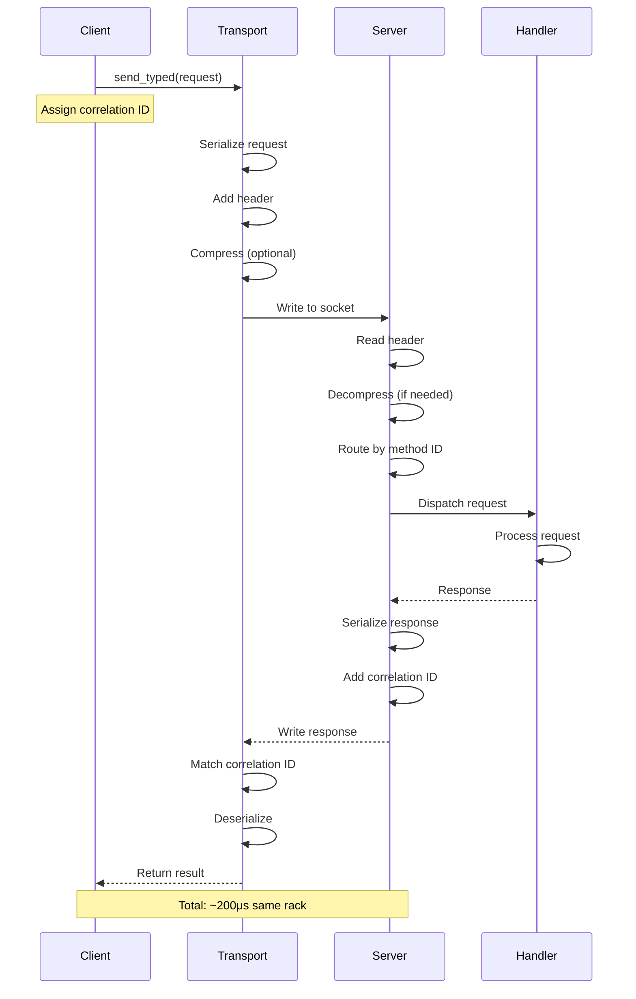

# Serialization and RPC: The Nervous System of Redpanda

**Part 6 of the Redpanda Deep Dive Technical Series**

*An in-depth exploration of how Redpanda's serialization framework and RPC layer enable efficient distributed communication*

---

## Introduction

In distributed systems, efficient communication is paramount. Every byte sent over the network, every nanosecond spent serializing data, and every memory allocation during deserialization directly impacts performance. Redpanda's serialization framework and RPC layer are optimized for the specific demands of streaming workloads: high throughput, low latency, and zero-copy where possible.

This post explores two fundamental components of Redpanda's architecture:
1. **Serde Framework**: Type-safe serialization with versioning and schema evolution
2. **RPC Layer**: Low-latency, high-throughput inter-broker communication

Understanding these components is crucial for understanding how Redpanda achieves its performance characteristics.

## From ADL to Serde

Redpanda initially used ADL (Avro Data Language) for serialization but migrated to a custom framework called Serde. This migration improved performance, type safety, and developer experience.

### The Serde Framework

Serde provides a simple, efficient serialization API from [`serde/rw/rw.h`](src/v/serde/rw/rw.h:19):

```cpp
namespace serde {

// Serialize to buffer
template<typename T>
void write(iobuf& buffer, T value) {
    write_tag(buffer, std::forward<T>(value));
}

// Deserialize from buffer
template<typename T>
std::decay_t<T> read(iobuf_parser& parser) {
    auto result = read_nested<T>(parser, 0U);
    
    if (unlikely(parser.bytes_left() != 0)) {
        throw serde_exception(fmt::format(
            "not all bytes consumed after read<{}>(), bytes_left={}",
            type_str<T>(),
            parser.bytes_left()
        ));
    }
    
    return result;
}

// Convenience functions
template<typename T>
iobuf to_iobuf(T&& value) {
    iobuf buffer;
    write(buffer, std::forward<T>(value));
    return buffer;
}

template<typename T>
T from_iobuf(iobuf buffer) {
    iobuf_parser parser{std::move(buffer)};
    return read<T>(parser);
}

} // namespace serde
```

### Envelope Pattern for Versioning

Serde uses the envelope pattern to support schema evolution:

```cpp
template<
    typename T,
    typename VersionType,
    typename CompatVersionType
>
struct envelope {
    // Version of this type
    static constexpr int8_t redpanda_serde_version = VersionType::value;
    
    // Backward compatibility version
    static constexpr int8_t redpanda_serde_compat_version = CompatVersionType::value;
    
    // Derived class must implement serde_fields()
    auto serde_fields() = delete;
};

// Example usage
struct my_message 
    : serde::envelope<my_message, serde::version<1>, serde::compat_version<0>> {
    
    int32_t field_v0;
    std::optional<ss::sstring> field_v1;  // Added in version 1
    
    auto serde_fields() {
        return std::tie(field_v0, field_v1);
    }
};
```

When deserializing:
1. Read version from stream
2. Check compatibility
3. Parse fields present in that version
4. Default-initialize missing fields

### Zero-Copy Serialization

For large objects, serde avoids copies:

```cpp
// iobuf is a chain of fragments (zero-copy)
class iobuf {
    struct fragment {
        std::unique_ptr<char[]> data;
        size_t size;
    };
    
    std::vector<fragment> _fragments;
    
public:
    // Append without copying
    void append(iobuf other) {
        _fragments.insert(
            _fragments.end(),
            std::make_move_iterator(other._fragments.begin()),
            std::make_move_iterator(other._fragments.end())
        );
    }
    
    // Share fragments (reference counting)
    iobuf share() const {
        iobuf copy;
        for (auto& frag : _fragments) {
            copy._fragments.push_back(frag.share());
        }
        return copy;
    }
};

// Serialize record batch without copying data
void write_batch(iobuf& out, const model::record_batch& batch) {
    // Write header
    write(out, batch.header());
    
    // Append data fragments directly (zero-copy)
    out.append(batch.data().share());
}
```

### Type Registration

Serde automatically handles common types:

```cpp
// Built-in type support
namespace serde {

// Integers
template<typename T>
    requires std::is_integral_v<T>
void write_tag(iobuf& out, T value) {
    // Variable-length encoding for efficiency
    write_varint(out, value);
}

// Strings
template<>
void write_tag(iobuf& out, const ss::sstring& str) {
    write_varint(out, str.size());
    out.append(str.data(), str.size());
}

// Vectors
template<typename T>
void write_tag(iobuf& out, const std::vector<T>& vec) {
    write_varint(out, vec.size());
    for (const auto& item : vec) {
        write(out, item);
    }
}

// Optional
template<typename T>
void write_tag(iobuf& out, const std::optional<T>& opt) {
    if (opt) {
        write(out, int8_t(1));
        write(out, *opt);
    } else {
        write(out, int8_t(0));
    }
}

} // namespace serde
```

## RPC Architecture

Redpanda's internal RPC system handles all inter-broker communication. It's designed for high throughput, low latency, and efficient resource usage.



### RPC Protocol Structure

Every RPC message has a header from [`rpc/types.h`](src/v/rpc/types.h:227):

```cpp
struct header {
    // Protocol version
    transport_version version{transport_version::v2};
    
    // Checksums
    uint32_t header_checksum{0};
    uint64_t payload_checksum{0};
    
    // Compression
    compression_type compression{compression_type::none};
    
    // Size
    uint32_t payload_size{0};
    
    // Routing
    uint32_t meta{0};           // Method ID or status code
    uint32_t correlation_id{0}; // Match requests to responses
};

// Header is exactly 26 bytes
static_assert(sizeof(header) == 26);
```

### Wire Protocol

```
┌────────────────────────────────────┐
│  Header (26 bytes)                 │
│  ┌──────────────────────────────┐  │
│  │  version            (1 byte) │  │
│  │  header_checksum    (4 bytes)│  │
│  │  compression        (1 byte) │  │
│  │  payload_size       (4 bytes)│  │
│  │  meta               (4 bytes)│  │
│  │  correlation_id     (4 bytes)│  │
│  │  payload_checksum   (8 bytes)│  │
│  └──────────────────────────────┘  │
├────────────────────────────────────┤
│  Payload (variable size)           │
│  - Compressed if compression != 0  │
│  - Serialized using serde          │
└────────────────────────────────────┘
```

### RPC Method Registration

Services register methods using code generation:

```cpp
// Example service definition (raftgen.json)
{
    "service_name": "raft",
    "methods": [
        {
            "name": "vote",
            "input_type": "vote_request",
            "output_type": "vote_reply"
        },
        {
            "name": "append_entries",
            "input_type": "append_entries_request",
            "output_type": "append_entries_reply"
        }
    ]
}

// Generated code
class raft_service {
    absl::flat_hash_map<uint32_t, rpc::method> _methods;
    
public:
    void register_methods() {
        // Method ID is hash of method name
        _methods[method_id("vote")] = rpc::method{
            .handle = [this](ss::input_stream<char>& in, 
                           rpc::streaming_context& ctx) {
                return handle_vote(in, ctx);
            }
        };
        
        _methods[method_id("append_entries")] = rpc::method{
            .handle = [this](ss::input_stream<char>& in,
                           rpc::streaming_context& ctx) {
                return handle_append_entries(in, ctx);
            }
        };
    }
    
private:
    ss::future<rpc::netbuf> handle_vote(
        ss::input_stream<char>& in,
        rpc::streaming_context& ctx
    ) {
        // Deserialize request
        auto request = co_await serde::read_async<vote_request>(in);
        
        // Process request
        auto reply = co_await _consensus->vote(std::move(request));
        
        // Serialize response
        rpc::netbuf response;
        response.set_status(rpc::status::success);
        response.set_correlation_id(ctx.get_header().correlation_id);
        serde::write(response.buffer(), reply);
        
        co_return response;
    }
};
```

### Transport Layer

The transport manages connections and sends requests:

```cpp
class transport {
    ss::connected_socket _socket;
    ss::input_stream<char> _input;
    ss::output_stream<char> _output;
    
    // Pending requests
    absl::flat_hash_map<
        uint32_t,  // correlation_id
        ss::promise<rpc::netbuf>
    > _pending_requests;
    
    uint32_t _next_correlation_id{0};
    
public:
    template<typename Request, typename Response>
    ss::future<result<Response>> send_typed(
        method_info method,
        Request request,
        rpc::client_opts opts
    ) {
        // Serialize request
        rpc::netbuf req_buf;
        req_buf.set_service_method(method);
        req_buf.set_compression(opts.compression);
        serde::write(req_buf.buffer(), request);
        
        // Assign correlation ID
        auto correlation_id = _next_correlation_id++;
        req_buf.set_correlation_id(correlation_id);
        
        // Create promise for response
        ss::promise<rpc::netbuf> response_promise;
        auto response_future = response_promise.get_future();
        _pending_requests[correlation_id] = std::move(response_promise);
        
        // Send request
        co_await write_netbuf(std::move(req_buf));
        
        // Wait for response (with timeout)
        auto response = co_await ss::with_timeout(
            opts.timeout.timeout_at(),
            std::move(response_future)
        );
        
        // Deserialize response
        iobuf_parser parser{std::move(response.buffer())};
        co_return serde::read<Response>(parser);
    }
    
private:
    ss::future<> write_netbuf(rpc::netbuf buf) {
        // Convert to scattered message
        auto msg = co_await std::move(buf).as_scattered();
        
        // Write to socket
        co_await _output.write(std::move(msg));
        co_await _output.flush();
    }
    
    // Background task: read responses
    ss::future<> read_responses() {
        while (!_as.abort_requested()) {
            // Read header
            auto header = co_await read_header(_input);
            
            // Read payload
            auto payload = co_await read_payload(_input, header);
            
            // Find pending request
            auto it = _pending_requests.find(header.correlation_id);
            if (it != _pending_requests.end()) {
                // Fulfill promise
                it->second.set_value(rpc::netbuf{
                    header,
                    std::move(payload)
                });
                _pending_requests.erase(it);
            }
        }
    }
};
```

## Timeout Handling

Proper timeout handling prevents cascading failures:

```cpp
struct timeout_spec {
    clock_type::time_point timeout_point;
    clock_type::duration timeout_period;
    
    static constexpr timeout_spec none = {
        rpc::no_timeout,
        rpc::max_duration
    };
    
    // Create from duration
    static constexpr timeout_spec from_now(clock_type::duration d) {
        return d == max_duration
            ? none
            : timeout_spec{clock_type::now() + d, d};
    }
    
    // Create from time point
    static constexpr timeout_spec from_point(clock_type::time_point tp) {
        if (tp == rpc::no_timeout) {
            return none;
        }
        return {tp, tp - clock_type::now()};
    }
    
    bool has_timed_out() const {
        return clock_type::now() > timeout_point;
    }
};

// Usage
ss::future<vote_reply> send_vote_request(vote_request req) {
    auto timeout = timeout_spec::from_now(5s);
    
    co_return co_await _transport->send_typed<vote_request, vote_reply>(
        method_info{.name = "vote", .id = 0x1234},
        std::move(req),
        rpc::client_opts{timeout}
    );
}
```

## Compression

RPC supports multiple compression algorithms:

```cpp
enum class compression_type : uint8_t {
    none = 0,
    zstd = 1
};

class compressor {
public:
    static ss::future<iobuf> compress(
        iobuf input,
        compression_type type
    ) {
        switch (type) {
        case compression_type::none:
            co_return std::move(input);
            
        case compression_type::zstd:
            co_return co_await compress_zstd(std::move(input));
        }
    }
    
    static ss::future<iobuf> decompress(
        iobuf input,
        compression_type type,
        size_t uncompressed_size
    ) {
        switch (type) {
        case compression_type::none:
            co_return std::move(input);
            
        case compression_type::zstd:
            co_return co_await decompress_zstd(
                std::move(input),
                uncompressed_size
            );
        }
    }
};

// Compress if worthwhile
ss::future<iobuf> maybe_compress(
    iobuf payload,
    compression_type type,
    size_t min_bytes
) {
    if (type == compression_type::none) {
        co_return std::move(payload);
    }
    
    if (payload.size_bytes() < min_bytes) {
        co_return std::move(payload);  // Too small to compress
    }
    
    auto compressed = co_await compressor::compress(
        payload.share(),
        type
    );
    
    // Only use if compression helped
    if (compressed.size_bytes() < payload.size_bytes() * 0.9) {
        co_return compressed;
    }
    
    co_return std::move(payload);
}
```

## Connection Management

Efficient connection management is critical for cluster communication.

### Connection Pool

```cpp
class connection_cache {
    struct connection_state {
        ss::shared_ptr<rpc::transport> transport;
        clock_type::time_point last_used;
        size_t inflight_requests{0};
    };
    
    absl::flat_hash_map<
        unresolved_address,
        connection_state
    > _connections;
    
    ss::semaphore _connection_sem;  // Limit concurrent connections
    
public:
    ss::future<ss::shared_ptr<rpc::transport>> 
    get_transport(unresolved_address addr) {
        // Check existing connection
        auto it = _connections.find(addr);
        if (it != _connections.end()) {
            it->second.last_used = clock_type::now();
            co_return it->second.transport;
        }
        
        // Limit concurrent connections
        auto units = co_await _connection_sem.get_units(1);
        
        // Connect
        auto transport = co_await rpc::transport::connect(
            addr,
            rpc::transport_configuration{
                .server_addr = addr,
                .recv_timeout = 30s,
                .credentials = _tls_credentials
            }
        );
        
        // Cache connection
        _connections[addr] = connection_state{
            .transport = transport,
            .last_used = clock_type::now(),
            .inflight_requests = 0
        };
        
        co_return transport;
    }
    
    // Evict idle connections
    ss::future<> evict_idle_connections() {
        auto now = clock_type::now();
        auto idle_threshold = config::connection_idle_timeout();
        
        std::vector<unresolved_address> to_evict;
        
        for (auto& [addr, state] : _connections) {
            if (state.inflight_requests == 0 
                && (now - state.last_used) > idle_threshold) {
                to_evict.push_back(addr);
            }
        }
        
        for (auto& addr : to_evict) {
            auto& state = _connections[addr];
            co_await state.transport->stop();
            _connections.erase(addr);
        }
    }
};
```

### Reconnection Logic

Handle connection failures gracefully:

```cpp
class reconnecting_transport {
    unresolved_address _server_addr;
    ss::shared_ptr<rpc::transport> _transport;
    
    size_t _reconnect_attempts{0};
    static constexpr size_t max_reconnect_attempts = 5;
    
public:
    template<typename Request, typename Response>
    ss::future<result<Response>> send_typed(
        method_info method,
        Request request,
        rpc::client_opts opts
    ) {
        for (size_t attempt = 0; attempt < max_reconnect_attempts; ++attempt) {
            try {
                // Ensure connected
                co_await ensure_connected();
                
                // Send request
                auto result = co_await _transport->send_typed<Request, Response>(
                    method,
                    request.copy(),
                    opts
                );
                
                _reconnect_attempts = 0;
                co_return result;
                
            } catch (const ss::broken_connection&) {
                // Connection lost, retry
                vlog(_logger.warn, "Connection lost to {}, reconnecting", _server_addr);
                _transport.reset();
                
                // Exponential backoff
                auto delay = std::chrono::milliseconds(100 * (1 << attempt));
                co_await ss::sleep(delay);
            }
        }
        
        co_return result<Response>(rpc::errc::connection_error);
    }
    
private:
    ss::future<> ensure_connected() {
        if (_transport && _transport->is_connected()) {
            co_return;
        }
        
        _transport = co_await rpc::transport::connect(_server_addr);
    }
};
```

## Backpressure

RPC includes backpressure mechanisms to prevent overload:

```cpp
class streaming_context {
    ssx::semaphore& _memory_sem;
    std::vector<ssx::semaphore_units> _reservations;
    
public:
    // Reserve memory for request
    ss::future<ssx::semaphore_units> reserve_memory(size_t bytes) {
        co_return co_await _memory_sem.get_units(bytes);
    }
    
    // Permanent reservation (held until context destroyed)
    ss::future<> permanent_memory_reservation(size_t bytes) {
        auto units = co_await reserve_memory(bytes);
        _reservations.push_back(std::move(units));
        co_return;
    }
};

// Server-side handler
ss::future<rpc::netbuf> handle_request(
    ss::input_stream<char>& in,
    rpc::streaming_context& ctx
) {
    auto& header = ctx.get_header();
    
    // Reserve memory for payload
    co_await ctx.permanent_memory_reservation(header.payload_size);
    
    // Now safe to read payload
    auto request_data = co_await in.read_exactly(header.payload_size);
    
    // Process request...
}
```

## Request Batching

Batching reduces overhead for small requests:

```cpp
class heartbeat_batcher {
    struct pending_heartbeat {
        raft::group_id group;
        model::offset commit_index;
        model::term_id term;
    };
    
    absl::flat_hash_map<
        model::node_id,
        std::vector<pending_heartbeat>
    > _pending;
    
    ss::timer<> _flush_timer;
    
public:
    void add_heartbeat(
        model::node_id target,
        raft::group_id group,
        model::offset commit_index,
        model::term_id term
    ) {
        _pending[target].push_back({group, commit_index, term});
        
        // Flush if threshold reached
        if (_pending[target].size() >= config::max_batched_heartbeats()) {
            flush_node(target);
        } else if (!_flush_timer.armed()) {
            _flush_timer.arm(config::heartbeat_interval());
        }
    }
    
    ss::future<> flush_node(model::node_id target) {
        auto heartbeats = std::move(_pending[target]);
        _pending.erase(target);
        
        // Build batched request
        heartbeat_request_v2 req{
            .heartbeats = std::move(heartbeats)
        };
        
        // Send single RPC
        auto reply = co_await _transport->send_typed<
            heartbeat_request_v2,
            heartbeat_reply_v2
        >(
            method_info{.name = "heartbeat", .id = 0x5678},
            std::move(req),
            rpc::client_opts{timeout_spec::from_now(5s)}
        );
        
        // Process replies
        for (auto& group_reply : reply.replies) {
            process_heartbeat_reply(group_reply);
        }
    }
};
```

## Delta Encoding

For repeated requests, delta encoding reduces bandwidth:

```cpp
class heartbeat_request_v2 {
    // Full heartbeats (sent periodically)
    std::vector<group_heartbeat> full_heartbeats;
    
    // Delta heartbeats (only changed fields)
    std::vector<group_heartbeat_delta> delta_heartbeats;
    
    // Hash of last full metadata for validation
    uint64_t metadata_hash;
    
public:
    auto serde_fields() {
        return std::tie(
            full_heartbeats,
            delta_heartbeats,
            metadata_hash
        );
    }
};

struct group_heartbeat {
    raft::group_id group;
    model::term_id term;
    model::offset commit_index;
    protocol_metadata metadata;  // Leader ID, config, etc.
    
    auto serde_fields() {
        return std::tie(group, term, commit_index, metadata);
    }
};

struct group_heartbeat_delta {
    raft::group_id group;
    std::optional<model::offset> commit_index;  // Only if changed
    
    auto serde_fields() {
        return std::tie(group, commit_index);
    }
};

// Sending side
heartbeat_request_v2 build_heartbeat_request() {
    heartbeat_request_v2 req;
    
    for (auto& [group, consensus] : _groups) {
        auto current_meta = consensus->meta();
        auto last_meta = _last_sent_metadata[group];
        
        // Send full heartbeat periodically
        if (should_send_full_heartbeat(group)) {
            req.full_heartbeats.push_back({
                .group = group,
                .term = consensus->term(),
                .commit_index = consensus->committed_offset(),
                .metadata = current_meta
            });
            
            _last_sent_metadata[group] = current_meta;
            
        } else if (current_meta.commit_index != last_meta.commit_index) {
            // Send delta if commit index changed
            req.delta_heartbeats.push_back({
                .group = group,
                .commit_index = current_meta.commit_index
            });
        }
    }
    
    req.metadata_hash = compute_metadata_hash(_last_sent_metadata);
    
    return req;
}
```

## Resource Management

RPC includes fine-grained resource control:

```cpp
struct client_opts {
    // Timeout
    timeout_spec timeout;
    
    // Compression
    compression_type compression{compression_type::none};
    size_t min_compression_bytes{1024};
    
    // Resource units to hold until send completes
    using resource_units_t = ss::foreign_ptr<
        ss::lw_shared_ptr<std::vector<ssx::semaphore_units>>
    >;
    resource_units_t resource_units;
};

// Example: Rate limiting
class rate_limited_rpc_client {
    ssx::semaphore _rate_limiter;
    
public:
    template<typename Request, typename Response>
    ss::future<result<Response>> send_typed(
        method_info method,
        Request request,
        rpc::client_opts opts
    ) {
        // Acquire rate limit token
        auto rate_units = co_await _rate_limiter.get_units(1);
        
        // Attach to request options
        auto units_vec = ss::make_lw_shared<std::vector<ssx::semaphore_units>>();
        units_vec->push_back(std::move(rate_units));
        opts.resource_units = ss::make_foreign(units_vec);
        
        // Send request
        auto result = co_await _transport->send_typed<Request, Response>(
            method,
            std::move(request),
            std::move(opts)
        );
        
        // Units released automatically when opts destroyed
        co_return result;
    }
    
private:
    ss::future<> refill_rate_limiter() {
        // Token bucket algorithm
        while (!_as.abort_requested()) {
            co_await ss::sleep(std::chrono::milliseconds(100));
            
            // Add tokens up to limit
            auto current = _rate_limiter.current();
            auto limit = _rate_limiter.limit();
            
            if (current < limit) {
                auto to_add = std::min(
                    config::rate_limit_refill_amount(),
                    limit - current
                );
                _rate_limiter.signal(to_add);
            }
        }
    }
};
```

## Streaming RPC

For large responses, use streaming:

```cpp
// Server-side streaming handler
ss::future<rpc::netbuf> handle_fetch_request(
    ss::input_stream<char>& in,
    rpc::streaming_context& ctx
) {
    // Read request
    auto request = co_await serde::read_async<fetch_request>(in);
    
    // Create response header
    rpc::netbuf response;
    response.set_correlation_id(ctx.get_header().correlation_id);
    
    // Stream batches
    auto reader = co_await _partition->make_reader(request.config());
    
    while (auto batch_opt = co_await reader.read_batch()) {
        auto& batch = *batch_opt;
        
        // Serialize batch
        serde::write(response.buffer(), batch);
        
        // Flush periodically
        if (response.buffer().size_bytes() > 1_MiB) {
            co_await ctx.send_partial_response(std::move(response));
            response = rpc::netbuf{};
        }
    }
    
    // Send final chunk
    co_return response;
}
```

## Metrics and Observability

RPC includes comprehensive metrics:

```cpp
class method_probes {
    log_hist_internal _latency_hist;
    uint64_t _requests_sent{0};
    uint64_t _requests_failed{0};
    uint64_t _bytes_sent{0};
    uint64_t _bytes_received{0};
    
public:
    void record_request(
        size_t request_size,
        size_t response_size,
        std::chrono::microseconds latency,
        bool success
    ) {
        _requests_sent++;
        _bytes_sent += request_size;
        _bytes_received += response_size;
        
        if (success) {
            _latency_hist.record(latency.count());
        } else {
            _requests_failed++;
        }
    }
    
    // Metrics
    double success_rate() const {
        return 1.0 - (static_cast<double>(_requests_failed) / _requests_sent);
    }
    
    double avg_latency_us() const {
        return _latency_hist.mean();
    }
    
    double p99_latency_us() const {
        return _latency_hist.percentile(0.99);
    }
};

// Per-method metrics
class rpc_service {
    absl::flat_hash_map<uint32_t, rpc::method> _methods;
    
public:
    void record_request_metrics(
        uint32_t method_id,
        size_t request_size,
        size_t response_size,
        std::chrono::microseconds latency,
        bool success
    ) {
        auto it = _methods.find(method_id);
        if (it != _methods.end()) {
            it->second.probes.record_request(
                request_size,
                response_size,
                latency,
                success
            );
        }
    }
};
```

## Security

RPC supports TLS for encryption and authentication:

```cpp
class tls_transport : public transport {
    ss::shared_ptr<ss::tls::certificate_credentials> _credentials;
    
public:
    static ss::future<ss::shared_ptr<tls_transport>> 
    connect(
        unresolved_address addr,
        ss::shared_ptr<ss::tls::certificate_credentials> creds
    ) {
        // Resolve address
        auto resolved = co_await net::resolve_dns(addr);
        
        // Connect with TLS
        auto socket = co_await ss::tls::connect(
            creds,
            resolved,
            ss::tls::tls_options{}
        );
        
        co_return ss::make_shared<tls_transport>(
            std::move(socket),
            creds
        );
    }
    
private:
    tls_transport(
        ss::connected_socket socket,
        ss::shared_ptr<ss::tls::certificate_credentials> creds
    ) : transport(std::move(socket))
      , _credentials(std::move(creds)) {}
};
```

## Versioning and Compatibility

RPC supports protocol versioning:

```cpp
enum class transport_version : uint8_t {
    v0 = 0,  // Legacy ADL (no longer supported)
    v1 = 1,  // ADL with version awareness (no longer supported)
    v2 = 2,  // Serde serialization (current)
    
    min_supported = v2,
    max_supported = v2
};

// Check version compatibility
bool is_version_supported(transport_version v) {
    return v >= transport_version::min_supported
        && v <= transport_version::max_supported;
}

// Handle unsupported version
ss::future<rpc::netbuf> handle_unsupported_version(
    transport_version requested_version
) {
    rpc::netbuf response;
    response.set_status(rpc::status::version_not_supported);
    
    // Include supported versions in response
    version_info info{
        .min_version = transport_version::min_supported,
        .max_version = transport_version::max_supported
    };
    serde::write(response.buffer(), info);
    
    co_return response;
}
```

## Performance Characteristics

### Serialization Performance

| Message Type | Serialize Time | Deserialize Time | Throughput | Notes |
|--------------|----------------|------------------|------------|-------|
| **Small struct (<100B)** | 0.5-1μs | 0.5-1μs | 2 GB/sec | Simple types |
| **Medium struct (1KB)** | 2-5μs | 3-7μs | 1 GB/sec | Nested types |
| **Large struct (10KB)** | 20-50μs | 30-70μs | 500 MB/sec | Complex nesting |
| **Record batch (1MB)** | 100-200μs | 150-300μs | 5 GB/sec | Zero-copy path |

### RPC Performance

| Scenario | Latency (p50) | Latency (p99) | Throughput | Bottleneck |
|----------|---------------|---------------|------------|------------|
| **Same rack** | ~200μs | ~500μs | 100K req/s | CPU (serialization) |
| **Same datacenter** | ~1ms | ~2ms | 50K req/s | Network RTT |
| **Cross-AZ** | ~3ms | ~8ms | 20K req/s | Network RTT |
| **Cross-region** | ~100ms | ~200ms | 1K req/s | Network RTT |

### Message Size Impact

| Message Size | Serialization | Network Transfer | Total Latency | Compression Benefit |
|--------------|---------------|------------------|---------------|---------------------|
| **100 bytes** | 1μs | 50μs | ~51μs | None (too small) |
| **1 KB** | 5μs | 80μs | ~85μs | Minimal (~10%) |
| **10 KB** | 30μs | 200μs | ~230μs | Moderate (~30%) |
| **100 KB** | 150μs | 1ms | ~1.15ms | Good (~50%) |
| **1 MB** | 500μs | 5ms | ~5.5ms | Very good (~60%) |

### Compression Performance

| Algorithm | Ratio | Encode Time (1MB) | Decode Time (1MB) | CPU Overhead | Use Case |
|-----------|-------|-------------------|-------------------|--------------|----------|
| **None** | 1.0x | 0μs | 0μs | 0% | Low latency |
| **Zstd (level 3)** | 3.5x | 2ms | 800μs | ~5% | Balanced |
| **Zstd (level 9)** | 4.5x | 8ms | 1ms | ~15% | WAN links |

*Zstd is preferred for its balance of compression ratio and speed*

### Comparison: Serde vs Other Frameworks

| Framework | Serialize (1KB) | Deserialize (1KB) | Zero-Copy | Schema Evolution | Type Safety |
|-----------|-----------------|-------------------|-----------|------------------|-------------|
| **Serde** | 2-5μs | 3-7μs | ✅ Yes | ✅ Envelope | ✅ Compile-time |
| **Protobuf** | 5-10μs | 8-15μs | ❌ No | ✅ Native | ✅ Code-gen |
| **JSON** | 20-50μs | 30-70μs | ❌ No | ❌ Manual | ❌ Runtime |
| **Avro** | 8-12μs | 10-18μs | ⚠️ Partial | ✅ Native | ⚠️ Schema required |
| **FlatBuffers** | 1-3μs | 0μs (direct) | ✅ Yes | ⚠️ Limited | ✅ Code-gen |

## Troubleshooting RPC Issues

### Issue 1: High RPC Latency

**Symptoms**:
- Increased p99 latency for distributed operations
- Slow partition replication
- Timeouts between brokers

**Diagnostic Steps**:
```bash
# Check RPC latency
curl localhost:9644/metrics | grep rpc_latency

# View per-method latency
curl localhost:9644/metrics | grep rpc_method_latency

# Check network stats
netstat -s | grep -i retrans

# Monitor connection count
ss -tn | grep :33145 | wc -l
```

**Solutions**:

1. **Network issues**
   ```bash
   # Check latency between brokers
   ping -c 100 <broker-ip>
   
   # Measure bandwidth
   iperf3 -c <broker-ip> -t 30
   
   # Check MTU settings
   ip link show | grep mtu
   ```

2. **Increase timeouts**
   ```yaml
   # /etc/redpanda/redpanda.yaml
   redpanda:
     rpc_server_timeout_ms: 30000  # 30 seconds
     rpc_client_timeout_ms: 10000  # 10 seconds
   ```

3. **Enable compression for WAN**
   ```yaml
   redpanda:
     rpc_server_compression_type: zstd
     rpc_min_compression_bytes: 1024
   ```

### Issue 2: Connection Failures

**Symptoms**:
- "Connection refused" errors
- Broken connections in logs
- RPC timeout errors

**Diagnostic Steps**:
```bash
# Check RPC connections
curl localhost:9644/metrics | grep rpc_connection

# View active connections
ss -tn | grep :33145

# Check firewall
sudo iptables -L -n | grep 33145

# Test connectivity
telnet <broker-ip> 33145
```

**Solutions**:

1. **Fix firewall rules**
   ```bash
   # Allow RPC port
   sudo firewall-cmd --permanent --add-port=33145/tcp
   sudo firewall-cmd --reload
   ```

2. **Verify advertised addresses**
   ```yaml
   # /etc/redpanda/redpanda.yaml
   redpanda:
     advertised_rpc_api:
       address: broker1.example.com  # Must be reachable
       port: 33145
   ```

3. **Check connection limits**
   ```bash
   # View file descriptor limits
   ulimit -n
   
   # Increase if needed
   echo "redpanda soft nofile 65536" >> /etc/security/limits.conf
   echo "redpanda hard nofile 65536" >> /etc/security/limits.conf
   ```

### Issue 3: Serialization Errors

**Symptoms**:
- "Deserialization failed" errors
- Version mismatch errors
- Corrupted messages

**Diagnostic Steps**:
```bash
# Check for serialization errors
journalctl -u redpanda | grep -i "serde\\|serialization"

# View version mismatches
journalctl -u redpanda | grep "version.*mismatch"

# Check message integrity
curl localhost:9644/metrics | grep rpc_checksum_errors
```

**Solutions**:

1. **Verify version compatibility**
   ```bash
   # Check cluster versions
   rpk cluster info | grep version
   
   # Ensure rolling upgrade order
   # Upgrade followers before leaders
   ```

2. **Check for corruption**
   ```bash
   # Enable checksum validation
   curl localhost:9644/metrics | grep payload_checksum
   
   # Review logs for CRC errors
   journalctl -u redpanda | grep -i crc
   ```

### Issue 4: Memory Leaks in RPC

**Symptoms**:
- Increasing memory usage over time
- OOM errors
- Slow RPC performance

**Diagnostic Steps**:
```bash
# Check RPC memory usage
curl localhost:9644/metrics | grep rpc_memory

# View pending requests
curl localhost:9644/metrics | grep rpc_pending

# Monitor memory growth
watch -n 1 'pmap $(pgrep redpanda) | tail -1'
```

**Solutions**:

1. **Limit pending requests**
   ```yaml
   redpanda:
     rpc_server_max_pending_requests: 1000
     rpc_client_max_pending_requests: 100
   ```

2. **Set memory limits**
   ```yaml
   redpanda:
     rpc_server_memory_limit: 1073741824  # 1GB
   ```

3. **Check for stuck requests**
   ```bash
   # View request age
   curl localhost:9644/v1/debug/rpc/pending
   ```

### Issue 5: RPC Throughput Bottleneck

**Symptoms**:
- Low message throughput
- High CPU usage in RPC layer
- Network not saturated

**Diagnostic Steps**:
```bash
# Check RPC throughput
curl localhost:9644/metrics | grep rpc_bytes_sent

# View serialization time
curl localhost:9644/metrics | grep rpc_serialize_latency

# Monitor CPU usage
top -p $(pgrep redpanda)
```

**Solutions**:

1. **Enable batching**
   ```yaml
   redpanda:
     raft_enable_lw_heartbeat: true  # Batch heartbeats
   ```

2. **Optimize message size**
   ```yaml
   redpanda:
     raft_max_batch_size: 262144  # 256KB batches
   ```

3. **Use zero-copy path**
   - Ensure messages use iobuf correctly
   - Avoid unnecessary copies in application code

### Debugging Tools

**RPC State Inspection**:
```bash
# View active RPC connections
curl localhost:9644/v1/debug/rpc/connections | jq

# Check pending requests
curl localhost:9644/v1/debug/rpc/pending | jq

# View method statistics
curl localhost:9644/metrics | grep rpc_method
```

**Network Tracing**:
```bash
# Capture RPC traffic
sudo tcpdump -i any port 33145 -w rpc.pcap

# Analyze with Wireshark
wireshark rpc.pcap

# Monitor bandwidth
iftop -i eth0 -f "port 33145"
```

**Metrics to Monitor**:
```bash
# Key RPC metrics
curl localhost:9644/metrics | grep -E \
  "(rpc_latency|rpc_errors|rpc_connection_count|rpc_bytes_sent)"

# Set up alerts for:
# - RPC latency p99 > 10ms
# - Connection failures > 10/hour
# - Pending requests > 1000
# - Serialization errors > 0
```

### Performance Tuning Checklist

- [ ] **Connection Pool**: Size for expected load
- [ ] **Timeouts**: Set based on network characteristics
- [ ] **Compression**: Enable for WAN, disable for LAN
- [ ] **Batching**: Enable for high-frequency RPCs
- [ ] **Memory Limits**: Prevent runaway allocations
- [ ] **Checksums**: Enable for critical data
- [ ] **TLS**: Use for security, understand overhead
- [ ] **Monitor Metrics**: Track latency, throughput, errors
- [ ] **Network Tuning**: Adjust TCP buffers for high throughput

## Conclusion

Redpanda's serialization and RPC layer provide the foundation for efficient distributed communication:

**Serde Framework**:
1. **Type-safe**: Compile-time checking
2. **Versioned**: Schema evolution support
3. **Efficient**: Zero-copy where possible
4. **Flexible**: Custom serialization for specialized types

**RPC Layer**:
1. **Low-latency**: Optimized for microsecond-scale operations
2. **High-throughput**: Multi-GB/sec per connection
3. **Resilient**: Automatic reconnection and backpressure
4. **Observable**: Comprehensive metrics and tracing

These components enable Redpanda's distributed architecture to communicate efficiently while maintaining strong consistency and reliability guarantees.

In the next post, we'll explore the cluster management layer that coordinates these communications across the cluster.

---

## Further Reading

- [Source: Serde Framework](src/v/serde/rw/rw.h)
- [Source: RPC Types](src/v/rpc/types.h)
- [Source: Transport Implementation](src/v/rpc/transport.h)

*Next: Part 7 - Cluster Management and the Controller*