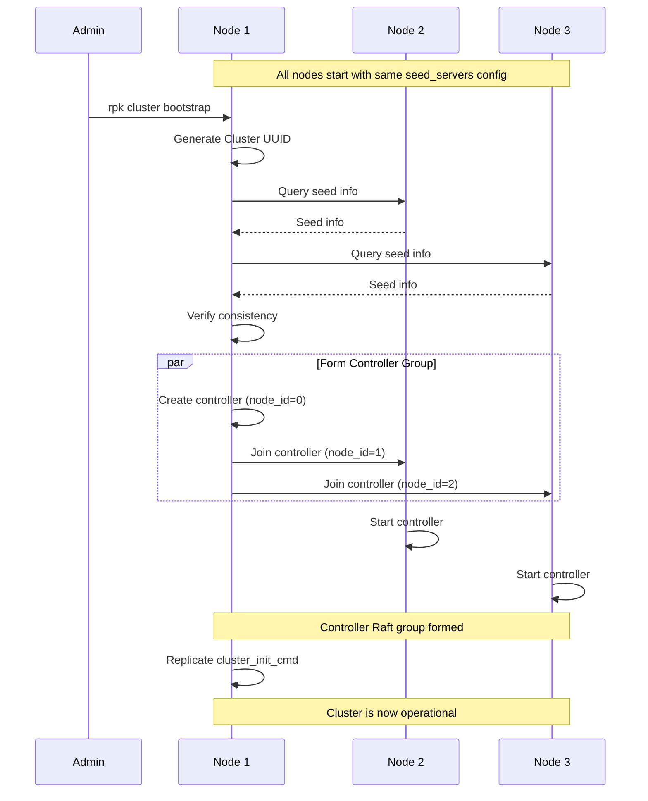
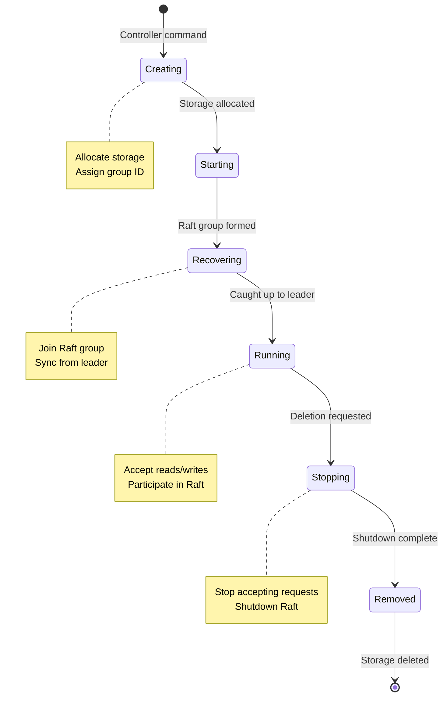

# Cluster Management and the Controller: Redpanda's Brain

**Part 7 of the Redpanda Deep Dive Technical Series**

*An in-depth exploration of how Redpanda manages cluster coordination, partition lifecycle, and configuration without ZooKeeper*

---

## Introduction

In traditional Kafka deployments, ZooKeeper acts as the "brain" of the cluster—managing metadata, coordinating leader elections, and tracking broker membership. Redpanda eliminates this dependency by implementing cluster coordination directly within brokers using a special Raft group called the **controller**.

The controller is one of Redpanda's most elegant architectural components. It's a replicated state machine that stores cluster metadata as a compacted log, providing strong consistency guarantees while eliminating external dependencies. Understanding the controller is key to understanding how Redpanda simplifies operations while improving reliability.

In this post, we'll explore cluster management in Redpanda, examining the controller architecture, partition lifecycle, node membership, and the modern bootstrap process.

## The Controller: A Special Raft Group

The controller is a Raft group with a well-known ID that exists on all brokers.

### Controller as Replicated State Machine

```cpp
namespace cluster {

// Controller is a Raft group with group_id = 0
constexpr raft::group_id controller_group_id{0};

// Controller NTP
const model::ntp controller_ntp{
    model::kafka_namespace,
    model::topic{"controller"},
    model::partition_id{0}
};

class controller {
    ss::shared_ptr<raft::consensus> _raft;
    ss::shared_ptr<storage::log> _log;
    
    // Metadata caches
    topics_table _topics;
    members_table _members;
    partition_allocator _allocator;
    config_manager _config_manager;
    
public:
    ss::future<> start() {
        // Start raft
        co_await _raft->start();
        
        // Replay controller log
        co_await replay_log();
        
        // Start background tasks
        _background_tasks.start();
    }
    
private:
    ss::future<> replay_log() {
        // Read entire controller log
        auto reader = co_await _log->make_reader(
            storage::log_reader_config{
                .start_offset = model::offset(0)
            }
        );
        
        // Apply each command
        while (auto batch = co_await reader.read_batch()) {
            for (auto& record : batch.records()) {
                co_await apply_command(record);
            }
        }
    }
};

} // namespace cluster
```

### Controller Commands

The controller log contains commands that modify cluster state:

```cpp
enum class cluster_command_type : int8_t {
    create_topic,
    delete_topic,
    update_topic_properties,
    create_partition,
    move_partition,
    finish_partition_move,
    add_node,
    decommission_node,
    update_config,
    create_user,
    delete_user,
    create_acl,
    delete_acl
};

// Topic creation command
struct create_topic_cmd {
    static constexpr cluster_command_type type = cluster_command_type::create_topic;
    
    model::topic_namespace topic;
    topic_configuration cfg;
    std::vector<partition_assignment> assignments;
    
    auto serde_fields() {
        return std::tie(topic, cfg, assignments);
    }
};

// Partition assignment
struct partition_assignment {
    raft::group_id group;
    model::partition_id id;
    std::vector<model::broker_shard> replicas;
    
    auto serde_fields() {
        return std::tie(group, id, replicas);
    }
};
```

### Applying Controller Commands

```cpp
ss::future<> controller::apply_command(const model::record& record) {
    // Deserialize command
    iobuf_parser parser{record.value().copy()};
    auto cmd_type = serde::read<cluster_command_type>(parser);
    
    switch (cmd_type) {
    case cluster_command_type::create_topic: {
        auto cmd = serde::read<create_topic_cmd>(parser);
        co_await apply_create_topic(std::move(cmd));
        break;
    }
    
    case cluster_command_type::move_partition: {
        auto cmd = serde::read<move_partition_cmd>(parser);
        co_await apply_move_partition(std::move(cmd));
        break;
    }
    
    // ... other command types
    }
}

ss::future<> controller::apply_create_topic(create_topic_cmd cmd) {
    // Add to topics table
    _topics.add_topic(
        cmd.topic,
        cmd.cfg.partition_count,
        cmd.cfg.replication_factor
    );
    
    // Create partitions on assigned brokers
    for (auto& assignment : cmd.assignments) {
        co_await create_partition_on_brokers(
            cmd.topic,
            assignment
        );
    }
    
    vlog(
        _logger.info,
        "Created topic {} with {} partitions",
        cmd.topic,
        cmd.cfg.partition_count
    );
}
```

## Cluster Bootstrap

Redpanda's bootstrap process has evolved to eliminate configuration pitfalls. The modern approach from [RFC 20221018](docs/rfcs/20221018_cluster_bootstrap.md:1) eliminates the need for distinguished root nodes.



### Modern Bootstrap Process

**Key Improvements**:
1. **No Manual Node IDs**: Nodes auto-assign UUIDs
2. **Uniform Configuration**: All nodes can have identical configs
3. **Multi-Node Initialization**: Controller forms with all seed servers
4. **Cluster UUID**: Global cluster identity for safety

### Node Identity

```cpp
class node_id_manager {
    // Persistent node UUID
    model::node_uuid _uuid;
    
    // Assigned node ID
    std::optional<model::node_id> _node_id;
    
public:
    ss::future<> initialize(storage::kvstore& kv) {
        // Load or generate UUID
        auto uuid_key = bytes("node_uuid");
        auto uuid_buf = co_await kv.get(uuid_key);
        
        if (uuid_buf) {
            _uuid = serde::from_iobuf<model::node_uuid>(*uuid_buf);
        } else {
            // Generate new UUID
            _uuid = model::node_uuid::create();
            
            // Persist
            co_await kv.put(
                uuid_key,
                serde::to_iobuf(_uuid)
            );
        }
    }
    
    ss::future<model::node_id> join_cluster(
        std::vector<net::unresolved_address> seed_servers
    ) {
        // Send join request with UUID
        join_request req{
            .node_uuid = _uuid,
            .advertised_addr = _advertised_addr
        };
        
        // Try each seed server
        for (auto& seed : seed_servers) {
            auto reply = co_await try_join_via_seed(seed, req);
            
            if (reply) {
                _node_id = reply->assigned_node_id;
                co_return *_node_id;
            }
        }
        
        throw std::runtime_error("Failed to join cluster");
    }
};
```

### Seed Server Coordination

```cpp
class cluster_bootstrap_manager {
    std::vector<net::unresolved_address> _seed_servers;
    std::optional<model::cluster_uuid> _cluster_uuid;
    
public:
    ss::future<> bootstrap() {
        if (_seed_servers.empty()) {
            // Single-node cluster
            co_await bootstrap_single_node();
            co_return;
        }
        
        // Multi-node cluster
        co_await bootstrap_multi_node();
    }
    
private:
    ss::future<> bootstrap_multi_node() {
        // Query all seed servers
        std::vector<initial_cluster_info_reply> replies;
        
        for (auto& seed : _seed_servers) {
            auto reply = co_await query_seed_server(seed);
            replies.push_back(reply);
        }
        
        // Check if cluster already exists
        for (auto& reply : replies) {
            if (reply.cluster_uuid) {
                // Join existing cluster
                _cluster_uuid = *reply.cluster_uuid;
                co_await join_existing_cluster();
                co_return;
            }
        }
        
        // Verify all seeds have matching configuration
        verify_seed_consistency(replies);
        
        // Wait for initialization command
        co_await wait_for_cluster_init();
    }
    
    void verify_seed_consistency(
        const std::vector<initial_cluster_info_reply>& replies
    ) {
        // Check all seeds agree on seed list
        for (size_t i = 1; i < replies.size(); ++i) {
            if (replies[i].seed_servers != replies[0].seed_servers) {
                throw std::runtime_error(
                    "Seed servers have inconsistent configuration"
                );
            }
        }
    }
    
    ss::future<> wait_for_cluster_init() {
        // Wait for init command (rpk cluster bootstrap)
        co_await _init_barrier.wait();
        
        // Generate cluster UUID
        _cluster_uuid = model::cluster_uuid::create();
        
        // Form initial controller group
        co_await form_controller_group();
    }
    
    ss::future<> form_controller_group() {
        // Build initial member list
        std::vector<raft::vnode> initial_members;
        
        for (size_t i = 0; i < _seed_servers.size(); ++i) {
            initial_members.push_back(raft::vnode{
                model::node_id(i),
                model::revision_id(0)
            });
        }
        
        // Start controller raft group
        co_await _controller->start(
            controller_group_id,
            initial_members
        );
        
        // Replicate initial cluster state
        cluster_init_cmd cmd{
            .cluster_uuid = *_cluster_uuid,
            .seed_servers = initial_members,
            .initial_users = _bootstrap_users
        };
        
        co_await _controller->replicate(serde::to_iobuf(cmd));
    }
};
```

## Partition Management

The [`partition_manager`](src/v/cluster/partition_manager.h:41) coordinates partition lifecycle on each broker:

```cpp
class partition_manager 
    : public ss::peering_sharded_service<partition_manager> {
    
    // Partition lookup tables
    model::ntp_map_type<ss::lw_shared_ptr<partition>> _ntp_table;
    chunked_hash_map<raft::group_id, ss::lw_shared_ptr<partition>> _raft_table;
    
    // Dependencies
    ss::sharded<storage::api>& _storage;
    ss::sharded<raft::group_manager>& _raft_manager;
    
public:
    ss::future<consensus_ptr> manage(
        storage::ntp_config ntp_cfg,
        raft::group_id group,
        std::vector<raft::vnode> initial_nodes,
        raft::with_learner_recovery_throttle throttle,
        raft::keep_snapshotted_log keep_log
    ) {
        // Check if already managing
        if (auto existing = get(ntp_cfg.ntp())) {
            co_return existing->raft();
        }
        
        // Create storage log
        auto log = co_await _storage.local().log_mgr().manage(
            std::move(ntp_cfg)
        );
        
        // Create raft consensus
        auto raft = co_await _raft_manager.local().create_group(
            group,
            std::move(initial_nodes),
            log,
            throttle,
            keep_log
        );
        
        // Create partition
        auto partition = ss::make_lw_shared<cluster::partition>(
            std::move(raft),
            _archival_conf
        );
        
        // Start partition
        co_await partition->start();
        
        // Register in tables
        _ntp_table[ntp_cfg.ntp()] = partition;
        _raft_table[group] = partition;
        
        // Notify watchers
        _manage_watchers.notify(ntp_cfg.ntp(), partition);
        
        vlog(
            _logger.info,
            "Now managing partition {} (group {})",
            ntp_cfg.ntp(),
            group
        );
        
        co_return partition->raft();
    }
    
    ss::future<> remove(
        const model::ntp& ntp,
        partition_removal_mode mode
    ) {
        auto partition = get(ntp);
        if (!partition) {
            co_return;  // Not found
        }
        
        // Notify watchers
        _unmanage_watchers.notify(ntp);
        
        // Remove from tables
        _ntp_table.erase(ntp);
        _raft_table.erase(partition->group());
        
        // Shutdown partition
        co_await shutdown_partition(partition, mode);
    }
};
```

### Partition Lifecycle



### Partition Creation

```cpp
ss::future<> create_partition(
    model::topic_namespace_view tp_ns,
    model::partition_id pid,
    std::vector<model::broker_shard> replicas
) {
    // Generate group ID
    auto group = allocate_group_id();
    
    // Create on each replica
    co_await ss::parallel_for_each(replicas, [&](auto& replica) {
        return create_partition_on_broker(
            replica.node_id,
            storage::ntp_config{
                model::ntp(tp_ns.ns, tp_ns.tp, pid),
                _data_directory
            },
            group,
            initial_nodes_from_replicas(replicas)
        );
    });
}

ss::future<> create_partition_on_broker(
    model::node_id broker,
    storage::ntp_config ntp_cfg,
    raft::group_id group,
    std::vector<raft::vnode> nodes
) {
    if (broker == _self) {
        // Local partition
        co_await _partition_manager.local().manage(
            std::move(ntp_cfg),
            group,
            std::move(nodes)
        );
    } else {
        // Remote partition - send RPC
        create_partition_request req{
            .ntp_cfg = std::move(ntp_cfg),
            .group = group,
            .nodes = std::move(nodes)
        };
        
        co_await _rpc_client.create_partition(broker, std::move(req));
    }
}
```

## Topic Management

Topics are collections of partitions with shared configuration.

### Topics Table

```cpp
class topics_table {
    struct topic_metadata {
        model::topic_namespace tp_ns;
        topic_configuration cfg;
        
        // Per-partition metadata
        absl::flat_hash_map<
            model::partition_id,
            partition_metadata
        > partitions;
        
        model::revision_id revision;
    };
    
    absl::flat_hash_map<
        model::topic_namespace,
        topic_metadata
    > _topics;
    
public:
    void add_topic(
        model::topic_namespace tp_ns,
        topic_configuration cfg,
        model::revision_id revision
    ) {
        _topics[tp_ns] = topic_metadata{
            .tp_ns = tp_ns,
            .cfg = std::move(cfg),
            .revision = revision
        };
        
        // Notify watchers
        _topic_created_notifications.notify(tp_ns);
    }
    
    std::optional<topic_metadata> get_topic_metadata(
        model::topic_namespace_view tp_ns
    ) const {
        auto it = _topics.find(tp_ns);
        return it != _topics.end() 
            ? std::make_optional(it->second)
            : std::nullopt;
    }
    
    // List all topics
    std::vector<model::topic_namespace> all_topics() const {
        std::vector<model::topic_namespace> result;
        for (auto& [tp_ns, _] : _topics) {
            result.push_back(tp_ns);
        }
        return result;
    }
};
```

### Creating Topics

```cpp
ss::future<errc> controller::create_topic(
    model::topic_namespace tp_ns,
    topic_configuration cfg
) {
    if (!is_leader()) {
        co_return errc::not_leader;
    }
    
    // Check if topic already exists
    if (_topics.contains(tp_ns)) {
        co_return errc::topic_already_exists;
    }
    
    // Generate partition assignments
    auto assignments = co_await _allocator.allocate_partitions(
        cfg.partition_count,
        cfg.replication_factor,
        _members.all_brokers()
    );
    
    // Create command
    create_topic_cmd cmd{
        .topic = tp_ns,
        .cfg = cfg,
        .assignments = std::move(assignments)
    };
    
    // Replicate via controller raft
    auto result = co_await _raft->replicate(
        serde::to_iobuf(cmd),
        raft::replicate_options{
            .consistency = raft::consistency_level::quorum_ack
        }
    );
    
    co_return result ? errc::success : errc::replication_error;
}
```

## Partition Allocation

The partition allocator decides where to place partitions:

```cpp
class partition_allocator {
    struct broker_state {
        model::node_id node;
        uint32_t core_count;
        
        // Current load
        uint32_t partition_count;
        uint32_t replica_count;
        
        // Resources
        double cpu_available;
        uint64_t memory_available;
        uint64_t disk_available;
    };
    
    absl::flat_hash_map<model::node_id, broker_state> _brokers;
    
public:
    ss::future<std::vector<partition_assignment>> 
    allocate_partitions(
        int32_t partition_count,
        int16_t replication_factor,
        const std::vector<model::broker>& available_brokers
    ) {
        std::vector<partition_assignment> assignments;
        
        for (int32_t pid = 0; pid < partition_count; ++pid) {
            // Allocate replicas for this partition
            auto replicas = co_await allocate_replicas(
                model::partition_id(pid),
                replication_factor,
                available_brokers
            );
            
            assignments.push_back(partition_assignment{
                .group = allocate_group_id(),
                .id = model::partition_id(pid),
                .replicas = std::move(replicas)
            });
        }
        
        co_return assignments;
    }
    
private:
    ss::future<std::vector<model::broker_shard>>
    allocate_replicas(
        model::partition_id pid,
        int16_t replication_factor,
        const std::vector<model::broker>& brokers
    ) {
        // Sort brokers by load (prefer less loaded)
        auto sorted = brokers;
        std::sort(sorted.begin(), sorted.end(), 
            [this](const auto& a, const auto& b) {
                return get_broker_load(a.id()) < get_broker_load(b.id());
            }
        );
        
        std::vector<model::broker_shard> replicas;
        
        for (int16_t i = 0; i < replication_factor; ++i) {
            auto& broker = sorted[i];
            
            // Select shard (round-robin within broker)
            auto shard = select_shard(broker.id(), pid);
            
            replicas.push_back(model::broker_shard{
                .node_id = broker.id(),
                .shard = shard
            });
            
            // Update load
            _brokers[broker.id()].replica_count++;
        }
        
        co_return replicas;
    }
    
    double get_broker_load(model::node_id node) const {
        auto it = _brokers.find(node);
        if (it == _brokers.end()) {
            return 0.0;
        }
        
        // Weighted load metric
        auto& state = it->second;
        return state.partition_count * 1.0 
             + state.replica_count * 0.5
             + (1.0 - state.cpu_available) * 2.0
             + (1.0 - state.disk_available / total_disk) * 1.5;
    }
};
```

## Member Management

The members table tracks cluster membership:

```cpp
class members_table {
    struct node_metadata {
        model::node_id node_id;
        model::node_uuid uuid;
        model::broker broker;
        model::membership_state state;
        model::revision_id revision;
    };
    
    absl::flat_hash_map<model::node_id, node_metadata> _nodes;
    
public:
    void add_node(node_metadata meta) {
        _nodes[meta.node_id] = std::move(meta);
        _node_added_notifications.notify(meta.node_id);
    }
    
    void update_node_state(
        model::node_id node,
        model::membership_state state
    ) {
        auto it = _nodes.find(node);
        if (it != _nodes.end()) {
            it->second.state = state;
        }
    }
    
    std::vector<model::broker> all_brokers() const {
        std::vector<model::broker> result;
        for (auto& [_, meta] : _nodes) {
            if (meta.state == model::membership_state::active) {
                result.push_back(meta.broker);
            }
        }
        return result;
    }
};

enum class membership_state : uint8_t {
    active,        // Normal operation
    draining,      // Decommissioning in progress
    removed        // Decommissioned
};
```

### Node Decommissioning

```cpp
ss::future<> controller::decommission_node(model::node_id node) {
    if (!is_leader()) {
        co_return;
    }
    
    // Mark node as draining
    decommission_node_cmd cmd{
        .node = node,
        .target_state = model::membership_state::draining
    };
    
    co_await _raft->replicate(serde::to_iobuf(cmd));
    
    // Wait for command to be applied
    co_await _members.wait_for_state(
        node,
        model::membership_state::draining
    );
    
    // Move all partitions off this node
    co_await move_partitions_from_node(node);
    
    // Mark as removed
    remove_node_cmd remove_cmd{
        .node = node
    };
    
    co_await _raft->replicate(serde::to_iobuf(remove_cmd));
}

ss::future<> controller::move_partitions_from_node(
    model::node_id source_node
) {
    // Find all partitions on this node
    auto partitions = _partition_balancer.get_partitions_on_node(source_node);
    
    // Move each partition
    for (auto& [ntp, replicas] : partitions) {
        // Find new replica
        auto target = co_await _allocator.allocate_replacement_replica(
            ntp,
            source_node,
            replicas
        );
        
        // Trigger partition move
        co_await move_partition_replica(ntp, source_node, target);
    }
}
```

## Partition Balancing

Automatic rebalancing maintains even distribution:

```cpp
class partition_balancer {
    // Detect imbalances
    ss::future<std::vector<partition_move>> 
    plan_rebalancing() {
        std::vector<partition_move> moves;
        
        // Calculate current distribution
        auto distribution = calculate_distribution();
        
        // Identify overloaded and underloaded brokers
        auto overloaded = find_overloaded_brokers(distribution);
        auto underloaded = find_underloaded_brokers(distribution);
        
        // Generate moves to balance
        for (auto& overloaded_broker : overloaded) {
            for (auto& underloaded_broker : underloaded) {
                auto move = find_best_move(
                    overloaded_broker,
                    underloaded_broker,
                    distribution
                );
                
                if (move) {
                    moves.push_back(*move);
                }
            }
        }
        
        co_return moves;
    }
    
private:
    struct broker_distribution {
        model::node_id node;
        size_t partition_count;
        size_t total_size_bytes;
        double cpu_usage;
    };
    
    std::vector<broker_distribution> calculate_distribution() {
        std::vector<broker_distribution> dist;
        
        for (auto& broker : _members->all_brokers()) {
            dist.push_back({
                .node = broker.id(),
                .partition_count = count_partitions_on(broker.id()),
                .total_size_bytes = total_size_on(broker.id()),
                .cpu_usage = get_cpu_usage(broker.id())
            });
        }
        
        return dist;
    }
    
    std::vector<model::node_id> find_overloaded_brokers(
        const std::vector<broker_distribution>& dist
    ) {
        auto avg_partitions = std::accumulate(
            dist.begin(), dist.end(), 0.0,
            [](double sum, const auto& d) {
                return sum + d.partition_count;
            }
        ) / dist.size();
        
        std::vector<model::node_id> result;
        for (auto& d : dist) {
            if (d.partition_count > avg_partitions * 1.2) {
                result.push_back(d.node);
            }
        }
        return result;
    }
};
```

### Partition Moves

```cpp
struct partition_move {
    model::ntp ntp;
    model::node_id from;
    model::node_id to;
};

ss::future<> execute_partition_move(partition_move move) {
    // Add new replica
    co_await add_partition_replica(move.ntp, move.to);
    
    // Wait for catch-up
    co_await wait_for_replica_caught_up(move.ntp, move.to);
    
    // Remove old replica
    co_await remove_partition_replica(move.ntp, move.from);
}

ss::future<> add_partition_replica(
    const model::ntp& ntp,
    model::node_id new_replica
) {
    auto partition = _partition_manager->get(ntp);
    auto current_replicas = partition->raft()->config().voters();
    
    // Add as learner first
    co_await partition->raft()->add_group_member(
        raft::vnode{new_replica, model::revision_id(0)},
        model::revision_id(_next_revision++),
        partition->raft()->committed_offset()  // Learner start offset
    );
    
    // Monitor catch-up progress
    while (true) {
        auto lag = calculate_lag(partition, new_replica);
        
        if (lag < config::promotion_lag_threshold()) {
            break;
        }
        
        co_await ss::sleep(1s);
    }
    
    // Promote to voter
    co_await partition->raft()->promote_learner_to_voter(
        raft::vnode{new_replica, model::revision_id(0)}
    );
}
```

## Configuration Management

Cluster and topic configurations are managed through the controller:

```cpp
class config_manager {
    // Cluster-wide configurations
    absl::flat_hash_map<ss::sstring, config_value> _cluster_configs;
    
    // Topic-level overrides
    absl::flat_hash_map<
        model::topic_namespace,
        topic_config_overrides
    > _topic_configs;
    
public:
    ss::future<> set_cluster_config(
        ss::sstring key,
        config_value value
    ) {
        // Validate configuration
        validate_config(key, value);
        
        // Replicate change
        set_config_cmd cmd{
            .key = key,
            .value = value
        };
        
        co_await _controller_raft->replicate(serde::to_iobuf(cmd));
    }
    
    void apply_config_change(
        ss::sstring key,
        config_value value
    ) {
        _cluster_configs[key] = value;
        
        // Notify subsystems of config change
        _config_changed_notifications.notify(key, value);
    }
};

// Dynamic config update example
ss::future<> update_segment_size(size_t new_size) {
    co_await _config_manager.set_cluster_config(
        "log_segment_size",
        config_value{new_size}
    );
    
    // Partitions will pick up new value on next segment roll
}
```

## Health Monitoring

The controller monitors cluster health:

```cpp
class health_monitor {
    struct node_health {
        model::node_id node;
        bool is_alive;
        clock_type::time_point last_heartbeat;
        std::optional<std::string> failure_reason;
    };
    
    absl::flat_hash_map<model::node_id, node_health> _node_health;
    
public:
    ss::future<> monitor_cluster() {
        while (!_as.abort_requested()) {
            // Check each node
            for (auto& broker : _members->all_brokers()) {
                co_await check_node_health(broker.id());
            }
            
            co_await ss::sleep(config::health_check_interval());
        }
    }
    
private:
    ss::future<> check_node_health(model::node_id node) {
        auto& health = _node_health[node];
        
        try {
            // Send health check RPC
            health_check_request req{
                .node_id = _self
            };
            
            auto reply = co_await _rpc->health_check(
                node,
                std::move(req),
                rpc::client_opts{timeout_spec::from_now(5s)}
            );
            
            // Node is alive
            health.is_alive = true;
            health.last_heartbeat = clock_type::now();
            health.failure_reason.reset();
            
        } catch (const std::exception& e) {
            // Node is down
            auto now = clock_type::now();
            auto time_down = now - health.last_heartbeat;
            
            if (health.is_alive) {
                vlog(
                    _logger.warn,
                    "Node {} is now unhealthy: {}",
                    node,
                    e.what()
                );
            }
            
            health.is_alive = false;
            health.failure_reason = e.what();
            
            // Take action if down for too long
            if (time_down > config::node_failure_threshold()) {
                co_await handle_node_failure(node);
            }
        }
    }
    
    ss::future<> handle_node_failure(model::node_id node) {
        vlog(
            _logger.error,
            "Node {} has been down for too long, triggering recovery",
            node
        );
        
        // Find partitions with replicas on failed node
        auto affected = find_affected_partitions(node);
        
        // Trigger partition recovery
        for (auto& ntp : affected) {
            co_await trigger_partition_recovery(ntp, node);
        }
    }
};
```

## Feature Flags

Feature flags enable safe rolling upgrades:

```cpp
class feature_table {
    struct feature_state {
        cluster_version version_introduced;
        cluster_version version_deprecated;
        bool is_active;
    };
    
    absl::flat_hash_map<ss::sstring, feature_state> _features;
    
public:
    bool is_active(std::string_view feature_name) const {
        auto it = _features.find(feature_name);
        return it != _features.end() && it->second.is_active;
    }
    
    ss::future<> activate_feature(std::string_view feature_name) {
        // Check cluster version
        auto current_version = _controller->cluster_version();
        auto feature_version = get_feature_version(feature_name);
        
        if (current_version < feature_version) {
            throw std::runtime_error(fmt::format(
                "Cannot activate feature {}: requires version {}, cluster is {}",
                feature_name,
                feature_version,
                current_version
            ));
        }
        
        // Activate feature
        activate_feature_cmd cmd{
            .feature = ss::sstring(feature_name)
        };
        
        co_await _controller_raft->replicate(serde::to_iobuf(cmd));
    }
};

// Usage in code
ss::future<> raft::consensus::cancel_configuration_change() {
    // Check if symmetric cancel is supported
    if (!_features.is_active("raft_symmetric_reconfiguration_cancel")) {
        co_return errc::feature_not_available;
    }
    
    // Use new symmetric algorithm
    co_await do_symmetric_configuration_cancel();
}
```

## Shard Table

The shard table maps NTPs to shards:

```cpp
class shard_table {
    absl::flat_hash_map<model::ntp, ss::shard_id> _ntp_to_shard;
    absl::flat_hash_map<raft::group_id, ss::shard_id> _group_to_shard;
    
public:
    void update(
        const model::ntp& ntp,
        raft::group_id group,
        ss::shard_id shard
    ) {
        _ntp_to_shard[ntp] = shard;
        _group_to_shard[group] = shard;
    }
    
    std::optional<ss::shard_id> shard_for(const model::ntp& ntp) const {
        auto it = _ntp_to_shard.find(ntp);
        return it != _ntp_to_shard.end() 
            ? std::make_optional(it->second)
            : std::nullopt;
    }
    
    std::optional<ss::shard_id> shard_for(raft::group_id group) const {
        auto it = _group_to_shard.find(group);
        return it != _group_to_shard.end()
            ? std::make_optional(it->second)
            : std::nullopt;
    }
};

// Cross-shard partition access
ss::future<ss::lw_shared_ptr<partition>>
get_partition(const model::ntp& ntp) {
    auto shard = _shard_table.shard_for(ntp);
    
    if (!shard) {
        co_return nullptr;
    }
    
    if (*shard == ss::this_shard_id()) {
        // Local access
        co_return _partition_manager.local().get(ntp);
    } else {
        // Remote access
        co_return co_await smp::submit_to(*shard, [ntp] {
            return _partition_manager.local().get(ntp);
        });
    }
}
```

## Performance Characteristics

### Controller Performance

| Metric | Value | Notes |
|--------|-------|-------|
| **Topic creation** | ~50ms | Includes Raft replication |
| **Partition assignment** | ~100ms | For 100 partitions |
| **Config update** | ~20ms | Cluster-wide propagation |
| **Node join** | ~1-2s | Including metadata sync |
| **Node decommission** | Minutes | Depends on data size |
| **Partition rebalance** | ~5s per partition | Parallel operations |

### Bootstrap Performance

| Cluster Size | Bootstrap Time | First Topic Creation | Notes |
|--------------|----------------|---------------------|-------|
| **1 node** | ~1s | +50ms | Instant (no consensus) |
| **3 nodes** | ~3s | +50ms | Form controller Raft |
| **5 nodes** | ~5s | +50ms | Larger quorum |
| **10 nodes** | ~10s | +50ms | Linear with node count |

### Partition Allocation Performance

| Partitions | Brokers | Allocation Time | Replicas/sec | Algorithm Complexity |
|------------|---------|-----------------|--------------|----------------------|
| 100 | 3 | ~50ms | 6K/sec | O(P × R × B) |
| 1,000 | 5 | ~300ms | 16K/sec | Optimized placement |
| 10,000 | 10 | ~2s | 30K/sec | Parallel allocation |
| 100,000 | 20 | ~15s | 40K/sec | Incremental batching |

## Troubleshooting Cluster Management

### Issue 1: Controller Not Elected

**Symptoms**:
- No controller leader
- Cluster operations fail
- \"Not controller leader\" errors

**Diagnostic Steps**:
```bash
# Check controller status
curl localhost:9644/v1/cluster/controller

# View controller Raft state
curl localhost:9644/v1/partitions/kafka/controller/0

# Check controller logs
journalctl -u redpanda | grep controller
```

**Solutions**:

1. **Ensure quorum**
   ```bash
   # Check how many controller replicas are up
   rpk cluster health
   
   # Need majority (e.g., 2/3 or 3/5)
   ```

2. **Fix network connectivity**
   ```bash
   # Test RPC connectivity between controller nodes
   for broker in broker1 broker2 broker3; do
     telnet $broker 33145
   done
   ```

3. **Check seed servers configuration**
   ```yaml
   # Must be identical on all nodes
   redpanda:
     seed_servers:
       - host: {address: broker1.example.com, port: 33145}
       - host: {address: broker2.example.com, port: 33145}
       - host: {address: broker3.example.com, port: 33145}
   ```

### Issue 2: Topic Creation Failures

**Symptoms**:
- Topics fail to create
- \"Insufficient brokers\" errors
- Timeout errors

**Diagnostic Steps**:
```bash
# Check available brokers
rpk cluster info

# View controller leader
curl localhost:9644/v1/cluster/controller

# Check for errors
journalctl -u redpanda | grep \"create_topic\"
```

**Solutions**:

1. **Verify broker availability**
   ```bash
   # Ensure enough brokers for replication factor
   rpk cluster info | grep -i broker
   
   # RF=3 requires at least 3 brokers
   ```

2. **Check partition allocator**
   ```bash
   # View allocation errors
   journalctl -u redpanda | grep allocator
   ```

3. **Retry with lower replication factor**
   ```bash
   rpk topic create my-topic --partitions 10 --replicas 1
   ```

### Issue 3: Partition Rebalancing Stuck

**Symptoms**:
- Partition moves not completing
- \"Reconfiguration in progress\" indefinitely
- Uneven partition distribution

**Diagnostic Steps**:
```bash
# Check ongoing moves
rpk cluster partitions move-status

# View partition details
rpk cluster partitions --detailed | grep -i moving

# Check rebalancer status
curl localhost:9644/v1/cluster/partition_balancer/status
```

**Solutions**:

1. **Cancel stuck moves**
   ```bash
   # List ongoing moves
   rpk cluster partitions move-status
   
   # Cancel specific move
   rpk cluster partitions move-cancel kafka/my-topic/5
   ```

2. **Check target broker health**
   ```bash
   # Ensure target has capacity
   rpk cluster status
   
   # View disk space
   df -h /var/lib/redpanda/data
   ```

3. **Adjust rebalancer settings**
   ```yaml
   redpanda:
     partition_autobalancing_mode: continuous  # or node_add
     partition_autobalancing_concurrent_moves: 5
   ```

### Issue 4: Node Cannot Join Cluster

**Symptoms**:
- New node fails to join
- \"No controller leader\" errors
- Node stays isolated

**Diagnostic Steps**:
```bash
# Check node status
rpk cluster info

# View cluster UUID
curl localhost:9644/v1/cluster/config/cluster_id

# Check seed servers
cat /etc/redpanda/redpanda.yaml | grep -A5 seed_servers
```

**Solutions**:

1. **Verify seed servers**
   ```yaml
   # Must match existing cluster
   redpanda:
     seed_servers:
       - host: {address: existing-broker.com, port: 33145}
   ```

2. **Check cluster UUID**
   ```bash
   # New node must have empty data directory
   # OR matching cluster UUID
   
   # Clear data if joining wrong cluster
   sudo rm -rf /var/lib/redpanda/data/*
   sudo systemctl restart redpanda
   ```

3. **Check network connectivity**
   ```bash
   # From new node, test connectivity to seed servers
   ping existing-broker.com
   telnet existing-broker.com 33145
   ```

### Issue 5: Feature Activation Failures

**Symptoms**:
- \"Feature not available\" errors
- Version incompatibility
- Upgrade issues

**Diagnostic Steps**:
```bash
# Check cluster version
curl localhost:9644/v1/cluster/config/cluster_version

# View active features
curl localhost:9644/v1/features | jq

# Check node versions
rpk cluster info | grep version
```

**Solutions**:

1. **Ensure all nodes upgraded**
   ```bash
   # Check versions
   rpk cluster info
   
   # Upgrade lagging nodes
   # Follow rolling upgrade procedure
   ```

2. **Manually activate feature**
   ```bash
   # After all nodes upgraded
   curl -X PUT localhost:9644/v1/features/<feature-name>/activate
   ```

### Debugging Tools

**Controller State Inspection**:
```bash
# View controller status
curl localhost:9644/v1/cluster/controller | jq

# Check controller log
curl localhost:9644/v1/partitions/kafka/controller/0 | jq

# View pending operations
curl localhost:9644/v1/cluster/partition_balancer/status | jq
```

**Cluster Metadata**:
```bash
# List all topics
rpk topic list

# View partition assignments
rpk cluster partitions --detailed

# Check broker metadata
curl localhost:9644/v1/brokers | jq
```

**Metrics to Monitor**:
```bash
# Key cluster management metrics
curl localhost:9644/metrics | grep -E \\\n  \"(controller_log_size|partitions_count|topics_count|cluster_unavailable_partitions)\"\n\n# Set up alerts for:\n# - No controller leader for > 10s\n# - Unavailable partitions > 0\n# - Failed partition moves > 5\n# - Node health check failures\n```

### Performance Tuning Checklist

- [ ] **Bootstrap Carefully**: Use `rpk cluster bootstrap` only once
- [ ] **Seed Servers**: Configure identically on all nodes
- [ ] **Partition Count**: Plan based on throughput needs
- [ ] **Replication Factor**: RF=3 for production
- [ ] **Enable Auto-Rebalancing**: Keep cluster balanced
- [ ] **Monitor Health**: Set up health check alerts
- [ ] **Feature Flags**: Understand before activating
- [ ] **Upgrade Process**: Follow rolling upgrade procedure
- [ ] **Backup Controller**: Regular controller log backups
- [ ] **Document Topology**: Maintain cluster diagram

## Conclusion

Redpanda's cluster management demonstrates how to build ZooKeeper-free coordination:

**Key Components**:
1. **Controller Raft Group**: Single source of truth for cluster metadata
2. **Modern Bootstrap**: Eliminates configuration pitfalls
3. **Intelligent Allocation**: Load-aware partition placement
4. **Health Monitoring**: Automatic failure detection and recovery
5. **Feature Flags**: Safe rolling upgrades

**Operational Benefits**:
- Single system to monitor and operate
- No split-brain scenarios
- Automatic rebalancing
- Simple configuration
- Fast recovery

In the final post of this series, we'll explore the performance engineering techniques that make all these components work together at high throughput and low latency.

---

## Further Reading

- [Source: Partition Manager](src/v/cluster/partition_manager.h)
- [RFC: Cluster Bootstrap](docs/rfcs/20221018_cluster_bootstrap.md)
- [RFC: Cluster Controller](docs/rfcs/20190926_cluster_controller.md)

*Next: Part 8 - Performance Engineering*