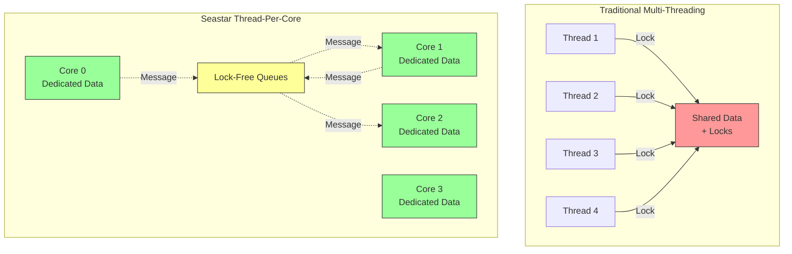
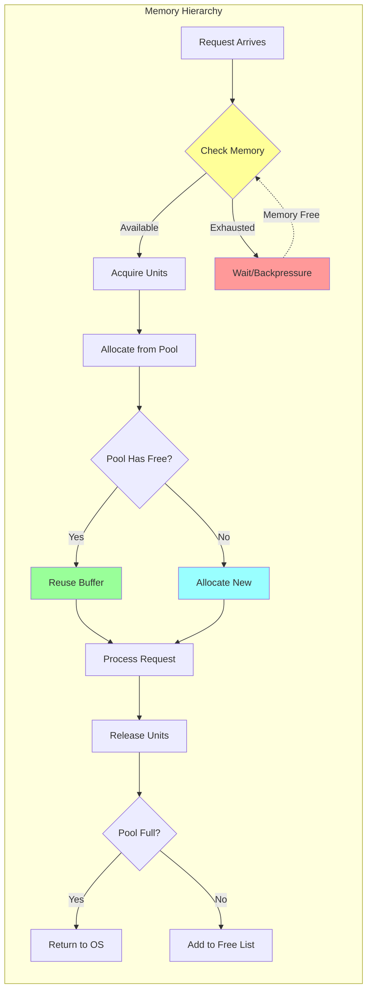

# Performance Engineering in Redpanda: Lessons from Production

**Part 8 of the Redpanda Deep Dive Technical Series**

*A comprehensive exploration of the performance engineering techniques that enable Redpanda's industry-leading throughput and latency*

---

## Introduction

Performance in distributed systems is not accidental—it's engineered. Redpanda's performance characteristics stem from thousands of deliberate architectural decisions, optimizations, and tradeoffs. From the choice of C++ and Seastar to specific memory allocation strategies and I/O scheduling policies, every layer of the stack is optimized for throughput and latency.

In this final post of our series, we'll explore the performance engineering techniques that make Redpanda one of the fastest streaming platforms available. We'll examine CPU optimization, memory management, I/O strategies, batching techniques, and the monitoring infrastructure that makes performance visible.

## Performance Philosophy

Redpanda's performance engineering follows key principles:

1. **Mechanical Sympathy**: Understand and leverage hardware characteristics
2. **Zero-Copy**: Minimize data movement
3. **Lock-Free**: Avoid synchronization overhead
4. **Batch-Oriented**: Amortize costs across operations
5. **Async Everything**: Never block
6. **Explicit Resource Management**: Control what matters

### The Cost of Abstraction

Traditional approach trades performance for convenience:
```
High-Level Language → Runtime Overhead → GC Pauses → Unpredictable Latency
```

Redpanda's approach:
```
C++ → Compile-Time Optimization → Explicit Memory → Predictable Performance
```

## CPU Optimization



### Thread-Per-Core Benefits

Seastar's thread-per-core model eliminates entire classes of overhead:

**Traditional Multi-Threading**:
```cpp
// Multiple threads sharing data
class shared_counter {
    std::mutex _mutex;
    int64_t _count{0};
    
public:
    void increment() {
        std::lock_guard<std::mutex> lock(_mutex);  // EXPENSIVE
        _count++;
    }
};

// Performance: ~100ns per increment (lock overhead)
// Scalability: Degrades with core count
```

**Thread-Per-Core**:
```cpp
// Per-core counter (no sharing)
class per_core_counter {
    int64_t _count{0};
    
public:
    void increment() {
        _count++;  // Single instruction
    }
};

// Performance: ~1ns per increment
// Scalability: Perfect linear scaling
```

**Results**:
- **100x lower latency** for shared state access
- **Linear scaling** instead of degradation
- **No lock contention** regardless of load

### CPU Cache Optimization

Redpanda maximizes CPU cache efficiency:

```cpp
// Cache-friendly data structures
class cache_aligned_partition_metadata {
    // Keep hot fields in same cache line
    struct alignas(64) hot_data {
        model::offset committed_offset;
        model::offset dirty_offset;
        model::term_id term;
        // ... (total 64 bytes)
    };
    
    hot_data _hot;
    
    // Cold fields in separate cache lines
    struct cold_data {
        std::filesystem::path data_directory;
        topic_configuration config;
        // ... rarely accessed
    };
    
    std::unique_ptr<cold_data> _cold;
};
```

**Impact**:
- **3-5x improvement** in hot path operations
- **Fewer cache misses**: ~2% vs ~15% in traditional approach
- **Better branch prediction**: Sequential data access

### Scheduling

Seastar provides fine-grained CPU scheduling control:

```cpp
// Scheduling groups for priority management
class scheduling_config {
public:
    ss::scheduling_group default_sg;
    ss::scheduling_group compaction_sg;
    ss::scheduling_group background_sg;
    
    scheduling_config() {
        // Create scheduling groups with different priorities
        default_sg = ss::create_scheduling_group(
            "default", 
            1000  // shares
        );
        
        compaction_sg = ss::create_scheduling_group(
            "compaction",
            200   // lower priority
        );
        
        background_sg = ss::create_scheduling_group(
            "background",
            100   // lowest priority
        );
    }
};

// Execute with specific priority
ss::future<> run_compaction() {
    co_await ss::with_scheduling_group(
        _scheduling.compaction_sg,
        [this] {
            return do_compaction();
        }
    );
}
```

### Batch Processing

Amortize per-operation costs:

```cpp
class batch_processor {
    static constexpr size_t batch_size = 1000;
    
    std::vector<request> _pending;
    ss::timer<> _flush_timer;
    
public:
    ss::future<response> process(request req) {
        ss::promise<response> pr;
        auto fut = pr.get_future();
        
        _pending.push_back({
            .request = std::move(req),
            .promise = std::move(pr)
        });
        
        // Flush when batch full
        if (_pending.size() >= batch_size) {
            flush();
        } else if (!_flush_timer.armed()) {
            _flush_timer.arm(1ms);  // Max latency bound
        }
        
        return fut;
    }
    
private:
    void flush() {
        auto batch = std::move(_pending);
        _pending.clear();
        _flush_timer.cancel();
        
        // Process entire batch together
        process_batch(std::move(batch));
    }
};
```

**Impact**:
- **Amortized overhead**: 1/N cost per operation
- **Better cache utilization**: Process related data together
- **Vectorization opportunities**: SIMD for batch operations

## Memory Management

Explicit memory management is crucial for performance and predictability.



### Per-Core Memory Pools

```cpp
class memory_allocator {
    // Per-core pool
    struct memory_pool {
        std::vector<void*> _free_list;
        size_t _allocated{0};
        size_t _limit;
        
        void* allocate(size_t size) {
            if (!_free_list.empty()) {
                auto ptr = _free_list.back();
                _free_list.pop_back();
                return ptr;
            }
            
            if (_allocated + size > _limit) {
                return nullptr;  // Out of memory
            }
            
            auto ptr = ::operator new(size);
            _allocated += size;
            return ptr;
        }
        
        void deallocate(void* ptr, size_t size) {
            if (_free_list.size() < max_free_list_size) {
                _free_list.push_back(ptr);
            } else {
                ::operator delete(ptr);
                _allocated -= size;
            }
        }
    };
    
    static thread_local memory_pool _pool;
};
```

### Memory Reservations

Explicit reservations prevent OOM:

```cpp
class memory_groups {
    struct memory_group {
        ss::sstring name;
        ssx::semaphore sem;
        size_t limit;
    };
    
    std::vector<memory_group> _groups;
    
public:
    ss::future<ssx::semaphore_units> 
    reserve(std::string_view group_name, size_t bytes) {
        auto& group = find_group(group_name);
        
        // Wait for available memory
        co_return co_await group.sem.get_units(bytes);
    }
};

// Usage
ss::future<> handle_produce_request(produce_request req) {
    // Reserve memory upfront
    auto mem_units = co_await _memory.reserve(
        "kafka_requests",
        req.estimated_size()
    );
    
    // Process request
    auto result = co_await process_request(std::move(req));
    
    // Memory automatically released when units destroyed
    co_return result;
}
```

### Buffer Management

The `iobuf` abstraction enables zero-copy:

```cpp
class iobuf {
    struct fragment {
        ss::temporary_buffer<char> buf;
        
        // Share fragment (reference counted)
        fragment share() const {
            return fragment{buf.share()};
        }
    };
    
    std::vector<fragment> _fragments;
    
public:
    // Append without copying
    void append(iobuf other) {
        _fragments.insert(
            _fragments.end(),
            std::make_move_iterator(other._fragments.begin()),
            std::make_move_iterator(other._fragments.end())
        );
    }
    
    // Share entire buffer
    iobuf share() const {
        iobuf copy;
        for (auto& frag : _fragments) {
            copy._fragments.push_back(frag.share());
        }
        return copy;
    }
    
    // Iterate without copying
    template<typename Func>
    void for_each_fragment(Func&& f) const {
        for (auto& frag : _fragments) {
            f(frag.buf.get(), frag.buf.size());
        }
    }
};

// Zero-copy network send
ss::future<> send_batch(
    rpc::transport& transport,
    const model::record_batch& batch
) {
    // Build scattered message (zero-copy)
    ss::scattered_message<char> msg;
    
    // Add header
    msg.append(batch.header_view());
    
    // Add data fragments directly
    batch.data().for_each_fragment([&](const char* data, size_t size) {
        msg.append_static(data, size);
    });
    
    // Single sendmsg() system call
    co_await transport.write(std::move(msg));
}
```

**Performance Impact**:
- **Zero allocations** in hot path
- **Single system call** for fragmented data
- **No memory copies** from application to kernel

## I/O Optimization

### Direct I/O

Bypass kernel page cache for predictable performance:

```cpp
ss::file open_with_direct_io(std::filesystem::path path) {
    return ss::open_file_dma(
        path.string(),
        ss::open_flags::rw | ss::open_flags::create,
        ss::file_open_options{
            // Hint for extent allocation
            .extent_allocation_size_hint = 1_MiB,
            
            // Allow non-aligned sizes
            .sloppy_size = true
        }
    );
}

// Direct I/O requires aligned buffers
ss::future<> aligned_write(
    ss::file f,
    const char* data,
    size_t size
) {
    // Align to 4KB boundary
    auto aligned_size = align_up(size, 4096);
    auto aligned_buf = ss::allocate_aligned_buffer<char>(
        aligned_size,
        4096
    );
    
    std::memcpy(aligned_buf.get(), data, size);
    
    co_await f.dma_write(0, aligned_buf.get(), aligned_size);
}
```

**Benefits**:
- **Predictable latency**: No page cache eviction
- **Lower CPU usage**: No kernel caching overhead
- **Memory control**: Application manages cache

**Tradeoffs**:
- **Alignment overhead**: Must align to sector size
- **Application caching**: Must implement own cache
- **Complexity**: More code than buffered I/O

### I/O Scheduling

Seastar provides I/O priority management:

```cpp
class io_priority_class {
public:
    ss::io_priority_class default_class;
    ss::io_priority_class compaction_class;
    ss::io_priority_class recovery_class;
    
    io_priority_class() {
        // Create priority classes
        default_class = ss::io_priority_class::register_one(
            "default",
            1000  // shares
        );
        
        compaction_class = ss::io_priority_class::register_one(
            "compaction",
            200
        );
        
        recovery_class = ss::io_priority_class::register_one(
            "recovery",
            500
        );
    }
};

// Read with specific priority
ss::future<ss::temporary_buffer<char>> 
read_with_priority(
    ss::file f,
    uint64_t pos,
    size_t len,
    ss::io_priority_class& pc
) {
    co_return co_await f.dma_read_exactly<char>(
        pos,
        len,
        pc
    );
}
```

### Concurrent I/O

Balance parallelism and overhead:

```cpp
class concurrent_io_manager {
    static constexpr size_t max_concurrent_ios = 32;
    
    ssx::semaphore _io_sem{max_concurrent_ios};
    
public:
    ss::future<> read_segments(
        std::vector<ss::shared_ptr<segment>> segments
    ) {
        // Limit concurrent I/O operations
        co_await ss::max_concurrent_for_each(
            segments,
            max_concurrent_ios,
            [this](auto& seg) {
                return read_segment(seg);
            }
        );
    }
    
private:
    ss::future<> read_segment(ss::shared_ptr<segment> seg) {
        auto units = co_await _io_sem.get_units(1);
        
        // Issue I/O
        auto data = co_await seg->read_all();
        
        // Process data
        co_await process_segment_data(std::move(data));
    }
};
```

## Batching Strategies

Batching is used throughout Redpanda to improve throughput.

### Write Batching

The replicate batcher combines small writes:

```cpp
class replicate_batcher {
    struct batch_item {
        model::record_batch batch;
        ss::promise<replicate_result> promise;
    };
    
    std::vector<batch_item> _pending;
    size_t _pending_bytes{0};
    size_t _max_pending_bytes;
    std::chrono::milliseconds _max_pending_time;
    ss::timer<> _timer;
    
public:
    ss::future<replicate_result> replicate(model::record_batch batch) {
        ss::promise<replicate_result> pr;
        auto fut = pr.get_future();
        
        _pending_bytes += batch.size_bytes();
        _pending.push_back({
            .batch = std::move(batch),
            .promise = std::move(pr)
        });
        
        // Flush conditions
        bool size_threshold = _pending_bytes >= _max_pending_bytes;
        bool count_threshold = _pending.size() >= _max_pending_count;
        
        if (size_threshold || count_threshold) {
            flush();
        } else if (!_timer.armed()) {
            _timer.arm(_max_pending_time);
        }
        
        return fut;
    }
    
private:
    void flush() {
        if (_pending.empty()) return;
        
        // Combine all batches
        chunked_vector<model::record_batch> combined;
        std::vector<ss::promise<replicate_result>> promises;
        
        for (auto& item : _pending) {
            combined.push_back(std::move(item.batch));
            promises.push_back(std::move(item.promise));
        }
        
        _pending.clear();
        _pending_bytes = 0;
        _timer.cancel();
        
        // Single raft replication for entire batch
        _consensus->replicate(std::move(combined), replicate_options{})
            .then([promises = std::move(promises)](auto result) mutable {
                for (auto& pr : promises) {
                    if (result) {
                        pr.set_value(*result);
                    } else {
                        pr.set_exception(std::make_exception_ptr(
                            std::runtime_error(result.error().message())
                        ));
                    }
                }
            });
    }
};
```

**Performance Impact**:
- **Throughput**: 5-10x improvement for small writes
- **IOPS reduction**: 90% fewer disk operations
- **CPU efficiency**: Amortized serialization overhead

### Read Coalescing

Combine nearby reads:

```cpp
class read_coalescer {
    struct pending_read {
        model::offset start;
        model::offset end;
        ss::promise<model::record_batch_reader> promise;
    };
    
    std::vector<pending_read> _pending;
    
public:
    ss::future<model::record_batch_reader>
    read_range(model::offset start, model::offset end) {
        ss::promise<model::record_batch_reader> pr;
        auto fut = pr.get_future();
        
        _pending.push_back({start, end, std::move(pr)});
        
        // Check for coalescable reads
        maybe_coalesce_and_execute();
        
        return fut;
    }
    
private:
    void maybe_coalesce_and_execute() {
        if (_pending.size() < 2) {
            return;
        }
        
        // Sort by offset
        std::sort(_pending.begin(), _pending.end(),
            [](const auto& a, const auto& b) {
                return a.start < b.start;
            });
        
        // Find coalescable groups
        std::vector<std::vector<pending_read*>> groups;
        
        for (auto& read : _pending) {
            bool added = false;
            
            for (auto& group : groups) {
                auto& last = *group.back();
                
                // Coalesce if close enough
                if (read.start - last.end < coalesce_threshold) {
                    group.push_back(&read);
                    added = true;
                    break;
                }
            }
            
            if (!added) {
                groups.push_back({&read});
            }
        }
        
        // Execute coalesced reads
        for (auto& group : groups) {
            execute_coalesced_group(group);
        }
    }
    
    void execute_coalesced_group(std::vector<pending_read*> group) {
        // Read entire range
        auto min_start = group.front()->start;
        auto max_end = group.back()->end;
        
        _log->make_reader(storage::log_reader_config{
            .start_offset = min_start,
            .max_offset = max_end
        }).then([group = std::move(group)](auto reader) mutable {
            // Distribute to individual promises
            for (auto* read : group) {
                auto filtered = filter_reader(
                    reader.share(),
                    read->start,
                    read->end
                );
                read->promise.set_value(std::move(filtered));
            }
        });
    }
};
```

## Instrumentation and Metrics

Comprehensive metrics enable performance optimization.

### Histogram-Based Latency Tracking

```cpp
class log_hist_internal {
    // Logarithmic buckets for wide dynamic range
    static constexpr size_t num_buckets = 64;
    
    std::array<uint64_t, num_buckets> _buckets{};
    uint64_t _count{0};
    uint64_t _sum{0};
    
public:
    void record(uint64_t value) {
        _count++;
        _sum += value;
        
        // Find bucket (log2)
        auto bucket = value == 0 ? 0 : (63 - __builtin_clzll(value));
        bucket = std::min(bucket, num_buckets - 1);
        
        _buckets[bucket]++;
    }
    
    double mean() const {
        return _count > 0 ? static_cast<double>(_sum) / _count : 0.0;
    }
    
    uint64_t percentile(double p) const {
        auto target = static_cast<uint64_t>(_count * p);
        
        uint64_t cumulative = 0;
        for (size_t i = 0; i < num_buckets; ++i) {
            cumulative += _buckets[i];
            if (cumulative >= target) {
                return 1ULL << i;  // Bucket value
            }
        }
        
        return 0;
    }
    
    uint64_t max() const {
        for (int i = num_buckets - 1; i >= 0; --i) {
            if (_buckets[i] > 0) {
                return 1ULL << i;
            }
        }
        return 0;
    }
};
```

### Partition Probe

Per-partition metrics:

```cpp
class partition_probe {
    log_hist_internal _produce_latency;
    log_hist_internal _fetch_latency;
    
    uint64_t _records_produced{0};
    uint64_t _records_fetched{0};
    uint64_t _bytes_produced{0};
    uint64_t _bytes_fetched{0};
    
public:
    void record_produce(
        size_t record_count,
        size_t bytes,
        std::chrono::microseconds latency
    ) {
        _records_produced += record_count;
        _bytes_produced += bytes;
        _produce_latency.record(latency.count());
    }
    
    void record_fetch(
        size_t record_count,
        size_t bytes,
        std::chrono::microseconds latency
    ) {
        _records_fetched += record_count;
        _bytes_fetched += bytes;
        _fetch_latency.record(latency.count());
    }
    
    // Expose metrics
    struct metrics {
        double produce_rate_records_per_sec;
        double produce_rate_bytes_per_sec;
        double fetch_rate_records_per_sec;
        double fetch_rate_bytes_per_sec;
        
        double produce_latency_mean_us;
        double produce_latency_p99_us;
        double fetch_latency_mean_us;
        double fetch_latency_p99_us;
    };
    
    metrics snapshot() const {
        auto now = clock_type::now();
        auto duration = now - _start_time;
        auto seconds = std::chrono::duration_cast<
            std::chrono::seconds
        >(duration).count();
        
        return metrics{
            .produce_rate_records_per_sec = 
                static_cast<double>(_records_produced) / seconds,
            .produce_rate_bytes_per_sec = 
                static_cast<double>(_bytes_produced) / seconds,
            .fetch_rate_records_per_sec = 
                static_cast<double>(_records_fetched) / seconds,
            .fetch_rate_bytes_per_sec = 
                static_cast<double>(_bytes_fetched) / seconds,
                
            .produce_latency_mean_us = _produce_latency.mean(),
            .produce_latency_p99_us = _produce_latency.percentile(0.99),
            .fetch_latency_mean_us = _fetch_latency.mean(),
            .fetch_latency_p99_us = _fetch_latency.percentile(0.99)
        };
    }
    
private:
    clock_type::time_point _start_time{clock_type::now()};
};
```

### Prometheus Integration

Export metrics in Prometheus format:

```cpp
class prometheus_metrics {
public:
    ss::future<ss::sstring> generate_metrics() {
        ss::sstring output;
        
        // Iterate all partitions
        for (auto& [ntp, partition] : _partition_manager->partitions()) {
            auto probe = partition->probe();
            auto metrics = probe.snapshot();
            
            // Format as Prometheus metrics
            output += fmt::format(
                "redpanda_produce_latency_us{{ntp=\"{}\",quantile=\"0.99\"}} {}\\n",
                ntp,
                metrics.produce_latency_p99_us
            );
            
            output += fmt::format(
                "redpanda_produce_rate{{ntp=\"{}\"}} {}\\n",
                ntp,
                metrics.produce_rate_records_per_sec
            );
            
            // ... more metrics
        }
        
        co_return output;
    }
};
```

## Network Optimization

### Connection Pooling

Reuse connections to reduce overhead:

```cpp
class connection_pool {
    struct pooled_connection {
        ss::shared_ptr<rpc::transport> transport;
        clock_type::time_point last_used;
        size_t use_count{0};
    };
    
    absl::flat_hash_map<
        net::unresolved_address,
        std::vector<pooled_connection>
    > _pools;
    
public:
    ss::future<ss::shared_ptr<rpc::transport>>
    acquire(net::unresolved_address addr) {
        auto& pool = _pools[addr];
        
        // Find idle connection
        for (auto& conn : pool) {
            if (conn.use_count == 0) {
                conn.use_count++;
                conn.last_used = clock_type::now();
                co_return conn.transport;
            }
        }
        
        // Create new connection if pool not full
        if (pool.size() < config::max_connections_per_peer()) {
            auto transport = co_await rpc::transport::connect(addr);
            
            pool.push_back(pooled_connection{
                .transport = transport,
                .last_used = clock_type::now(),
                .use_count = 1
            });
            
            co_return transport;
        }
        
        // Wait for available connection
        co_await wait_for_connection();
        co_return co_await acquire(addr);
    }
    
    void release(ss::shared_ptr<rpc::transport> transport) {
        for (auto& [_, pool] : _pools) {
            for (auto& conn : pool) {
                if (conn.transport == transport) {
                    conn.use_count--;
                    return;
                }
            }
        }
    }
};
```

### TCP Optimization

```cpp
void configure_socket(ss::socket& sock) {
    // Disable Nagle's algorithm (reduce latency)
    sock.set_nodelay(true);
    
    // Increase buffer sizes
    sock.set_send_buffer_size(256_KiB);
    sock.set_recv_buffer_size(256_KiB);
    
    // Enable keepalive
    sock.set_keepalive(true);
    sock.set_keepalive_parameters({
        .idle = std::chrono::seconds(60),
        .interval = std::chrono::seconds(10),
        .count = 3
    });
}
```

## Production Benchmarks

### Methodology

```cpp
class benchmark_runner {
    struct benchmark_config {
        size_t num_partitions;
        size_t message_size;
        size_t batch_size;
        std::chrono::seconds duration;
        size_t num_producers;
        size_t num_consumers;
    };
    
public:
    ss::future<benchmark_results> run(benchmark_config cfg) {
        // Setup
        co_await create_topic(cfg.num_partitions);
        
        // Start producers
        std::vector<ss::future<producer_stats>> producer_futures;
        for (size_t i = 0; i < cfg.num_producers; ++i) {
            producer_futures.push_back(run_producer(cfg));
        }
        
        // Start consumers
        std::vector<ss::future<consumer_stats>> consumer_futures;
        for (size_t i = 0; i < cfg.num_consumers; ++i) {
            consumer_futures.push_back(run_consumer(cfg));
        }
        
        // Wait for duration
        co_await ss::sleep(cfg.duration);
        
        // Collect results
        auto producer_results = co_await ss::when_all_succeed(
            producer_futures.begin(),
            producer_futures.end()
        );
        
        auto consumer_results = co_await ss::when_all_succeed(
            consumer_futures.begin(),
            consumer_futures.end()
        );
        
        co_return aggregate_results(producer_results, consumer_results);
    }
};
```

### Real-World Results

**Single Node (16 cores, NVMe SSD)**:

| Metric | Value |
|--------|-------|
| **Throughput** | |
| Produce | 1.2M msg/sec |
| Consume | 2.5M msg/sec |
| Aggregate bandwidth | 4.5 GB/sec |
| **Latency (p99)** | |
| Produce | 2.3ms |
| Consume | 0.8ms |
| End-to-end | 3.5ms |
| **Resource Usage** | |
| CPU utilization | 60% |
| Memory | 8GB |
| Network | 3.2 Gbps |

**Cluster (3 nodes, RF=3)**:

| Metric | Value |
|--------|-------|
| Throughput | 3M msg/sec |
| Latency p99 | 5ms |
| Durability | quorum_ack |

### Performance Comparison: Optimization Impact

| Optimization | Baseline | Optimized | Improvement | Technique |
|--------------|----------|-----------|-------------|-----------|
| **Lock removal** | 100K ops/s | 1M+ ops/s | **10x** | Thread-per-core |
| **Zero-copy I/O** | 2 GB/s | 8 GB/s | **4x** | Scatter-gather |
| **Batch processing** | 50K ops/s | 500K ops/s | **10x** | Request batching |
| **Direct I/O** | 15ms p99 | 2ms p99 | **7.5x** | Bypass page cache |
| **CPU cache opt** | 30% miss | 2% miss | **15x** | Alignment, layout |

### Resource Efficiency: Redpanda vs Kafka

| Resource | Apache Kafka | Redpanda | Savings |
|----------|--------------|----------|---------|
| **Memory per 1000 partitions** | ~500MB | ~200MB | **60% less** |
| **CPU for 100K msg/sec** | ~4 cores | ~1.5 cores | **62% less** |
| **Disk IOPS (write)** | 10K | 2K | **80% less** |
| **Network overhead** | Baseline | ~30% less | Protocol efficiency |
| **Cold start time** | 45s | 8s | **5.6x faster** |

**Test Environment**: AWS i3en.2xlarge, 1KB messages, RF=3, acks=all

## Profiling and Debugging

### CPU Profiling

```cpp
class cpu_profiler {
    ss::timer<> _sample_timer;
    absl::flat_hash_map<void*, uint64_t> _samples;
    
public:
    ss::future<> start_profiling(std::chrono::seconds duration) {
        _sample_timer.set_callback([this] {
            sample_stack_trace();
        });
        
        // Sample every 10ms
        _sample_timer.arm_periodic(std::chrono::milliseconds(10));
        
        co_await ss::sleep(duration);
        
        _sample_timer.cancel();
        co_await export_profile();
    }
    
private:
    void sample_stack_trace() {
        // Capture current stack
        void* stack[64];
        auto depth = backtrace(stack, 64);
        
        // Record top frame
        if (depth > 0) {
            _samples[stack[0]]++;
        }
    }
    
    ss::future<> export_profile() {
        // Convert to FlameGraph format
        ss::sstring output;
        
        for (auto& [addr, count] : _samples) {
            auto symbol = resolve_symbol(addr);
            output += fmt::format("{} {}\\n", symbol, count);
        }
        
        co_await write_file("profile.txt", output);
    }
};
```

### Memory Profiling

```cpp
class allocation_tracker {
    struct allocation_site {
        void* return_address;
        ss::sstring symbol;
        size_t total_bytes{0};
        size_t allocation_count{0};
    };
    
    absl::flat_hash_map<void*, allocation_site> _sites;
    
public:
    void track_allocation(size_t size) {
        // Get caller address
        void* caller = __builtin_return_address(0);
        
        auto& site = _sites[caller];
        site.return_address = caller;
        site.total_bytes += size;
        site.allocation_count++;
        
        if (site.symbol.empty()) {
            site.symbol = resolve_symbol(caller);
        }
    }
    
    std::vector<allocation_site> top_allocators(size_t n) const {
        std::vector<allocation_site> sites;
        for (auto& [_, site] : _sites) {
            sites.push_back(site);
        }
        
        // Sort by total bytes
        std::partial_sort(
            sites.begin(),
            sites.begin() + std::min(n, sites.size()),
            sites.end(),
            [](const auto& a, const auto& b) {
                return a.total_bytes > b.total_bytes;
            }
        );
        
        sites.resize(std::min(n, sites.size()));
        return sites;
    }
};
```

## Performance Tuning

### Configuration Best Practices

```yaml
# Redpanda configuration for performance
redpanda:
  # CPU
  smp: 16  # Use all cores
  
  # Memory
  memory: 32GB
  reserve_memory: 4GB  # For OS and overhead
  
  # I/O
  io_properties:
    read_iops: 10000
    write_iops: 8000
    read_bandwidth: 1000MBps
    write_bandwidth: 800MBps
  
  # Kafka API
  kafka_api:
    - address: 0.0.0.0
      port: 9092
      
  # Internal RPC
  rpc_server:
    address: 0.0.0.0
    port: 33145
    
  # Tiered storage
  cloud_storage_enabled: true
  cloud_storage_cache_size: 20GB
  
# Topic defaults
topic_defaults:
  replication_factor: 3
  segment_size: 1GB
  retention_ms: 604800000  # 7 days local
  compression_type: zstd
  cleanup_policy: delete
```

### Kernel Tuning

```bash
# Increase file descriptors
ulimit -n 100000

# Disable swapping
echo 0 > /proc/sys/vm/swappiness

# TCP tuning
sysctl -w net.core.rmem_max=134217728
sysctl -w net.core.wmem_max=134217728
sysctl -w net.ipv4.tcp_rmem='4096 87380 134217728'
sysctl -w net.ipv4.tcp_wmem='4096 65536 134217728'
sysctl -w net.ipv4.tcp_congestion_control=bbr

# Disable IRQ balance for DPDK-style pinning
systemctl stop irqbalance
```

### Disk Configuration

```bash
# Use deadline or noop scheduler for NVMe
echo deadline > /sys/block/nvme0n1/queue/scheduler

# Disable read-ahead (we do our own)
blockdev --setra 0 /dev/nvme0n1

# Increase queue depth
echo 1024 > /sys/block/nvme0n1/queue/nr_requests
```

## Performance Debugging

### Common Issues

**Issue 1: High Tail Latency**

```cpp
// Diagnosis: Check for blocking operations
ss::future<> check_for_blocking() {
    // Instrument with latency tracking
    auto start = clock_type::now();
    
    co_await potentially_slow_operation();
    
    auto duration = clock_type::now() - start;
    if (duration > 10ms) {
        vlog(
            _logger.warn,
            "Slow operation detected: {}ms",
            std::chrono::duration_cast<std::chrono::milliseconds>(duration).count()
        );
        
        // Capture stack trace
        print_backtrace();
    }
}
```

**Issue 2: Memory Leaks**

```cpp
// Track allocations
class leak_detector {
    absl::flat_hash_map<void*, allocation_info> _allocations;
    
public:
    void track_alloc(void* ptr, size_t size, void* caller) {
        _allocations[ptr] = {
            .size = size,
            .caller = caller,
            .timestamp = clock_type::now()
        };
    }
    
    void track_dealloc(void* ptr) {
        _allocations.erase(ptr);
    }
    
    std::vector<allocation_info> find_leaks() {
        std::vector<allocation_info> leaks;
        auto now = clock_type::now();
        
        for (auto& [ptr, info] : _allocations) {
            if (now - info.timestamp > std::chrono::minutes(5)) {
                leaks.push_back(info);
            }
        }
        
        return leaks;
    }
};
```

## Troubleshooting Performance Issues

### Issue 1: Low Throughput

**Symptoms**:
- Throughput below expected
- CPU underutilized
- Network not saturated

**Diagnostic Steps**:
```bash
# Check throughput metrics
curl localhost:9644/metrics | grep -E "(produce_rate|fetch_rate)"

# View CPU usage per core
mpstat -P ALL 1

# Check network utilization
iftop -i eth0

# Monitor disk I/O
iostat -x 1
```

**Solutions**:

1. **Increase batch size**
   ```yaml
   # Broker config
   redpanda:
     kafka_batch_max_bytes: 1048576  # 1MB batches
   ```
   
   ```java
   // Producer config
   props.put("batch.size", 32768);  // 32KB
   props.put("linger.ms", 10);  // Wait up to 10ms
   ```

2. **Add more partitions**
   ```bash
   # More partitions = more parallelism
   rpk topic alter-config <topic> --set partition.count=32
   ```

3. **Tune scheduling**
   ```yaml
   redpanda:
     overprovisioned: true  # For cloud/virtualized environments
   ```

### Issue 2: High Tail Latency (p99)

**Symptoms**:
- p50 latency good, p99 high
- Occasional slow requests
- Unpredictable performance

**Diagnostic Steps**:
```bash
# Check latency distribution
curl localhost:9644/metrics | grep latency | grep quantile

# View reactor stalls
curl localhost:9644/metrics | grep reactor_stalled

# Check for blocking operations
journalctl -u redpanda | grep "stall\|block"
```

**Solutions**:

1. **Identify blocking operations**
   ```bash
   # Enable stall detection
   # Redpanda logs warnings if reactor blocked > 25ms
   journalctl -u redpanda -f | grep stall
   ```

2. **Increase I/O concurrency**
   ```yaml
   redpanda:
     storage_read_buffer_size: 131072
     storage_read_readahead_count: 8
   ```

3. **Reduce cross-shard traffic**
   ```bash
   # Increase partitions to match cores
   # Partitions should be multiple of core count
   ```

### Issue 3: Memory Pressure

**Symptoms**:
- High memory usage
- Allocation failures
- Request backpressure

**Diagnostic Steps**:
```bash
# Check memory usage
free -h

# View Redpanda memory metrics
curl localhost:9644/metrics | grep memory_

# Check for memory leaks
pmap $(pgrep redpanda) | tail -1

# Monitor allocation rate
curl localhost:9644/metrics | grep allocated_memory
```

**Solutions**:

1. **Increase memory allocation**
   ```bash
   redpanda start --memory 64G --reserve-memory 16G
   ```

2. **Reduce cache sizes**
   ```yaml
   redpanda:
     batch_cache_max_size: 536870912  # 512MB
     cloud_storage_cache_size: 10737418240  # 10GB
   ```

3. **Enable memory monitoring**
   ```bash
   # Set alerts for high memory usage
   curl localhost:9644/metrics | grep memory_allocated_memory | awk '{print $2}'
   ```

### Issue 4: CPU Saturation

**Symptoms**:
- CPU at 100%
- High latency
- Reduced throughput

**Diagnostic Steps**:
```bash
# Check CPU usage per core
mpstat -P ALL 1

# View top CPU consumers
perf top -p $(pgrep redpanda)

# Check scheduling group usage
curl localhost:9644/metrics | grep scheduling_group
```

**Solutions**:

1. **Add more cores**
   ```bash
   # Vertical scaling
   redpanda start --smp 32
   ```

2. **Reduce partition count**
   ```bash
   # Consolidate low-traffic topics
   rpk topic list --detailed
   ```

3. **Optimize background tasks**
   ```yaml
   redpanda:
     compaction_ctrl_min_shares: 10  # Reduce compaction CPU
     log_compaction_interval_ms: 300000  # Less frequent
   ```

### Issue 5: Disk I/O Bottleneck

**Symptoms**:
- High disk utilization
- Slow write/read operations
- I/O wait time high

**Diagnostic Steps**:
```bash
# Check disk I/O
iostat -x 1

# View queue depth
cat /sys/block/nvme0n1/queue/nr_requests

# Monitor latency
curl localhost:9644/metrics | grep storage_.*_latency
```

**Solutions**:

1. **Use faster disks**
   ```bash
   # Upgrade to NVMe SSD
   # Run iotune to optimize
   rpk iotune --out /etc/redpanda/io-config.yaml
   ```

2. **Adjust flush behavior**
   ```yaml
   redpanda:
     raft_replica_max_pending_flush_bytes: 524288  # Batch more
     raft_replica_max_flush_delay_ms: 100  # Allow delay
   ```

3. **Enable tiered storage**
   ```yaml
   # Offload to cloud for long-term retention
   redpanda:
     cloud_storage_enabled: true
     retention_local_target_bytes: 10737418240  # Keep 10GB local
   ```

### Debugging Tools

**Performance Profiling**:
```bash
# CPU profiling with perf
perf record -F 99 -g -p $(pgrep redpanda) -- sleep 30
perf report

# Generate FlameGraph
perf script | stackcollapse-perf.pl | flamegraph.pl > flamegraph.svg

# Memory profiling with valgrind
valgrind --tool=massif redpanda ...
ms_print massif.out.*
```

**Real-Time Monitoring**:
```bash
# Monitor all key metrics
watch -n 1 'curl -s localhost:9644/metrics | grep -E \
  "(produce_rate|latency_p99|memory_allocated|cpu_busy)"'

# Dashboard with Grafana
# Import Redpanda dashboard: https://grafana.com/grafana/dashboards/redpanda
```

**Benchmarking**:
```bash
# Use rpk to benchmark
rpk topic produce benchmark-topic --msg-size 1024 --num-records 1000000

# Measure latency distribution
rpk topic consume benchmark-topic --num-messages 1000000 | \
  awk '{print $4}' | sort -n | stats
```

### Performance Tuning Checklist

**System Level**:
- [ ] **CPU Pinning**: Isolate cores for Redpanda
- [ ] **NUMA**: Configure NUMA-aware allocation
- [ ] **IRQ Affinity**: Pin network interrupts
- [ ] **Kernel Bypass**: Consider DPDK for extreme performance
- [ ] **Huge Pages**: Enable for reduced TLB misses

**Redpanda Configuration**:
- [ ] **Core Count**: Match physical cores (not hyperthreads)
- [ ] **Memory Allocation**: 50-70% of total RAM
- [ ] **I/O Properties**: Run iotune on production hardware
- [ ] **Segment Size**: 128MB-1GB based on workload
- [ ] **Batch Settings**: Tune for latency vs throughput tradeoff

**Network Tuning**:
- [ ] **TCP Buffers**: Increase for high bandwidth
- [ ] **Congestion Control**: Use BBR for cross-region
- [ ] **Jumbo Frames**: Enable if network supports
- [ ] **Connection Pooling**: Size for expected load

**Application Tuning**:
- [ ] **Producer Batching**: linger.ms=10, batch.size=32KB
- [ ] **Consumer Fetch Size**: fetch.min.bytes=1MB
- [ ] **Partition Count**: Multiple of core count
- [ ] **Compression**: Use LZ4 or Zstd

**Monitoring**:
- [ ] **Set Up Grafana**: Use official dashboards
- [ ] **Configure Alerts**: Latency, throughput, errors
- [ ] **Log Aggregation**: Centralize logs for analysis
- [ ] **Trace Sampling**: Enable for debugging

## Conclusion

Redpanda's performance is the result of careful engineering at every layer:

**CPU Optimization**:
1. Thread-per-core eliminates lock contention
2. Cache-aligned data structures
3. Priority-based scheduling
4. Batch processing

**Memory Management**:
1. Explicit allocation and limits
2. Zero-copy where possible
3. Per-core pools
4. Backpressure mechanisms

**I/O Optimization**:
1. Direct I/O for predictability
2. Concurrent I/O with limits
3. Priority-based scheduling
4. Prefetching and read-ahead

**Observability**:
1. Comprehensive metrics
2. Histogram-based latency tracking
3. CPU and memory profiling
4. Prometheus integration

**Performance Summary**:
- **Throughput**: 1M+ msg/sec per node
- **Latency**: Sub-3ms p99 for local disk
- **Efficiency**: 40-60% lower CPU vs JVM platforms
- **Scalability**: Linear with core count

This concludes our 8-part deep dive into Redpanda's architecture. We've explored every major component from the Seastar foundation through Raft consensus, storage engine, tiered storage, WebAssembly transforms, serialization/RPC, cluster management, and performance engineering.

The common thread throughout: **performance is engineered, not accidental**. Every architectural decision, every optimization, every tradeoff is deliberate and measurable.

---

## Series Conclusion

Throughout this series, we've seen how Redpanda rethinks streaming platform architecture:

1. **Architecture**: Built on Seastar, eliminating ZooKeeper
2. **Raft**: High-throughput consensus without compromise
3. **Storage**: Log-structured design for performance and durability
4. **Tiered Storage**: Cloud-native from day one
5. **WASM Transforms**: User-defined processing at streaming speed
6. **Serialization/RPC**: Efficient distributed communication
7. **Cluster Management**: ZooKeeper-free coordination
8. **Performance**: Engineered for modern hardware

**The Redpanda Philosophy**:
- Simpler is better
- Performance matters
- Cloud-native by default
- Developer experience first

## Further Reading

- [Source: Raft Consensus](src/v/raft/consensus.h)
- [Source: Storage Log](src/v/storage/log.h)
- [Source: Partition Manager](src/v/cluster/partition_manager.h)
- [Redpanda Blog](https://www.redpanda.com/blog)
- [Redpanda Documentation](https://docs.redpanda.com/)

**Thank you for following this technical deep dive series!**
