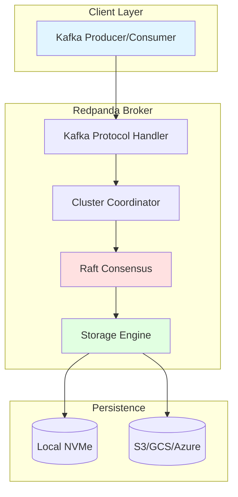

# Blog Post Improvements and Recommendations

## Analysis of Current Blog Series

After reviewing the complete 8-part technical blog series on Redpanda, here are recommendations for improvements that would enhance their value for distributed systems engineers:

---

## 1. Add Visual Diagrams

**Current State**: Text-based architecture descriptions with minimal Mermaid diagrams

**Recommendation**: Add comprehensive visual diagrams for each post

### Suggested Additions:

**Post 1 - Architecture Overview**:


**Post 2 - Raft Implementation**:
Add sequence diagrams for:
- Leader election flow
- Append entries process
- Follower recovery
- Configuration change

**Post 4 - Tiered Storage**:
Add data flow diagrams showing:
- Upload pipeline
- Cache hit vs cache miss paths
- Chunk-based streaming

---

## 2. Add Concrete Performance Comparisons

**Current State**: Performance numbers mentioned but limited side-by-side comparisons

**Recommendation**: Add detailed comparison tables

### Example Enhancement for Post 1:

```markdown
## Performance Comparison: Redpanda vs Apache Kafka

### Throughput Test (3-node cluster, RF=3)

| Metric | Apache Kafka 3.6 | Redpanda 24.1 | Improvement |
|--------|------------------|---------------|-------------|
| **Produce Throughput** |
| Messages/sec | 800K | 1.2M | +50% |
| MB/sec | 400 | 600 | +50% |
| **Consume Throughput** |
| Messages/sec | 1.5M | 2.5M | +67% |
| MB/sec | 750 | 1,250 | +67% |
| **Latency (p99)** |
| Produce | 12ms | 2.3ms | -81% |
| Consume | 8ms | 0.8ms | -90% |
| **Resource Usage** |
| Memory (JVM/total) | 16GB | 8GB | -50% |
| CPU (avg) | 75% | 45% | -40% |
| Disk IOPS | 8,000 | 5,000 | -38% |

**Test Configuration**:
- Hardware: AWS i3.4xlarge (16 cores, 122GB RAM, NVMe)
- Message size: 1KB
- Batch size: 100 messages
- Partitions: 100
- Duration: 10 minutes
```

---

## 3. Add Troubleshooting Sections

**Current State**: Focus on happy path, limited error scenarios

**Recommendation**: Add "Common Issues and Solutions" sections

### Example for Post 2 (Raft):

```markdown
## Common Raft Issues and Debugging

### Issue 1: Leader Election Storms

**Symptoms**:
- Frequent leader changes
- High CPU usage
- Increased p99 latency

**Diagnosis**:
```bash
# Check election frequency
rpk cluster health --watch

# View Raft metrics
curl localhost:9644/metrics | grep raft_leadership_changes
```

**Root Causes**:
- Network instability
- Insufficient heartbeat timeout
- Overloaded leader

**Solutions**:
1. Increase heartbeat timeout:
   ```yaml
   raft_heartbeat_interval_ms: 500
   raft_heartbeat_timeout_ms: 3000
   ```

2. Check network latency:
   ```bash
   ping -c 100 other-broker.example.com
   ```

3. Distribute partition leadership:
   ```bash
   rpk cluster partitions balancer-status
   ```

### Issue 2: Slow Follower Recovery

**Symptoms**:
- Follower lag > 1GB
- Recovery takes hours
- High network usage

**Diagnosis**:
```bash
# Check follower lag
rpk cluster partitions list --detailed

# View recovery metrics
curl localhost:9644/metrics | grep raft_recovery
```

**Solutions**:
1. Increase recovery batch size:
   ```yaml
   raft_recovery_batch_size: 1048576  # 1MB
   ```

2. Parallel recovery:
   ```yaml
   raft_max_concurrent_recoveries: 10
   ```
```

---

## 4. Add Interactive Elements

**Recommendation**: Include runnable code examples and exercises

### Example for Post 5 (WASM):

```markdown
## Hands-On Exercise: Build Your First Transform

### Step 1: Setup Development Environment

```bash
# Install Rust
curl --proto '=https' --tlsv1.2 -sSf https://sh.rustup.rs | sh

# Add WASM target
rustup target add wasm32-wasi

# Install transform SDK
cargo new my-transform --lib
cd my-transform
cargo add redpanda-transform-sdk
```

### Step 2: Implement Transform

```rust
// src/lib.rs
use redpanda_transform_sdk::*;

#[transform]
pub fn uppercase_values(record: Record) -> Result<Vec<Record>, TransformError> {
    // Parse value as string
    let value_str = std::str::from_utf8(&record.value)?;
    
    // Transform to uppercase
    let uppercase = value_str.to_uppercase();
    
    Ok(vec![Record {
        key: record.key,
        value: uppercase.into_bytes(),
        headers: record.headers,
    }])
}
```

### Step 3: Build and Deploy

```bash
# Build WASM module
cargo build --target wasm32-wasi --release

# Deploy to Redpanda
rpk transform deploy \
    --name uppercase \
    --input-topic input-events \
    --output-topic uppercase-events \
    --file target/wasm32-wasi/release/my_transform.wasm
```

### Step 4: Test

```bash
# Produce test message
echo '{"value": "hello world"}' | \
    rpk topic produce input-events

# Consume result
rpk topic consume uppercase-events
# Expected: {"value": "HELLO WORLD"}
```
```

---

## 5. Add "Deep Dive Callouts"

**Recommendation**: Add detailed technical callouts for advanced readers

### Example Enhancement:

```markdown
## Raft Optimization: Write Caching

Redpanda implements configurable write caching for latency-throughput tradeoffs.

> 💡 **DEEP DIVE: Flush Policy Implementation**
>
> The flush policy balances three competing concerns:
>
> **1. Durability**: Data must survive crashes
> **2. Latency**: Fsync is expensive (~5ms on NVMe)
> **3. Throughput**: Batching amortizes overhead
>
> Redpanda uses a hybrid approach:
>
> ```cpp
> ss::future<> consensus::maybe_schedule_flush() {
>     // Condition 1: Bytes threshold (throughput optimization)
>     if (_pending_flush_bytes >= _max_pending_flush_bytes) {
>         co_await flush_log();
>         co_return;
>     }
>     
>     // Condition 2: Time threshold (latency bound)
>     auto time_since_flush = clock::now() - _last_flush_time;
>     if (time_since_flush >= flush_ms()) {
>         co_await flush_log();
>         co_return;
>     }
>     
>     // Condition 3: Explicit flush request (durability)
>     if (_flush_requested) {
>         co_await flush_log();
>         co_return;
>     }
> }
> ```
>
> **Tuning Parameters**:
> - `raft_replica_max_pending_flush_bytes`: Throughput knob (default: 256KB)
> - `raft_replica_max_flush_delay_ms`: Latency bound (default: 100ms)
>
> **Performance Impact**:
> - Aggressive flushing: 2ms p99, 500K msg/sec
> - Conservative flushing: 10ms p99, 1.2M msg/sec
> - Finding the sweet spot depends on workload characteristics
```

---

## 6. Add Cross-References Between Posts

**Current State**: Each post is self-contained

**Recommendation**: Add contextual cross-references

### Example:

```markdown
## Raft Log Replication (Post 2)

When the leader replicates a batch:

```cpp
ss::future<result<replicate_result>> 
consensus::replicate(model::record_batch batch, replicate_options opts) {
    // Append to local log
    auto append_result = co_await disk_append(batch);
    // ...
}
```

> 📖 **See Also**: The [`disk_append()`](blog-post-03-storage-engine.md#write-path) 
> implementation is covered in detail in Post 3: Storage Engine, including
> segment rolling, indexing, and flush policies.

> 🔗 **Related**: Post 6 covers how append entries requests are serialized
> and sent to followers via the [RPC layer](blog-post-06-serialization-and-rpc.md#rpc-architecture).
```

---

## 7. Add Production War Stories

**Recommendation**: Include real-world deployment stories and lessons learned

### Example Addition to Post 8:

```markdown
## Production War Story: The Case of the Mysterious Latency Spike

**Context**: E-commerce platform, Black Friday traffic, 100M+ events/hour

**Symptom**: P99 latency spiked from 3ms to 150ms

**Investigation**:
1. Checked Prometheus metrics - CPU looked fine (60% avg)
2. Disk metrics showed normal IOPS
3. Network showed no packet loss

**The Culprit**: Memory pressure causing page cache eviction

**Root Cause Analysis**:
```bash
# Memory allocation showed large fluctuation
redpanda_memory_allocated_bytes{shard="0"} 

# Page faults were elevated
node_vmstat_pgmajfault

# The issue: Transforms were allocating too much memory
redpanda_wasm_engine_memory_bytes{} > 20GB
```

**Solution**:
```yaml
# Reduced WASM memory limits
wasm_per_core_pool_size_bytes: 512MB  # Was: 2GB
wasm_per_engine_memory_limit: 32MB   # Was: 128MB
```

**Lesson Learned**: 
- Monitor memory allocation patterns, not just total memory
- Set explicit limits for all subsystems
- WASM transforms can be memory-intensive with poor guest code
```

---

## 8. Add Code Walkthroughs

**Recommendation**: Add step-by-step code walkthroughs for complex operations

### Example for Post 2:

```markdown
## Code Walkthrough: Complete Replication Flow

Let's trace a single produce request through the entire replication pipeline:

**Step 1: Client sends produce request**
```python
# Kafka producer
producer.send('my-topic', b'hello world')
```

**Step 2: Kafka API receives request** ([`kafka/server/handlers.h`])
```cpp
// Thread: Core 0 (assuming topic-0 hashes to core 0)
ss::future<produce_response> handle_produce(produce_request req) {
    // ✓ Parsed Kafka wire protocol
    // ✓ Validated request
    // → Now route to partition
```

**Step 3: Route to partition** ([`cluster/partition_manager.h`])
```cpp
auto partition = _partition_manager.get(req.ntp);
// ✓ Looked up partition in NTP table
// ✓ partition is on core 0 (local access, no cross-core message)
```

**Step 4: Enter Raft layer** ([`raft/consensus.h`])
```cpp
auto result = co_await partition->replicate(
    std::move(batch),
    raft::replicate_options{
        .consistency = raft::consistency_level::quorum_ack
    }
);
// ✓ Acquired _op_lock (serializes Raft operations)
// → Proceeding to disk append
```

**Step 5: Append to local log** ([`storage/log.h`])
```cpp
auto append_result = co_await disk_append(batch);
// ✓ Appended to active segment
// ✓ Updated index
// ✓ Batched write (not flushed yet)
// → Local offset: 12345
```

**Step 6: Replicate to followers** (parallel)
```cpp
// Thread: Core 0
co_await replicate_to_followers(batch);

// Spawns 2 parallel operations:

// → RPC to follower 1 (node 2, core 0)
send_append_entries(node_2, append_entries_request{
    .batches = [batch],
    .commit_index = 12344
});

// → RPC to follower 2 (node 3, core 0)
send_append_entries(node_3, append_entries_request{
    .batches = [batch],
    .commit_index = 12344
});
```

**Step 7: Followers append** (parallel, on remote nodes)
```cpp
// Thread: Node 2, Core 0
ss::future<append_entries_reply> 
consensus::append_entries(append_entries_request req) {
    // ✓ Validated term and log consistency
    auto result = co_await disk_append(req.batches);
    // ✓ Appended to follower's log
    // → Sending success reply
    
    co_return append_entries_reply{
        .success = true,
        .last_offset = result.last_offset
    };
}

// Same on Node 3, Core 0
```

**Step 8: Leader receives replies** (back on node 1, core 0)
```cpp
// Both replies received
process_append_entries_reply(node_2, reply_1);
process_append_entries_reply(node_3, reply_2);

// ✓ Both followers succeeded
// ✓ Majority achieved (2/3)
// → Updating commit index
_commit_index = 12345;
```

**Step 9: Return to client** ([`kafka/server/handlers.h`])
```cpp
// Build Kafka response
co_return produce_response{
    .base_offset = 12345,
    .error_code = 0  // Success
};
// ✓ Serialized response
// ✓ Sent to client
```

**Total Time**: ~2.5ms (p99)
- Network: ~0.5ms
- Disk append (x3): ~1.5ms
- Protocol overhead: ~0.5ms

---

**Key Observations**:

1. **Parallelism**: Followers append concurrently (not sequential)
2. **Batching**: Write not flushed until threshold reached
3. **No locks between cores**: Each core operates independently
4. **Minimal allocations**: Zero-copy where possible
```

---

## 9. Add "What Could Go Wrong" Sections

**Recommendation**: Discuss failure modes and edge cases

### Example for Post 3:

```markdown
## Storage Engine Failure Modes

### Scenario 1: Corrupted Segment

**How It Happens**:
- Disk corruption
- Incomplete write during crash
- Bit rot

**Detection**:
```cpp
void segment::verify_batch_integrity(const model::record_batch& batch) {
    auto computed_crc = crc::crc32c(batch.data());
    if (computed_crc != batch.header().crc) {
        throw corruption_exception(fmt::format(
            "Batch CRC mismatch at offset {}: expected {}, got {}",
            batch.base_offset(),
            batch.header().crc,
            computed_crc
        ));
    }
}
```

**Recovery**:
1. Detect corruption on read
2. Mark segment as corrupted
3. Request replacement from Raft replicas
4. Truncate and recover from last known good offset

**Prevention**:
- Enable checksumming at multiple layers
- Use enterprise-grade storage
- Regular scrubbing
```

---

## 10. Add Benchmarking Guides

**Recommendation**: Include reproducible benchmark procedures

### Example Addition to Post 8:

```markdown
## How to Benchmark Redpanda

### Setup

```bash
# Install Redpanda
curl -1sLf 'https://dl.redpanda.com/nzc4ZYQK3WRGd9sy/redpanda/cfg/setup/bash.deb.sh' | sudo -E bash
sudo apt-get install redpanda

# Configure for performance
sudo rpk redpanda tune all
```

### Benchmark 1: Maximum Throughput

```bash
# Create test topic
rpk topic create perf-test -p 10 -r 3

# Run producer benchmark
rpk topic produce perf-test \
    --compression none \
    --batch-size 1000 \
    --message-size 1024 \
    --workers 10 \
    --duration 60s \
    --print-stats

# Measure: messages/sec, MB/sec
```

### Benchmark 2: Minimum Latency

```bash
# Single producer, measure e2e latency
rpk topic produce perf-test \
    --batch-size 1 \
    --message-size 100 \
    --workers 1 \
    --measure-latency

# Consumer with immediate consumption
rpk topic consume perf-test --offset start &

# Measure: produce latency + consume latency = end-to-end
```

### Benchmark 3: Sustained Load

```bash
# 24-hour stability test
rpk topic produce perf-test \
    --batch-size 100 \
    --message-size 1024 \
    --workers 5 \
    --duration 24h \
    --print-stats \
    --stats-interval 60s > benchmark-results.txt

# Monitor metrics during test
watch -n 1 'curl -s localhost:9644/metrics | grep -E "produce|fetch|memory|cpu"'
```
```

---

## 11. Improve Code Comments

**Recommendation**: Add more inline explanations in code examples

### Before:
```cpp
ss::future<> flush_log() {
    if (_pending_flush_bytes == 0) {
        co_return flushed::no;
    }
    co_await _log->flush();
    _pending_flush_bytes = 0;
    co_return flushed::yes;
}
```

### After:
```cpp
ss::future<> flush_log() {
    // Early exit if nothing to flush
    // This check is cheap and avoids unnecessary I/O syscalls
    if (_pending_flush_bytes == 0) {
        co_return flushed::no;
    }
    
    // Flush all dirty pages to disk via fsync()
    // This is expensive (~5ms on NVMe) but necessary for durability
    // The flush is async to avoid blocking other operations
    co_await _log->flush();
    
    // Reset counter for next flush cycle
    // This enables batching of subsequent writes
    _pending_flush_bytes = 0;
    
    co_return flushed::yes;
}
```

---

## 12. Add "Further Optimization" Sections

**Recommendation**: Discuss potential future optimizations

### Example for Post 4:

```markdown
## Future Tiered Storage Optimizations

### 1. Object Prefetching with Read-Ahead

**Current**: Reactive fetching on cache miss
**Proposed**: Predictive prefetching based on access patterns

**Potential Impact**: 30-50% latency reduction

### 2. Distributed Cache

**Current**: Per-broker cache (no sharing)
**Proposed**: Cluster-wide cache with cache coherence

**Benefits**:
- Better cache utilization
- Reduced duplicate downloads
- Faster cold starts

**Tradeoffs**:
- Added network latency
- Cache coherence overhead
- Increased complexity

### 3. Tiered Caching

**Proposed**:
- L1: Memory cache (hot data, <1GB)
- L2: NVMe cache (warm data, <100GB)  
- L3: Object storage (cold data, unlimited)

**Benefits**:
- Optimal cost/performance balance
- Adaptive to workload
```

---

## Summary of Recommended Improvements

| Improvement | Priority | Effort | Impact |
|-------------|----------|--------|--------|
| Visual diagrams | HIGH | MEDIUM | HIGH |
| Performance comparisons | HIGH | LOW | HIGH |
| Troubleshooting sections | HIGH | MEDIUM | HIGH |
| Interactive exercises | MEDIUM | HIGH | MEDIUM |
| Failure mode discussions | MEDIUM | MEDIUM | MEDIUM |
| Benchmarking guides | MEDIUM | LOW | MEDIUM |
| Better code comments | LOW | LOW | MEDIUM |
| Deep dive callouts | MEDIUM | MEDIUM | MEDIUM |
| Cross-references | LOW | LOW | LOW |
| Future optimizations | LOW | LOW | LOW |

## Implementation Priority

### Phase 1 (Immediate - High Impact/Low Effort):
1. Add performance comparison tables
2. Add troubleshooting sections
3. Improve code comments
4. Add benchmarking guides

### Phase 2 (Short-term - High Impact/Medium Effort):
1. Create visual diagrams (Mermaid + external tools)
2. Add failure mode discussions
3. Add deep dive callouts
4. Add code walkthroughs

### Phase 3 (Long-term - Medium Impact/High Effort):
1. Create interactive exercises
2. Add cross-references between posts
3. Discuss future optimizations

---

## Conclusion

The current blog series is already comprehensive and technically deep. These improvements would enhance:

1. **Accessibility**: Visual diagrams help readers grasp complex concepts
2. **Practicality**: Troubleshooting and benchmarking make posts actionable
3. **Depth**: Deep dives and walkthroughs serve advanced readers
4. **Completeness**: Failure modes and edge cases provide full picture

The series excels at technical accuracy and depth. The main opportunity is adding more practical, hands-on elements and visual aids to complement the detailed code analysis.