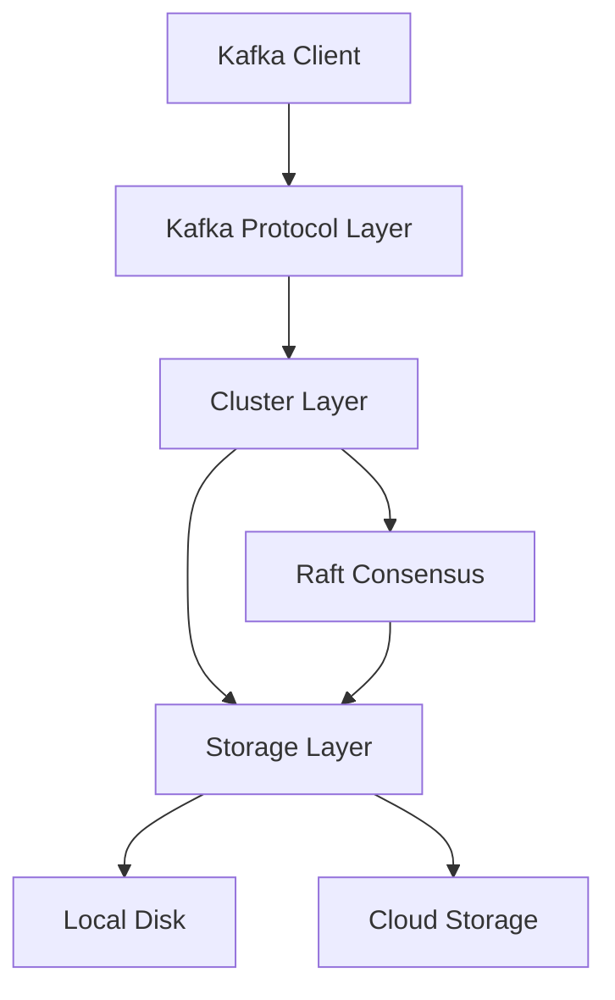

# Redpanda Deep Dive: A Technical Blog Series Outline

## Series Overview

This comprehensive blog series explores Redpanda's architecture, implementation, and design philosophy for experienced distributed systems engineers. Each post provides deep technical insights with code examples, architecture diagrams, and real-world applications.

**Target Audience**: Distributed systems engineers, infrastructure architects, and performance-focused developers who want to understand modern streaming platform internals.

**Series Goals**:
- Demystify Redpanda's high-performance architecture
- Explore modern C++ and Seastar framework usage
- Examine cloud-native streaming platform design
- Provide actionable insights for building high-performance distributed systems

---

## Blog Post 1: "Redpanda Architecture: ZooKeeper-Free Kafka Compatibility from the Ground Up"

**Estimated Length**: 3,500-4,000 words

### Key Topics

#### Introduction to Redpanda
- What is Redpanda and why it matters
- The ZooKeeper problem in Apache Kafka
- Design philosophy: lighter, faster, simpler

#### Core Architecture Components
- **Seastar Framework Foundation**
  - Share-nothing architecture
  - Per-core scheduling and memory management
  - Async I/O without thread synchronization
  - Code example: [`src/v/base/seastarx.h`](src/v/base/seastarx.h)

- **Thread-per-Core Model**
  - Eliminating lock contention
  - NUMA-aware design
  - CPU cache optimization
  
- **Module Organization** (referencing [`src/v/README.md`](src/v/README.md:1))
  ```
  raft/          - Consensus protocol
  kafka/         - Kafka compatibility layer
  storage/       - Low-level storage interface
  cluster/       - Cluster management
  cloud_storage/ - Tiered storage integration
  ```

#### Kafka API Compatibility
- Wire protocol compatibility
- Request handling pipeline
- Produce/consume path overview

#### Architectural Diagram


### Code Examples
- Seastar reactor pattern usage
- Partition management structure
- Request routing

### Key Takeaways
- How Redpanda achieves Kafka compatibility without JVM overhead
- Benefits of share-nothing architecture
- Why eliminating ZooKeeper simplifies operations

---

## Blog Post 2: "Inside Redpanda's Raft Implementation: Consensus Without Compromise"

**Estimated Length**: 4,000-4,500 words

### Key Topics

#### Raft Consensus Fundamentals
- Why Raft over other consensus protocols
- Leader election and log replication
- Safety and liveness guarantees

#### Redpanda's Raft Implementation ([`src/v/raft/consensus.h`](src/v/raft/consensus.h:67))

**Core Classes**:
```cpp
class consensus {
public:
    // Leader election and term management
    model::term_id term() const;
    bool is_leader() const;
    
    // Replication
    ss::future<result<replicate_result>> 
        replicate(model::record_batch, replicate_options);
    
    // Commit index management
    model::offset committed_offset() const;
};
```

#### Advanced Features

**1. Configuration Changes** ([RFC](docs/rfcs/20221018_cluster_bootstrap.md:1))
- Dynamic membership changes
- Joint consensus for safety
- Learner protocol for catch-up
- Code: [`group_configuration`](src/v/raft/group_configuration.h:108)

**2. Optimizations**
- **Write Caching**
  - Batching for throughput
  - Flush policies
  - Durability guarantees
  
- **Heartbeat Management** ([`heartbeat_manager`](src/v/raft/heartbeat_manager.h:87))
  - Efficient heartbeat batching
  - Delta compression for metadata
  - Selective full heartbeats

**3. Recovery and Snapshots**
- Snapshot mechanism
- Log truncation
- State machine recovery
- Two-phase bootstrap ([RFC](docs/rfcs/20190926_cluster_controller.md:1))

#### Performance Characteristics
- Benchmarking methodology
- Throughput vs latency tradeoffs
- Consistency level options:
  ```cpp
  enum class consistency_level { 
      quorum_ack,    // Wait for majority
      leader_ack,    // Wait for leader only
      no_ack         // Fire and forget
  };
  ```

### Code Deep Dive
- Follower state tracking ([`follower_states.h`](src/v/raft/follower_states.h:20))
- Append entries processing
- Vote request handling

### Key Takeaways
- How Redpanda optimizes Raft for high throughput
- Tradeoffs between durability and performance
- Production lessons from Raft implementation

---

## Blog Post 3: "Redpanda's Storage Engine: Building for Performance and Durability"

**Estimated Length**: 3,800-4,200 words

### Key Topics

#### Storage Architecture Overview

**Log Abstraction** ([`storage/log.h`](src/v/storage/log.h:37))
```cpp
class log {
    // Core operations
    virtual ss::future<> truncate(truncate_config) = 0;
    virtual ss::future<> truncate_prefix(truncate_prefix_config) = 0;
    virtual log_appender make_appender(log_append_config) = 0;
    virtual ss::future<model::record_batch_reader> 
        make_reader(local_log_reader_config) = 0;
};
```

#### Segment Management
- Segment rolling policies
- Indexing strategy
- Compaction mechanics

#### Write Path
1. **Batching and Buffering**
   - Write coalescing
   - Memory management
   - Flush triggers

2. **Durability Options**
   - Fsync policies
   - Write-ahead logging
   - Crash recovery

3. **Performance Optimizations**
   - Direct I/O
   - Zero-copy operations
   - Page cache considerations

#### Read Path
1. **Sequential Reads**
   - Segment reader implementation
   - Prefetching strategies
   - Memory efficiency

2. **Random Access**
   - Index utilization
   - Timestamp queries ([`timequery_config`](src/v/storage/log.h:101))
   - Offset translation

#### Offset Translation Layer ([`offset_translator`](src/v/cloud_storage/offset_translation_layer.h:36))
- Kafka offset vs internal offset
- Delta tracking
- Configuration records impact

### Code Examples
- Segment iteration
- Batch consumer pattern
- Compaction algorithm

### Key Takeaways
- Storage layer design for low-latency, high-throughput
- Balancing memory usage and performance
- Durability guarantees and recovery strategies

---

## Blog Post 4: "Cloud-Native from Day One: Redpanda's Tiered Storage Architecture"

**Estimated Length**: 4,200-4,800 words

### Key Topics

#### Tiered Storage Vision
- Separation of compute and storage
- Cost optimization for cold data
- Infinite retention possibilities

#### Architecture Components

**1. Cloud Storage Integration** ([`cloud_storage/`](src/v/cloud_storage/))

Key abstractions:
```cpp
class remote {
    // Upload segments to cloud
    ss::future<upload_result> upload_segment(upload_request);
    
    // Download for reads
    ss::future<download_result> download_segment(download_request);
    
    // Manifest management
    ss::future<> upload_manifest(partition_manifest);
};
```

**2. Partition Manifest** ([`partition_manifest.h`](src/v/cloud_storage/partition_manifest.h:67))
- Segment metadata tracking
- Version control
- Spillover manifests for scale

**3. Remote Partition** ([`remote_partition.h`](src/v/cloud_storage/remote_partition.h:49))
- Seamless local/remote reads
- Cache management
- Hydration strategies

#### Advanced Features

**Segment Chunking** ([`segment_chunk.h`](src/v/cloud_storage/segment_chunk.h:35))
- Chunk-based downloads
- Predictive prefetching
- Memory-efficient streaming

**Cache Architecture**
- LRU eviction
- Cache warming
- Hit rate optimization

**Materialized Segments** ([`segment_state.h`](src/v/cloud_storage/segment_state.h:34))
- Lifecycle management
- Reference counting
- Resource constraints

#### Cloud Provider Support
- S3 implementation ([`s3_client.h`](src/v/cloud_storage_clients/s3_client.h:126))
- Azure Blob Storage ([`abs_client.h`](src/v/cloud_storage_clients/abs_client.h:118))
- GCS support
- Authentication and credentials

#### Performance Characteristics
- Read amplification
- Upload batching
- Bandwidth management

### Code Deep Dive
- Async manifest materialization
- Remote segment batch reader
- Cloud storage anomaly detection

### Key Takeaways
- Building cloud-native storage from first principles
- Tradeoffs in tiered storage design
- Production deployment considerations

---

## Blog Post 5: "WebAssembly Transforms: User-Defined Processing at Streaming Speed"

**Estimated Length**: 3,500-4,000 words

### Key Topics

#### Data Transforms Vision
- In-broker data processing
- Schema transformation
- Filtering and enrichment

#### WASM Engine Architecture ([`wasm/`](src/v/wasm/))

**Core Abstractions** ([`engine.h`](src/v/wasm/engine.h:46)):
```cpp
class engine {
    virtual ss::future<> transform(
        model::record_batch, 
        transform_probe*, 
        transform_callback) = 0;
};

class factory {
    virtual ss::future<ss::shared_ptr<engine>>
        make_engine(std::unique_ptr<wasm::logger>) = 0;
};

class runtime {
    virtual ss::future<ss::shared_ptr<factory>>
        make_factory(model::transform_metadata, 
                    model::wasm_binary_iobuf) = 0;
};
```

#### Wasmtime Integration ([`wasmtime.h`](src/v/wasm/wasmtime.h))
- C API usage
- Async execution model
- Stack switching
- Signal handling considerations

#### Host Functions (FFI)
**Transform Module**
- Batch/record iteration
- Read/write operations
- Suspension and resumption

**Schema Registry Module**
- Schema lookup
- Serialization support
- Caching

**WASI Module**
- POSIX-like APIs
- Environment variables
- Clock access

#### Memory Management
**Custom Allocators** ([`allocator.h`](src/v/wasm/allocator.h))
- Seastar integration
- Heap limits per engine
- Stack allocation

#### Security and Isolation
- Sandboxing
- Resource limits (CPU, memory)
- Timeout enforcement

#### Performance Optimization
- Engine pooling and reuse
- Compilation caching
- Fuel-based execution limits

### Code Examples
- WASM module lifecycle
- Transform implementation
- Host function registration

### Key Takeaways
- Bringing user-defined functions to streaming platforms
- Safety and performance in sandboxed execution
- WASM as a universal plugin system

---

## Blog Post 6: "Serialization and RPC: The Nervous System of Redpanda"

**Estimated Length**: 3,200-3,800 words

### Key Topics

#### Serialization Framework Evolution

**From ADL to Serde** ([`serde/rw/rw.h`](src/v/serde/rw/rw.h:1))
```cpp
template<typename T>
void write(iobuf& b, T x);

template<typename T>
std::decay_t<T> read(iobuf_parser& in);
```

**Key Features**:
- Zero-copy where possible
- Versioning support
- Schema evolution
- Type safety

#### RPC Architecture ([`rpc/types.h`](src/v/rpc/types.h:1))

**Core Structures**:
```cpp
struct header {
    transport_version version;
    uint32_t header_checksum;
    compression_type compression;
    uint32_t payload_size;
    uint32_t correlation_id;
    uint64_t payload_checksum;
};
```

**Transport Protocol**:
- Connection management
- Request/response correlation
- Timeout handling ([`timeout_spec`](src/v/rpc/types.h:65))
- Compression options

#### Internal vs External RPC
- Cluster communication
- Client-facing APIs
- Protocol versioning

#### Performance Optimizations
- Connection pooling
- Batch processing
- Memory reservation
- Backpressure handling

### Code Deep Dive
- RPC method registration
- Streaming context
- Client implementation

### Key Takeaways
- Building efficient serialization for distributed systems
- RPC design patterns
- Versioning and backward compatibility

---

## Blog Post 7: "Cluster Management and the Controller: Redpanda's Brain"

**Estimated Length**: 4,000-4,500 words

### Key Topics

#### Controller Architecture

**What is the Controller?**
- Cluster-wide metadata management
- Single Raft group for coordination
- Compacted topic for state

**Controller Responsibilities**:
1. Topic lifecycle
2. Partition assignment
3. Node membership
4. Feature flags
5. Configuration management

#### Cluster Bootstrap ([RFC](docs/rfcs/20221018_cluster_bootstrap.md:1))

**Modern Bootstrap Process**:
- No distinguished root node
- UUID-based node identity
- Automatic node ID assignment
- Multi-node initialization

**Safety Improvements**:
- Cluster UUID validation
- Configuration consistency checks
- Prevention of split-brain

#### Partition Management ([`partition_manager.h`](src/v/cluster/partition_manager.h:41))

```cpp
class partition_manager {
    ss::future<consensus_ptr> manage(
        storage::ntp_config,
        raft::group_id,
        std::vector<raft::vnode>,
        ...
    );
    
    ss::future<> remove(
        const model::ntp& ntp, 
        partition_removal_mode mode
    );
};
```

**Partition Lifecycle**:
1. Creation and initial placement
2. Replication
3. Leadership management
4. Removal and cleanup

#### Shard Placement
- CPU affinity
- NUMA awareness
- Load balancing

#### Configuration Management
- Topic-level overrides
- Cluster-wide settings
- Dynamic updates

#### Recovery and Failover
- Node replacement
- Partition recovery
- State machine snapshots

### Code Deep Dive
- Controller command processing
- Partition state machine
- Topic lifecycle

### Key Takeaways
- ZooKeeper-free coordination
- Simplified cluster operations
- Safety and consistency guarantees

---

## Blog Post 8: "Performance Engineering in Redpanda: Lessons from Production"

**Estimated Length**: 4,500-5,000 words

### Key Topics

#### Performance Philosophy
- Mechanical sympathy
- Zero-copy principles
- Lock-free where possible
- Batch-oriented processing

#### CPU Optimization

**1. Thread-Per-Core Benefits**
- No context switching overhead
- Better cache locality
- Predictable latency

**2. Scheduling** ([`scheduling_config`](src/v/raft/types.h:605))
- Priority-based task scheduling
- IO scheduling groups
- CPU quota management

#### Memory Management

**1. Seastar Memory Model**
- Per-core allocators
- Memory pooling
- Explicit memory reservation

**2. Buffer Management**
- `iobuf` design
- Fragment handling
- Zero-copy operations

**3. Resource Quotas**
- Memory limits
- Backpressure mechanisms
- OOM prevention

#### IO Optimization

**1. Disk IO**
- Direct IO usage
- IO depth tuning
- IO scheduler selection

**2. Network IO**
- Zero-copy networking
- TCP optimization
- Connection pooling

#### Batching Strategies
- Write batching ([`replicate_batcher`](src/v/raft/replicate_batcher.h))
- Read coalescing
- RPC batching

#### Monitoring and Observability

**Probes and Metrics**:
- Per-subsystem probes
- Histogram-based latency tracking
- Resource utilization metrics

**Example**: Partition probe
```cpp
class partition_probe {
    void record_produce_latency(std::chrono::microseconds);
    void record_fetch_latency(std::chrono::microseconds);
    uint64_t get_records_produced() const;
};
```

#### Production Tuning
- Configuration best practices
- Common anti-patterns
- Performance debugging

#### Benchmarking
- Methodology
- Representative workloads
- Interpretation

### Code Examples
- Memory reservation patterns
- Async batch processing
- Probe instrumentation

### Key Takeaways
- How Redpanda achieves industry-leading performance
- Trade-offs in optimization
- Operational best practices

---

## Conclusion

This blog series provides a comprehensive technical exploration of Redpanda's architecture, from its Seastar foundation through its Raft consensus, storage engine, cloud-native features, WebAssembly transforms, serialization/RPC layer, cluster management, and performance engineering.

Each post builds on the previous ones while remaining self-contained enough for readers to dive into specific topics of interest. The series demonstrates how modern C++, carefully chosen architectural patterns, and relentless focus on performance combine to create a next-generation streaming platform.

---

## Supplementary Resources

### Diagrams to Create
1. Overall system architecture
2. Request flow (produce/consume)
3. Raft consensus flow
4. Storage layer structure
5. Tiered storage architecture
6. WASM transform pipeline
7. RPC protocol layers
8. Cluster topology

### Code Examples Repository
- Sample transform functions
- Configuration examples
- Client usage patterns
- Performance benchmarking scripts

### Related RFCs to Reference
- Cluster bootstrap
- Controller refactoring
- Raft recovery
- Leader epoch support
- Connection limits
- Feature flags
